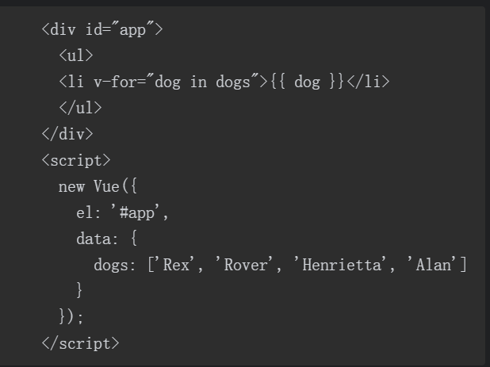

# Vue.js快跑

*注： 整体大纲同Vue.js快跑一致，在书籍的基础上，与官方文档（2.x版本）进行了总结比较，从而完善了本文档的编写*

## 第一章 Vue.js基础

### 模板、数据和指令

- 此处需要注意一点： 
  - 在下文**数据、方法和计算属性**一节中，提到了data的写法
  - 如果是 `data() { a: this}` 写法 ，此时this 指向 **当前Vue实例**
  - 如果是 `data: { a: this}`的写法， this指向的 是 **window**,
  - (**关于箭头函数，官网补充写法**)还介绍了第三种写法
  - 如果是 `data:(vm) => { a: this, b: vm}`  的写法， this指向的 是 **window**, vm参数是当前Vue实例

```html
<!DOCTYPE html>
<html lang="en">
<head>
  <meta charset="UTF-8">
  <title>Title</title>
</head>
<body>
<div id="app">
  <p>模板显示文本</p>
  {{hello}}
  <p>模板对于数组对象的显示（这里用数组为例）</p>
  显示一个:{{colors[0]}}
  <p>显示全部，会自动用JSON.stringify进行转义</p>
  {{colors}}

  <p>时间显示的例子,注意： 该例子不是实时显示的 (data基本用法 指令v-if用法)</p>
  <p v-if="isMorning">早上好!</p>
  <p v-if="isAfternoon">中午好！</p>
  <p v-if="isEvening">晚上好！</p>
  <p>指令当中可以写入比较逻辑，hour变量也可以直接在data中得到(好处，定义的变量更少)</p>
  <p v-if="hour < 12">早上好!</p>
  <p v-if="hour >= 12 && hour < 18">中午好！</p>
  <p v-if="hour >= 18">晚上好！</p>
</div>
<script src="https://cdn.jsdelivr.net/npm/vue@2.6.12"></script>
<script>
  const hours = new Date().getHours()
  const app = new Vue({
    el: '#app',
    data() {
      return {
        hello: 'hello Vue!',
        isMorning: hours < 12,
        isAfternoon: 18 > hours && hours >= 12, // 注： js处理连续的比较会有问题 所以不能用 18>hours>12的写法
        isEvening: hours >= 18,
        hour: new Date().getHours(),
        colors: ['赤','橙','黄','绿','青','蓝','紫']
      }
    }
  })
</script>
</body>
</html>
```


### v-if  Vs v-show

**v-if**

```html
<div v-if="true">
     one
</div>
<div v-if="false">
    two
</div>
```

对应dom为

```html
<div>
    one
</div>
```

注： v-else-if ,v-else  与正常 if else else if 行为一致


**v-show**

```html
<div v-show="true">
    one
</div>
<div v-show="false">
    two
</div>
```

对应dom为

```html
<div>
    one
</div>
<div style="display:none;">
    two
</div>
```

区别： 

- v-if 为false时不会生成dow元素，v-show则无论如何会生成，他为false时只是控制了display属性
- 如图所示，该例子会抛出一个异常，因为v-show生成了dom元素，而user不存在name属性，如果这里使用的是v-if就不会出现这样的问题，因为元素根本不会被生成


使用场景：

- 切换次数少 v-if

- 频繁切换v-show, 且元素中如果有图片资源，推荐v-show，他会在浏览器要显示图片前就开始加载 ，因为v-if会在要显示时才会加载

### v-for

#### 遍历数组

- dogs是源数据 dog是被迭代的数组元素的别名， 如果该元素是对象，可以通过 dog.属性的方式，继续访问对应属性值,
- 除了dog为还可以有第二个参数，为当前数据的索引(dog,index) in dogs



#### 遍历对象

- 同样有两个参数 值得注意的是 顺序为 value,key  先属性值后属性名
- *注意*： 对应还可以有第三个参数作为索引(0,1,2...)  
  - (rent, city, index) in averageRent
  - 在遍历对象时，会按 `Object.keys()` 的结果遍历，但是**不能**保证它的结果在不同的 JavaScript 引擎下都一致。


- 最后如果只想要得到一个计数器，可以传递数字作为参数

```html
<div id="app">
    <p>
        这里依次输出 1-10,如果希望列表输出0-9，则用 n-1 in 10 实现
    </p>
    <div v-for="n in 10">
        {{i}}
    </div>
</div>
<script>
    new Vue({
        el: "#app",
        data() {
            return {}
        }
    })
</script>
```


#### **列表渲染包含多个元素的内容**

- 可以将`v-for`写在 template标签上

```html
<ul>
  <template v-for="item in items">
    <li>{{ item.msg }}</li>
    <li class="divider" role="presentation"></li>
  </template>
</ul>
```

#### v-for 与 v-if 一同使用 

- 什么场景会涉及这个问题
  - 如下所示： 
  - 使用v-for遍历users渲染一个列表，但是要通过单个 的user.isAcitive去判断该条是否应该渲染

```html
<li v-for="user in users" v-if="user.isActive" :key="user.id">
  {{ user.name }}
</li>
```

但是，**实际开发中，我们不推荐在同一元素上使用 `v-if` 和 `v-for`。**

- 原因： 在vue中 v-for比 v-if 指令的优先级更高， 所以这种写法，哪怕实际只需要渲染一部分元素，但在每次**重新渲染**的这个**列表**时，都会再次**遍历所有的元素**，不管**if条件是否变化**

  - ```js
    //上面的例子相当于，每次都执行如下代码
    this.users.map((user) => {
        if (user.isActive) {
            return user.name
        }
    })
    // 可能每次都返回：  ['张三',undefined, '王五']
    ```

- 解决方案，

- 1.对于能够将 v-if挪到 v-for外面的逻辑，尽量挪到外面

- 2.使用计算属性遍历，在计算属性中 用 filter进行过滤

  - 好处有两点，

    - 一： filter不会返回多余的元素,它只返回每次遍历结果为true的元素组成的数组isActive，即不会像map一样有**多余的 undefined**
    - 二（最大的优势）：计算属性在重新渲染时，如果if的**条件不变化**，那么就**不会再次遍历**，会直接复用旧的结果过

  - ```html
    <li v-for="activeUser in activeUsers" :key="activeUser.id">
        {{activeUser.name}}
    </li>
    <script>
        computed: {
            activeUsers() {
                // 可能每次都返回： ['张三','王五']
                return this.users.fier((user) => {
                    return user.active
                })
            }
        }
    </script>
    ```

#### 就地更新策略 与 key(虚拟DOM)

当 Vue **更新**使用 `v-for` 渲染的元素列表时，它默认使用“就地更新”的策略

- 就地更新：

  - 如果数据项的顺序被改变，Vue 将不会移动 DOM 元素来匹配数据项的顺序，而是就地更新每个元素，并且确保它们在每个索引位置正确渲染 
  - 这个默认的模式是高效的，但是**只适用于不依赖子组件状态或临时 DOM 状态 (例如：表单输入值) 的列表渲染输出**。

- 那么如何进行包含排序，删除的更新 ，**使用key**

  - `key` 的特殊 attribute 主要用在 Vue 的虚拟 DOM 算法，在新旧 nodes 对比时辨识 VNodes。如果不使用 key，Vue 会使用一种最大限度减少动态元素并且尽可能的尝试就地修改/复用相同类型元素的算法。而使用 key 时，它会**基于 key 的变化重新排列元素顺序，并且会移除 key 不存在的元素**。
  - 注：
    -  不要使用对象或数组之类的非基本类型值作为 `v-for` 的 `key`。请用字符串或数值类型的值。
    - 2.2.0+ 的版本里，当在**组件上使用 v-for 时**，**key** 现在是**必须的**。

- key的**使用场景**  （由上文可以得知，key实际上是解决就地更新的一种方案，所以他不光只能用于 v-for中，它还有其他的使用场景）

  - v-for  ----  最常见的用途

  - 完整触发组件的生命周期钩子 ----- 因为就地更新策略，不会直接删除DOM,所以一个**组件更新时**并不会将组件直接删除，也就不会触发完整的生命周期钩子，而key可以

  - 触发过渡

    - 如下例所示，如果没有key，那么每次就地更新会直接更新span中的文本，dom元素span不会变化，有了key，由于key发生了变化，会删除原先key的dom，生成新key的dom由此触发了过渡动画

    - ```html
      <transition>
          <span :key="text">{{text}}</span>
      </transition>
      ```

  - 如果一组 v-if + v-else 的元素类型相同，最好使用 key (比如两个 `<div>` 元素)。

### 属性绑定v-bind

- v-bind用于将一个值绑定到一个HTML属性上
  - 下面的这个例子将submit值绑定到按钮的type属性上： 
  - 并将 `v-bind:type` 使用简写写为 `:type`

```html
<div id="app">
    <button :type="buttonType">
        Test Button
    </button>
</div>
<script>
    const app = new Vue({
        el: '#app',
        data() {
            return {
                buttonType: 'submit'
            }
        }
    })
</script>
```

对应dom

```html
<button type="submit">
     Test Button
</button>
```

### 响应式原理


#### **概念**

- 当你把一个普通的 JavaScript 对象传入 Vue 实例作为 data 选项，Vue 将遍历此对象所有的 property，并使用 Object.defineProperty 把这些 property 全部转为 getter/setter,每个组件实例都对应一个 **watcher** 实例，它会在组件渲染的过程中把“接触”过的数据 property 记录为依赖。之后当依赖项的 setter 触发时，会通知 watcher，从而使它关联的组件重新渲染。

#### **限制**

- 对象：

- 因为getter/setter方法是在Vue实例初始化的时候添加的，只有已经存在的属性是响应式的；当为对象添加一个新的属性时，直接添加并不会使这个属性成为响应式的：
- 举例： 这里的 name属性和a属性就不是响应式的

```js
const vm = new Vue({
    data: {
        formData: {
            username: 'someuser'
        }
    }
})
vm.formData.name = 'Some user'
vm.a = '11'
```

- **补充说明**（响应式对象不再响应的方法）
  - 可以通过`Object.freeze(obj)`方法实现

```html
<div id="app">
  <p>{{ foo }}</p>
  <!-- 这里的 `foo` 不会更新！ -->
  <button v-on:click="foo = 'baz'">Change it</button>
</div>
<script>
    var obj = {
        foo: 'bar'
    }
// 冻结了 obj对象
    Object.freeze(obj)

    new Vue({
        el: '#app',
         // 这里整个data都不会再响应式，注意：除了直接冻结冻结data，还可以对于data中嵌套的特定对象，进行冻结
        data: obj 
    })
</script>
```

#### 解决方案

```js
//1.   初始化时就定义该属性
data: {
    a: undefined
    formData: {
        username: 'someuser',
        name: undefined  
    }
}
// 下列方案用于嵌套的对象属性，不试用于a属性
// 2. 当一次更新多个属性时 使用 Object.assgin, 
// 注1: 调用assgin方法时要传递三个参数，应该用原对象与要混合进去的对象的 property 一起创建一个新的对象，最后赋值，而不能用Object.assign(this.someObject, { a: 1, b: 2 })，这种不创建新对象的方式，不会触发更新
// 注2：Object.assgin()本质上是浅拷贝，它对于对象中的方法，只会拷贝引用，不会创建新方法
vm.formData = Object.assgin({}, vm.formData, {
    name: 'Some user'
})

//3. 全局方法Vue.set() 组件内部 this.$set()
Vue.set(vm.formData, 'name', 'Some user')
```

- 数组：

```js
const vm = new Vue({
    data() {
        return {
            colors: ['赤','橙','黄','绿','青','蓝','紫']
        }
    }
})

vm.colors.length = 3 // 不能监测
vm.colors[0] = 'test' //不能监测
```

- 解决方案:set 方法 或 splice 方法

```js
Vue.set(vm.colors, 0, 'red') // 第二个参数是索引
vm.colors.splice(2, 1, 'yellow') 


// 缩短数组长度 ，注意，只能缩短，不能增长
vm.colors.splice(3)
```

#### **更多数组方法**

- 所有会触发视图更新的数组方法(这些方法原数组会直接改变)
  
  - `push()`
  - `pop()`
  - `shift()`
  - `unshift()`
  - `splice()`
  - `sort()`
  - `reverse()`
  
- 返回一个新数组( 这些方法，原数组不会直接改变，但是返回一个新数组后，可以对原数组进行赋值，从而触发视图的改变)

  - `filter()`

  - `concat()` 

  -  `slice()`

  - ```js
    // example1 是一个Vue实例example1.items = example1.items.filter(function (item) {
      return item.message.match(/Foo/)
    })
    ```

#### **关于异步更新队列**

- Vue 在更新 DOM 时是**异步**执行的。只要侦听到数据变化，Vue 将开启一个队列，并缓冲在同一事件循环中发生的所有数据变更。如果同一个 watcher 被多次触发，只会被推入到队列中一次。这种在缓冲时去除重复数据对于避免不必要的计算和 DOM 操作是非常重要的。然后，在下一个的事件循环“tick”中，Vue 刷新队列并执行实际 (已去重的) 工作。Vue 在内部对异步队列尝试使用原生的 `Promise.then`、`MutationObserver` 和 `setImmediate`，如果执行环境不支持，则会采用 `setTimeout(fn, 0)` 代替，
  
- 简单的说就是通过 异步执行，对同一条数据的多次更新进行了过滤，只保留最新一条进行DOM渲染，减少了DOM更新次数
  
- 基于异步，如果我们在改变数据后，立刻想对DOM做出某些操作，显然是不能直接完成的,这时可以调用`Vue.nextTick(callback)`

  - 例： 这里可以看到在改变数据后，同步获取dom，dom中的文本并没有更新 ，而nextTick则可以得到最新文本

  - ```html
    <div id="example">{{message}}</div>
    <script>
        var vm = new Vue({
        el: '#example',
        data: {
      	  message: '123'
        }
        })
        vm.message = 'new message' // 更改数据
        vm.$el.textContent === 'new message' // false
        Vue.nextTick(function () {
        vm.$el.textContent === 'new message' // true
        })
    </script>
    ```

- 在组件内部使用 可以调用 `vm.$nextTick(callback)`

  - ```js
    Vue.component('example', {
      template: '<span>{{ message }}</span>',
      data: function () {
        return {
          message: '未更新'
        }
      },
      methods: {
        updateMessage: function () {
          this.message = '已更新'
          console.log(this.$el.textContent) // => '未更新'
          this.$nextTick(function () {
            console.log(this.$el.textContent) // => '已更新'
          })
        }
      }
    })
    ```

  - 也可以使用 async/await语法

  - ```js
    methods: {
      updateMessage: async function () {
        this.message = '已更新'
        console.log(this.$el.textContent) // => '未更新'
        await this.$nextTick()
        console.log(this.$el.textContent) // => '已更新'
      }
    }
    ```


### 双向数据绑定

**概念**

- 使用v-model指令，它作用于输入框元素(`input`,`select`,`textarea`)，将输入框的值绑定到data对象的对应属性上，因此输入框不但会接收data上的初始值，而且当输入内容更新时，data上的属性值也会更新。
- 在使用v-model时，如果设置了value、checked和selected属性，这些属性会被忽略
- 对于输入元素（input）、多行文本框（textareas）、下拉列表和复选框，输入的值和data对象中的值都能保持一致（对于复选框，单个（data对象中的值是一个布尔值），多个（data对象中的值是value值的数组））。单选框有一点不同，因为同一个v-model会对应多个不同的元素，存储在data中的值等于当前选中的单选输入框的value属性的值（多个单选框，也是value值组成的数组）：

```html
<div id="app">
    <input type="text" v-model="inputText">
    <p>
        inputText: {{inputText}} 
    </p>
</div>
<script>
    new Vue({
        el: "#app",
        data() {
            return {
                inputText: ''
            }
        }
    })
</script>
```

**修饰符**

- `.lazy`: 在默认情况下，`v-model` 在每次 `input` 事件触发后将输入框的值与数据进行同步。你可以添加 `lazy` 修饰符，从而转为在 `change` 事件_之后_进行同步
- `.number`: 如果想自动将用户的输入值转为数值类型，可以给 `v-model` 添加 `number` 修饰符
- `trim`: 如果要自动过滤用户输入的首尾空白字符，可以给 `v-model` 添加 `trim` 修饰符：

```html
<input v-model.lazy="msg"> <!--使用方式>
```

### 动态设置HTML

- 有时可能会希望通过一个表达式设置某个元素的HTML。比如说调用一个API，这个API返回一些需要显示在页面上的HTML。在理想情况下，这个API会返回一个JSON对象，可以将它传给Vue并自行处理模板
  - 但问题是，如果使用  `{{ yourHtml}}`，由于Vue内建了自动转义功能，youHtml变量中的HTML就会被转义，这时如果想要不转义，将HTML直接渲染在页面上，就可以使用 `v-html`

```html
<div v-html="yourHtml">
</div>
```

- 注意： 务必慎用这一功能！从某个变量中取出HTML并输出到页面上，你可能将自己暴露在XSS风险中。永远不要将用户输入或者允许用户修改的内容置于v-html中，除非对他们输入的内容提前进行了仔细的校验和转义。不然你可能会一不小心允许了用户在你的网站上执行恶意脚本。记住，只用v-html处理你信任的数据。

### 方法

- 函数是十分优雅的语言特性，它让我们可以采用可复用的方式存储一段逻辑，从而不用重复代码就可以多次使用这一逻辑。在Vue的模板里，函数被定义为方法来使用

```html
<div id="app">
    <p>
        当前状态{{currentStatus(status)}}
    </p>
</div>
<script>
    const vm = new Vue({
        el: "#app",
        data() {
            return {
                status: '3'
            }
        },
        methods: {
            currentStatus(id) {
                const current = ({
                    '1': 吃饭，
                    '2': 睡觉,
                    '3': 学习
                })[id]
                return current || '未知状态'
            }
        },
        created() {
            // 也可以在内部通过 this调用
            this.currentStatus(1)
        }
    })
    // 方法也可以在外部通过实例调用
    console.log(vm.currentStatus(2))
</script>
```

- 除了在插值中使用方法，还可以在属性绑定中使用它们——实际上，任何可以使用JavaScript表达式的地方都可以使用方法 
  - 如： v-for 中被遍历的部分就可以是方法名，只要该方法最后的返回值能遍历即可
- this指向： 
  - 在方法中，this指向该方法所属的组件。可以使用this访问data对象的属性和其他


### 计算属性

- 计算属性介于data对象的属性和方法两者之间：可以像访问data对象的属性那样访问它，但需要以函数的方式定义它(一般来说，由于他的特性，计算属性一定会有返回值)
  - 计算属性会被缓存：如果在模板中多次调用一个方法，方法中的代码在每一次调用时都会执行一遍；但如果计算属性被多次调用，其中的代码只会执行一次，之后的每次调用都会使用被缓存的值。只有当计算属性的依赖发生变化时，代码才会被再次执行（**或者在模板内部，方法或计算属性B,依赖于属性A，B多次调用A时，A显然是计算属性性能更高**）：
  - 例如，在这个例子中，如果向numbers中添加一项，numberTotal中的代码会再次执行以获取新的计算值。因为这种方式可以确保代码只在必要的时刻执行，所以适合处理一些潜在的资源密集型工作。
  - 计算属性可以使用再 `v-for`中

```html
<div id="app">
    数字总和是 {{numberTotal}}
</div>
<script>
    new Vue({
        data() {
            return {
                numbers: [1, -5, 23, 7, 26, -3]
            }
        },
        computed: {
            numberTotal() {
                return numbers.reduce((sum,val) => sum+val)
            }
        }
    })
</script>
```

- 计算属性和方法的另外一个区别是，除了能像上例展示的那样获取计算属性的值，还可以设置计算属性的值，并且在设置过程中做一些操作。实现这一点需要将计算属性由函数改为带有get和set属性的对象
  - 下面的写法作用时，当进行获取值操作时，获取总数字和，当为计算属性，进行赋值操作时，会将新值和数字总和的差，添加到数组中，如： this.numberTotal += 5 ，数字5就会添加到numbers的最后，这时如果再读取 this.numberTotal，会发现他的值也被更新了

```html
<div id="app">
    数字总和是 {{numberTotal}}
</div>
<script>
    new Vue({
        data() {
            return {
                numbers: [1, -5, 23, 7, 26, -3]
            }
        },
        computed: {
            numberTotal: {
                getter() {
                  return numbers.reduce((sum,val) => sum+val)
                },
                setter(newNum) {
                    const oldVal = this.numberTotal
                    const diffVal = newNum - oldVal
                    this.numbers.push(diffVal)
                }
            }
        }
    })
</script>
```

**对比**

|          | 可读 | 可写 | 可以接收参数？ | 需要运算？ | 有缓存？ |
| -------- | ---- | ---- | -------------- | ---------- | -------- |
| data     | 是   | 是   | 否             | 否         | 否       |
| 方法     | 是   | 否   | 是             | 是         | 否       |
| 计算属性 | 是   | 是   | 否             | 是         | 是       |

### 侦听器

- 侦听器可以监听data对象属性或者计算属性的变化。

- 基本使用方式

  - ```js
    new Vue({
        el: "#app",
        data() {
            return {
                count: 0
            }
        },
        watch: {
            count() {
                console.log('count有变化了')
            }
        }
    })
    ```

- 使用场景，一般来说在Vue，常见的监听，用computed的方式实现更好

  - 如下所示： 如果想要通过两个变量实时更新第三个变量，用watch需要两个变量全部监听，而使用computed的方式，则只需返回两个变量的和既可以

  - 注: watch通常可以传入两个变量 val 是当前值， oldVal是旧值

  - ```js
    new Vue({
        el: "app",
        data() {
            return {
                name: ’张三‘
                firstname: '张',
                lastname: '三'
            }
        },
        watch: {
            firstname(val，oldVal) {  // this.firstname === val
                this.name = this.lastname + val
            },
            lastname(val) {
                this.name = this.firstname + val
            }
        },
        computed: {
            names() {
                return this.firstname + this.lastname
            }
        }
    })
    ```

- 而在 数据变化时执行异步或开销较大的操作时，watch这个方式才是最有用的

- watch中可以使用`.`操作符

  - ```js
    watch: {
        'a.b'() {
            // 成功监听了 a.b
        }
    }
    ```

- 深度监听 

  - watch默认不会开启深度监听，比如在默认情况下，如果你正在监听formData对象并且修改了formData.username，对应的侦听器并不会触发，它只在formData对象被整个替换时触发。

  - 监听整个对象被称作深度监听，通过将deep选项设置为true来开启这一特性：

  - ```js
    watch: {
        formData: {
            // 监听的回调
            handler(val,oldVal) {
                console.log(val, oldVal)
            },
            deep: true  // 开始深度监听
        }
    }
    ```

  - 

### 关于箭头函数，官网部分内容补充

- data 

  - 如果你为 `data` property 使用了箭头函数，则 `this` 不会指向这个组件的实例，不过你仍然可以将其实例作为函数的第一个参数来访问（注：前提是需要在外部对vue实例进行赋值）

  - ```js
    const vm = new Vue({
        data:(vm) => ({a: 1, b: vm.a})
    })
    ```

- computed 

  - 如果你为一个计算属性使用了箭头函数，则 `this` 不会指向这个组件的实例，不过你仍然可以将其实例作为函数的第一个参数来访问(注：前提是需要在外部对vue实例进行赋值）

  - ```js
    const vm = new Vue({
        computed: {
            aDouble: (vm) =>  vm.a * 2
        }
    })
    ```

- method

  - **不应该使用箭头函数来定义 method 函数**,理由是箭头函数绑定了父级作用域的上下文，所以 `this` 将不会按照期望指向 Vue 实例，`this.a` 将是 undefined。

- watch

  - 与method一致，不应该使用箭头函数来定义

- 所有生命周期钩子：

  - 不应使用箭头函数来定义

### 过滤器

- 过滤器是一种在模板中处理数据的便捷方式，而且经常会在其他模板语言中见到。它们特别适合对字符串和数字进行简单的显示变化：例如，将字符串变为正确的大小写格式，或者用更容易阅读的格式显示数字
- 使用场景
  - 这段代码可以正常工作，但是存在很多重复。对于每一项商品我们都要进行下面的计算：将价格单位从分转换为元、格式化为两位小数，同时添加美元符号。尽管我们可以将这一逻辑拆分为一个**方法**，但这次我们要把这一逻辑拆分为**过滤器**，因为这样可读性更好而且可以全局使用：


- 使用过滤器: 可以看到这种写法复用性更好，可维护性更高

  - ```html
    <div id="app">
        <p>商品一花费了：{{productOneCost | formatCost}}</p>
        <p>尚品二花费了：{{productTwoCost | formatCost}}</p>
        <p>商品三花费了：{{productTwoCost | formatCost}}</p>
    </div>
    <script>
        new Vue({
            el: "#app",
            data() {
              return {
                  productOneCost： 998，
                  productTwoCost: 2399,
                  productThreeCost: 5300
              }  
            },
            filters: {
                formatCost(value) { // 第一个参数为管道符 左侧的值
                    return '$' + (value / 100).toFixed(2)
                }
            }
        })
    </script>
    ```

- 过滤器可以用管道符`|` 进行链式调用， 一个数值可以用多个过滤器进行处理

- 过滤器可以传递参数（如上面的例子，可以改为）

  - ```html
    <p>商品一花费了：{{productOneCost | formatCost('$')}}</p>
    <script>
        formatCost(val, symbol) { // 这里第二个参数就是传递的参数
            return symbol  + (val / 100).toFixed(2)
        }
    </script>
    ```

- 过滤器还可以在 `v-bind`(一般用在绑定数值到属性时)中使用

  - ```html
    <input :value="productOneCost | formatCost('$')" type="text">
    ```

- 如果要定义一个通用的过滤器，可以将它定义在全局中

  - ```js
    // 参数1 为过滤器名 ，参数2 为过滤器值
    Vue.filter('productCost', function(value, symbol='$') {
        return stymbol + (value / 100).toFixed(2)
    })
    ```

- 注意点，
  - 1.过滤器是组件中唯一不能使用this来访问数据或者方法的地方，因为过滤器应该是纯函数，也就是说对于同样的输入每次都返回同样的输出，而不涉及任何外部数据。如果想在过滤器中访问其他数据，可以将它作为参数传入
  - 2.只可以在插值和v-bind指令中使用过滤器。而在Vue 1中，可以在任何可以使用表达式的地方使用过滤器，Vue 2取消了这种做法

### 使用ref直接访问元素

**用法**

- `ref` 被用来给元素或子组件注册引用信息。引用信息将会注册在父组件的 `$refs` 对象上。如果在普通的 DOM 元素上使用，引用指向的就是 DOM 元素；如果用在子组件上，引用就指向组件实例

```html
<p ref="p"> <!-- vm.$refs.p -->
    hello
</p>
<!-- this.$refs.child -->
<child-component ref="child"> </child-component>
```


**好处**

- 在组件中使用ref尤为有用。同一组件的代码可能在页面上出现多次，这意味着根本不能为组件内的元素添加一个唯一的类名然后使用querySelector来选择该元素。相比之下，this.$refs只包含当前组件内部元素的引用，这意味着如果在组件内调用this.$refs.blablabla，它总是指向该组件内的对应元素，而不是页面其他地方的元素

**注意点**

- `ref`作为渲染结果出现，所以在初始渲染时不能访问
- `$refs`不是响应式的，所以不能尝试用它在模板中进行数据绑定

### 输入和事件

#### 基本用法

- 可以用 `v-on` 指令监听 DOM 事件，并在触发时运行一些 JavaScript 代码
  - 下面的例子，按钮通过v-on绑定了click事件，每次点击，counter加一

```html
<div id="example-1">
  <button v-on:click="counter += 1">Add 1</button>
  <p>The button above has been clicked {{ counter }} times.</p>
</div>
<script>
    var example1 = new Vue({
        el: '#example-1',
        data: {
            counter: 0
        }
    })
</script>
```

- 对于复杂逻辑，直接将js代码写在v-on指令中是不可行的，这时可以定义一个方法
- 调用定义的方法，
  - 1.不加括号直接使用时 第一个参数会自动传event事件 ； 
  - 2.如果加括号不传值 ，调用时使用显示undefined  ；
  - 3.加括号传多个参数，$event 参数是event

```html
<div id="example-2">
  <!-- 1.`greet` 是在下面定义的方法名 -->
  <button v-on:click="greet">Greet</button>
  <!-- 2.   <button v-on:click="greet()">Greet</button>-->
  <!-- 3.   <button v-on:click="greet($event,args)">Greet</button> -->
    
    
</div>
<script>
var example2 = new Vue({
  el: '#example-2',
  data: {
    name: 'Vue.js'
  },
  // 在 `methods` 对象中定义方法
  methods: {
      // 1.
    greet: function (event) {
        //2. event === undefined  true
        // 3. event === undefined false
      // `this` 在方法里指向当前 Vue 实例
      alert('Hello ' + this.name + '!')
      // `event` 是原生 DOM 事件
      if (event) {
        alert(event.target.tagName)
      }
    }
  }
})

// 4.也可以用 JavaScript 直接调用方法
example2.greet() // => 'Hello Vue.js!'
</script>
```

**简写**

- `v-on:`可以简写为  `@ `
  - 如： 绑定 `click`事件 `@click` 

#### **事件修饰符**

- 在事件处理程序中调用 `event.preventDefault()` 或 `event.stopPropagation()` 是非常常见的需求。尽管我们可以在方法中轻松实现这点，但更好的方式是：方法只有纯粹的数据逻辑，而不是去处理 DOM 事件细节

- 为了解决这个问题，Vue.js 为 `v-on` 提供了**事件修饰符**。之前提过，修饰符是由点开头的指令后缀来表示的（*多个修饰符可以一同串联使用 如，@click.stop.prevent*）

- `.stop` 阻止单击事件继续传播

- `.prevent` 阻止浏览器默认行为

- `.capture` 使用事件捕获模式，即由外向内执行事件

- `.self`  只当在 event.target 是当前元素自身时触发处理函数 ，即事件不是从内部元素触发的

- `.once`

- `.passive` 和滚动事件搭配使用,滚动事件的默认行为 (即滚动行为) 将会立即触发，而不会等待 `onScroll` 完成,能够提升移动端的性能

  - ```html
    <div v-on:scroll.passive="onScroll">...</div>
    ```

  - 不要把 `.passive` 和 `.prevent` 一起使用，因为 `.prevent` 将会被忽略,`.passive` 会告诉浏览器你*不*想阻止事件的默认行为

*注意*

- 使用修饰符时，顺序很重要；相应的代码会以同样的顺序产生。因此，用 `v-on:click.prevent.self` 会阻止**所有的点击的默认行为**，而 `v-on:click.self.prevent` 只会阻止对元素自身的点击。

#### **按键修饰符**

- 在监听键盘事件时，我们经常需要检查详细的按键。Vue 允许为 `v-on` 在监听键盘事件时添加按键修饰符
- 键盘：`.enter`  `.tab`  `.delete` (捕获“删除”和“退格”键)  `.esc`  `.space`  `.up`  `.down` `.left`  `.right`
- `.ctrl`  `.alt`  `.shift`  `.meta`（在 Mac 系统键盘上，meta 对应 command 键 。在 Windows 系统键盘 meta 对应 Windows 徽标键 ）
- 鼠标：  `.left`  `.right`  `.middle`

**.exact修饰符**

- 精确控制按键修饰符，比如说`@click.ctrl` 当同时按下 `ctrl`和`shift`键时，他仍然会触发，
- 而`@click.ctrl.exact`只有光按下`ctrl`才会触发； 
- `@click.exact`, 没有任何按键修饰符被按下的时候才触发

#### **在DOM监听事件的好处**

- 只看模板就能发现定义的事件，并在js中找到相应方法
- 不需要手动绑定事件，如`addEventListener`进行绑定
- 当一个`ViewModel`被销毁时，事件处理器会跟着销毁，不需要人为处理


### 生命周期钩子

- 官网参考图


**参考图中出现的，常见的8个钩子函数**

> 初始化执行流程

执行new Vue，初始vue实例

- 触发beforeCreate：

 数据观测 (data observer)，property 和方法的运算，watch/event 事件回调

- 触发created

解析模板——模板内容可以从template或render选项获取，或者从Vue初始化时所挂载元素的outerHTML获取

- 触发beforeMount

创建DOM节点,并渲染

- 触发mounted： 触发mouted时，并不保证DOM元素已经添加在页面上，可以用nextTick保证

> 更新执行流程

数据更新

- 触发beforeUpdate

更新DOM页面

- 触发updated

> 销毁流程

组件被从DOM移除前

- 触发beforeDestory

组件被从DOM移除

- destoryed

**特定情况会使用的3个钩子函数**

- activated
  - 被 keep-alive 缓存的组件激活时调用。
- deactivated
  - 被 keep-alive 缓存的组件停用时调用。
- errorCaptured
  - 当捕获一个来自子孙组件的错误时被调用。此钩子会收到三个参数：错误对象、发生错误的组件实例以及一个包含错误来源信息的字符串。此钩子可以返回 `false` 以阻止该错误继续向上传播。

**关于keep-alive**

- `keep-alive` 包裹动态组件时，会缓存不活动的组件实例，而不是销毁它们。

```html
<!-- 基本 -->
<keep-alive>
  <component :is="view"></component>
</keep-alive>
```

- keep-alive 支持的 **prop**
  - `include` - 字符串或正则表达式。只有名称匹配的组件会被缓存。
  - `exclude` - 字符串或正则表达式。任何名称匹配的组件都不会被缓存。
  - `max` - 数字。最多可以缓存多少组件实例。


### 自定义指令

- 在有的情况下，需要对普通 DOM 元素进行底层操作，这时候可以用自定义指令

**指令定义对象提供的钩子函数**

- bind : 只调用一次，指令第一次绑定到元素时调用。在这里可以进行一次性的初始化设置。
- inserted: 被绑定元素插入父节点时调用 (仅保证父节点存在，但不一定已被插入文档中)。可以使用nextTick确保插入文档中
- update: 所在组件的 VNode(虚拟DOM) 更新时调用，**但是可能发生在其子 VNode 更新之前**。指令的值可能发生了改变，也可能没有。但是你可以通过比较更新前后的值(前后的值通过,参数binding的 oldvalue,和value属性进行比较)来忽略不必要的模板更新（如果前后值没改变，没必要更新模板）
- componentUpdated：指令所在组件的 VNode **及其子 VNode** 全部更新后调用。
- unbind：只调用一次，指令与元素解绑时调用。

**钩子函数的参数**

- `el`：指令所绑定的元素，可以用来直接操作 DOM。
- `binding`一个对象，包含以下 property：
  - `name`：指令名，不包括 `v-` 前缀。
  - `value`：指令的绑定值，例如：`v-my-directive="1 + 1"` 中，绑定值为 `2`。
  - `oldValue`：指令绑定的前一个值，仅在 `update` 和 `componentUpdated` 钩子中可用。无论值是否改变都可用。
  - `expression`：字符串形式的指令表达式。例如 `v-my-directive="1 + 1"` 中，表达式为 `"1 + 1"`。
  - `arg`：传给指令的参数，可选。例如 `v-my-directive:foo` 中，参数为 `"foo"`。
  - `modifiers`：一个包含修饰符的对象。例如：`v-my-directive.foo.bar` 中，修饰符对象为 `{ foo: true, bar: true }`。
- `vnode`：Vue 编译生成的虚拟节点。
- `oldVnode`：上一个虚拟节点，仅在 `update` 和 `componentUpdated` 钩子中可用。

**示例1**： 该指令实现了页面加载时自动聚焦的功能

```html
<input v-focus>
<script>
    // 全局指令
Vue.directive('focus', {
    inserted(el) {
        el.focus()
    }
})
    
   //实例内部，也可以注册专属于该实例的指令，通过directives选项来实现
directives: {
    focus: {
        inserted(el) {
            el.focus()
        }
    }
}
    
</script>
```

**示例2**：一个使用了大部分参数的指令

```html
<div id="app">
    <div v-test:demo.a.b="testData">
    </div>
</div>

<script>
    new Vue({
        el: '#app',
        data() {
            return {
                testData: 'hello'
            }  
        },
        directives: {
            test: {
                bind(el, binding, vnode) {
                    // 由于需要多次调用JSON.stringify这里赋值以后，可以简化的用s调用
                    var s = JSON.stringify
                    el.innerHTML =
                        'name: '       + s(binding.name) + '<br>' +
                        'value: '      + s(binding.value) + '<br>' +
                        'expression: ' + s(binding.expression) + '<br>' +
                        'argument: '   + s(binding.arg) + '<br>' +
                        'modifiers: '  + s(binding.modifiers) + '<br>' +
                        'vnode keys: ' + Object.keys(vnode).join(', ')
                }
            }
        }
    })
</script>
```

```js
name: 'test'
value: 'hello'
expression: 'testData'
argument: 'demo'
modifiers: {'a': true, 'b': true}
vnode keys: tag, data, children, text, elm, ns, context, fnContext, fnOptions, fnScopeId, key, componentOptions, componentInstance, parent, raw, isStatic, isRootInsert, isComment, isCloned, isOnce, asyncFactory, asyncMeta, isAsyncPlaceholder
```

**实例3**：灵活使用动态参数

```html
<div id="app">
    <div v-pin:[arguments]="200">
        固定任意方向200px处
    </div>
</div>
<script>
    new Vue({
        el: '#app'
        data() {
          return {
              arguments: 'top'
          }  
        },
        directives: {
            pin: {
                bind: function (el, binding) {
                    el.style.position = 'fixed'
                    let postion = binding.arg
                    el.style[postion] = binding.value + 'px'
                }
            }
        }
    })
</script>
```

**实例4**： 合并钩子，以及传递对象字面量

```html
<div id="app">
   	<div v-more="{text: 'text', num: 13}">
    </div>
</div>
<script>
    new Vue({
        el: '#app',
        directives: {
            // 这里直接使用回调，相当于合并了 bind 和 update钩子，这两个钩子都会在这里执行
            more(el,binding) {
                el.innerText = binding.value.text + binding.value.num
            }
        }
    })
</script>
```


### 动画

#### css过渡

**一个简单的例子**

```css
.fade-enter, .fade-leave-to {
    opacity: 0
}
.fade-enter-active, .fade-leave-active {
    transtion: opacity 1.5s 
}
```


```html
<div id="app">
    <button @click="isShow = !isShow">切换显示</button>
    <transiton name="fade"> <!-- transtion 标签必须有，如果没有就是正常的显示隐藏，没有过渡效果-->
        <div v-if="isShow">
            hello!
        </div>
    </transiton>
    </div>
</div>
<script>
    new Vue({
        el: '#app',
        data() {
            isShow: true
        }
    })
</script>
```

由该例子可以看出，css过渡有三点要求

- 处于**特定场景**
  - 条件渲染 (使用 `v-if`)
  - 条件展示 (使用 `v-show`)
  - 动态组件
  - 组件根节点
- 处于`transiton`标签包裹中,标签中用 `name`属性进行命名
- 使用name属性设定过渡类名,并填入样式

**过渡类名**

- {name}-enter： 这个类名会在元素被插入DOM时加入，然后在下一帧立刻移除。可以使用它来设置那些需要在元素开始进入过渡时移除的CSS属性。
- {name}-enter-active： 这个类名会在元素整个动画阶段应用。它和-enter类名同时被添加，然后在动画完成时被移除。这个类适用于设置transition这个CSS属性，以设置过渡的时间长度、过渡的属性和使用的曲线函数。
- {name}-enter-to： 这个类名会在-enter类名从元素上移除的同时添加到元素上。它适合用来设置那些在元素开始进入过渡时添加的CSS属性
- {name}-leave： 在离开过渡中，这个类名相当于进入过渡中的-enter类名。它在离开过渡触发时被添加，然后在下一帧被移除
- {name}-leave-active： 在离开过渡中，这个类名相当于进入过渡中的-enter-active。它应用于离开过渡的整个阶段。
- {name}-leave-to： 在离开过渡中，这个类名相当于进入过渡中的-enter-to。它在离开过渡被触发之后下一帧生效（与此同时-leave被删除），在过渡完成之后才被移除。

**过渡类名使用情况**

- 通常使用 以下四个钩子频率更高
- {name}-enter   {name}-enter-active    {name}-leave-active   {name}-leave-to

#### css 动画

在css过渡的基础上，一般只会用到  {name}-enter-active    {name}-leave-active 两个钩子

```html
<div id="app">
    <button @click="isShow = !isShow">切换显示</button>
    <transiton name="scale"> 
        <div v-if="isShow">
            hello!
        </div>
    </transiton>
    </div>
</div>
<script>
    new Vue({
        el: '#app',
        data() {
            isShow: true
        }
    })
</script>
```

```css
.scale-enter-active {
    // 使用animated属性调用 定义的动画，并设置时间等相关属性
    animation: scale-in 0.5s 
}
.scale-leave-active {
    animation: scale-in 0.5s reverse 
    
}
// 定义动画，动画名没有限制
@keyframes scale-in {
    0% {
        transform: scale(0)
    }
    50% {
        transform: scale(1.5)
    }
    100% {
        transform: scale(1)
    }
}
```

#### 自定义类名

可以通过以下 attribute 来自定义过渡类名：(**除了自己定义类名，通常也可以配合动画类库使用**)

- `enter-class`
- `enter-active-class`
- `enter-to-class` (2.1.8+)
- `leave-class`
- `leave-active-class`
- `leave-to-class` (2.1.8+)

**示例**

```html
<link href="https://cdn.jsdelivr.net/npm/animate.css@3.5.1" rel="stylesheet" type="text/css">

<div id="example-3">
  <button @click="show = !show">
    Toggle render
  </button>
    <!--此处使用了enter-active-class leave-active-class 两个属性 配合 animate.css的动画类实现动画-->
  <transition
    name="custom-classes-transition"
    enter-active-class="animated tada"
    leave-active-class="animated bounceOutRight"
  >
    <p v-if="show">hello</p>
  </transition>
</div>

<script>
    new Vue({
        el: '#example-3',
        data: {
            show: true
        }
    })
</script>
```

#### js动画 / 过渡 事件钩子

```html
<transition
  v-on:before-enter="beforeEnter"
  v-on:enter="enter"
  v-on:after-enter="afterEnter"
  v-on:enter-cancelled="enterCancelled"

  v-on:before-leave="beforeLeave"
  v-on:leave="leave"
  v-on:after-leave="afterLeave"
  v-on:leave-cancelled="leaveCancelled"
>
  <!-- ... -->
</transition>
<script>
    // ...
methods: {
    // 这个钩子会在进入动画开始前被触发，适合设置初始值。
  beforeEnter: function (el) {
   //这个钩子会在进入动画开始时被触发，可以在这里运行动画。使用done回调来标明动画已经完成。
  // 当与 CSS 结合使用时回调函数 done 是可选的
  enter: function (el, done) {
    done()
  },
  // 这个钩子会在进入动画执行完成时被触发。
  afterEnter: function (el) {
  },
  // 这个钩子会在进入动画被取消时触发。
  enterCancelled: function (el) {
  },
  // 在离开动画开始前被调用
  beforeLeave: function (el) {
    // ...
  },
  // 这个钩子会在离开动画开始时被触发，可以在这里运行动画 当与 CSS 结合使用时回调函数 done 是可选的
  leave: function (el, done) {
    done()
  },
      // 这个钩子会在离开动画执行完成时被触发
  afterLeave: function (el) {
  },
  // 会在离开动画被取消时触发 leaveCancelled 只用于 v-show 中
  leaveCancelled: function (el) {
  }
}
</script>
```

当只用 JavaScript 过渡的时候，**在 `enter` 和 `leave` 中必须使用 `done` 进行回调**。否则，它们将被同步调用，过渡会立即完成。

推荐对于仅使用 JavaScript 过渡的元素添加 `v-bind:css="false"`，Vue 会跳过 CSS 的检测。这也可以避免过渡过程中 CSS 的影响。

*示例可参见官方文档* 

#### 同时使用过渡和动画时的事件监听

**通过设置`type`属性**

- 在一些场景中，你需要给同一个元素同时设置两种过渡动效，比如 `animation` 很快的被触发并完成了，而 `transition` 效果还没结束。在这种情况中，你就需要使用 `type` attribute 并设置 `animation` 或 `transition` 来明确声明你需要 Vue 监听的类型。

#### 显示设置过渡持续时间

在很多情况下，Vue 可以自动得出过渡效果的完成时机。默认情况下，Vue 会等待其在过渡效果的根元素的第一个 `transitionend` 或 `animationend` 事件。然而也可以不这样设定——比如，我们可以拥有一个精心编排的一系列过渡效果，其中一些嵌套的内部元素相比于过渡效果的根元素有延迟的或更长的过渡效果（**也就是说，希望内部元素比外部过渡时间长，那么可以给外部元素通过属性 duration 设置过渡时间**）

```html
<transition :duration="1000">...</transition>
```

你也可以定制进入和移出的持续时间：

```html
<transition :duration="{ enter: 500, leave: 800 }">...</transition>
```

#### 初始渲染时的过渡

可以通过 `appear` attribute 设置节点在初始渲染的过渡

```html
<transition appear>
  <!-- ... -->
</transition>
```

这里默认和进入/离开过渡一样，同样也可以自定义 CSS 类名。

```html
<transition
  appear
  appear-class="custom-appear-class"
  appear-to-class="custom-appear-to-class" (2.1.8+)
  appear-active-class="custom-appear-active-class"
>
  <!-- ... -->
</transition>
```

自定义 JavaScript 钩子：

```html
<transition
  appear
  v-on:before-appear="customBeforeAppearHook"
  v-on:appear="customAppearHook"
  v-on:after-appear="customAfterAppearHook"
  v-on:appear-cancelled="customAppearCancelledHook"
>
  <!-- ... -->
</transition>
```

在上面的例子中，无论是 `appear` attribute 还是 `v-on:appear` 钩子都会生成初始渲染过渡。

#### 多元素过渡

注1： 对于相同标签名，为了正常触发过渡，注意要使用`key`

注2: 多元素过渡写法灵活，很多时候可以写为更简单的方式

**例1**

```html
<transition>
  <button v-if="isEditing" key="save">
    Save
  </button>
  <button v-else key="edit">
    Edit
  </button>
</transition>
```

可以简写为

```html
<transition>
    <buttton :key="isEditing">
        {{isEditing ? 'Save' : 'Edit'}}
    </buttton>
</transition>
```

**例2**

使用多个 `v-if` 的多个元素的过渡可以重写为绑定了动态 property 的单个元素过渡。例如：

```html
<transition>
  <button v-if="docState === 'saved'" key="saved">
    Edit
  </button>
  <button v-if="docState === 'edited'" key="edited">
    Save
  </button>
  <button v-if="docState === 'editing'" key="editing">
    Cancel
  </button>
</transition>
```

可以简写为

```html
<transition>
  <button v-bind:key="docState">
    {{ buttonMessage }}
  </button>
</transition>

<script>
// ...
computed: {
  buttonMessage: function () {
    switch (this.docState) {
      case 'saved': return 'Edit'
      case 'edited': return 'Save'
      case 'editing': return 'Cancel'
    }
  }
}
</script>
```

**关于过渡模式**

- 多个元素的过渡动画，开始和结束会同时进行，然而有时并不希望他们同时生效
  - 如： 两个按钮切换状态，点击一个当前按钮，该按钮隐藏，另一个按钮显示，如果这里的显示的淡入淡出效果，效果暂且可以，但如果是滑动效果，两个按钮一起滑动，可能就与预期不符 （*示例可参见官方文档* ）

- 可以使用 `mode`属性 设置过渡模式， 可选值为
  - `in-out`：新元素先进行过渡，完成之后当前元素过渡离开。
  - `out-in`：当前元素先进行过渡，完成之后新元素过渡进入。

#### 多组件过渡

- 多个组件的过渡不需要使用 key attribute。相反，我们只需要使用动态组件
- 注： 动态组件使用步骤
  - 1.在`component`标签中用 `is `属性绑定 `data`中的变量
  - 2.为`data`中的变量赋值 `component`中已经注册过的组件名

```html
<transition name="component-fade" mode="out-in">
  <component v-bind:is="view"></component>
</transition>
```

```js
new Vue({
  el: '#transition-components-demo',
  data: {
    view: 'v-a'
  },
  components: {
    'v-a': {
      template: '<div>Component A</div>'
    },
    'v-b': {
      template: '<div>Component B</div>'
    }
  }
})
```

```css
.component-fade-enter-active, .component-fade-leave-active {
  transition: opacity .3s ease;
}
.component-fade-enter, .component-fade-leave-to
/* .component-fade-leave-active for below version 2.1.8 */ {
  opacity: 0;
}
```


#### 列表过渡

上文中介绍了

- 单个节点的过渡
- 同一时间渲染多个节点中的一个过渡

那么怎么同时渲染整个列表，比如使用 `v-for`？

- 在这种场景中，使用 `transition-group` 组件

`transition-group`特点

- 不同于 `<transition>`，它会以一个真实元素呈现：默认为一个 <span>。
- 也可以通过 tag attribute 更换为其他元素。
- 过渡模式不可用，因为我们不再相互切换特有的元素。
- 内部元素总是需要提供唯一的 key attribute 值。
- CSS 过渡的类将会应用在内部的元素中，而不是这个组/容器本身。

**示例** 

```html
<!--引入 lodash.js -->
<script src="https://cdnjs.cloudflare.com/ajax/libs/lodash.js/4.14.1/lodash.min.js"></script>

<div id="list-complete-demo" class="demo">
  <button v-on:click="shuffle">Shuffle</button>
  <button v-on:click="add">Add</button>
  <button v-on:click="remove">Remove</button>
<!--定义name 改变 tag 为 p-->
  <transition-group name="list-complete" tag="p">
<!--遍历内部元素，并设置类名用于设置 css-->
    <span
      v-for="item in items"
      v-bind:key="item"
      class="list-complete-item"
    >
      {{ item }}
    </span>
  </transition-group>
</div>
```


```js
new Vue({
  el: '#list-complete-demo',
  data: {
    items: [1,2,3,4,5,6,7,8,9],
    nextNum: 10
  },
  methods: {
      // 创建随机索引
    randomIndex: function () {
      return Math.floor(Math.random() * this.items.length)
    },
      // 添加随机数字
    add: function () {
      this.items.splice(this.randomIndex(), 0, this.nextNum++)
    },
      // 删除随机数字
    remove: function () {
      this.items.splice(this.randomIndex(), 1)
    },
      // 调用 lodash中的方法，该方法会创建一个被打乱的集合
    shuffle: function () {
      this.items = _.shuffle(this.items)
    }
  }
})
```

```css
// 设置内部元素css，margin-right内部样式， transition 设置了过渡时间， 
.list-complete-item {
  transition: all 1s;
  display: inline-block;
  margin-right: 10px;
}
// 设置整体所有内部元素 被插入前，和离开后的状态
.list-complete-enter, .list-complete-leave-to
/* .list-complete-leave-active for below version 2.1.8 */ {
  opacity: 0;
  transform: translateY(30px);
}
// 设置内部离开过程中的状态 absolute 可以保证脱离文档流 后面的元素就会前挪
.list-complete-leave-active {
  position: absolute;
}
```

Vue 使用了一个叫 FLIP 简单的动画队列，保证了内部元素平滑的过渡

**该例子中`display`为`inline-block`**

是因为 ，使用 FLIP 过渡的元素不能设置为 `display: inline` 。作为替代方案，可以设置为 `display: inline-block` 或者放置于 flex 中

（*更多示例可参见官方文档*）

#### 可复用的过渡

- 直接创建组件即可

```js
Vue.component('my-special-transition', {
  template: '\
    <transition\
      name="very-special-transition"\
      mode="out-in"\
      v-on:before-enter="beforeEnter"\
      v-on:after-enter="afterEnter"\
    >\
      <slot></slot>\
    </transition>\
  ',
  methods: {
    beforeEnter: function (el) {
      // ...
    },
    afterEnter: function (el) {
      // ...
    }
  }
})
```

函数式组件更适合完成这个任务：

```js
Vue.component('my-special-transition', {
  functional: true,
  render: function (createElement, context) {
    var data = {
      props: {
        name: 'very-special-transition',
        mode: 'out-in'
      },
      on: {
        beforeEnter: function (el) {
          // ...
        },
        afterEnter: function (el) {
          // ...
        }
      }
    }
    return createElement('transition', data, context.children)
  }
})
```

#### 动态过渡

两种实现方式，一种通过属性操作 ，一种通过js操作

**1**

动态过渡最基本的例子是通过 `name` attribute 来绑定动态值。

```
<transition v-bind:name="transitionName">
  <!-- ... -->
</transition>
```

当你想用 Vue 的过渡系统来定义的 CSS 过渡/动画在不同过渡间切换会非常有用。

所有过渡 attribute 都可以动态绑定

**2**

但我们不仅仅只有 attribute 可以利用，还可以通过事件钩子获取上下文中的所有数据，因为事件钩子都是方法。这意味着，根据组件的状态不同，你的 JavaScript 过渡会有不同的表现。（这句话的意思是，比如可以在data中设置多个变量，在不同的钩子方法中通过将改变的变量值，赋给元素的方式来达到不同的过渡效果）


## 第二章 Vue.js 组件

什么是组件呢？组件是一段独立的、代表了页面的一个部分的代码片段。它拥有自己的数据、JavaScript脚本，以及样式标签。组件可以包含其他的组件，并且它们之间可以相互通信。组件主要优势是，负责页面每一部分的代码都很靠近该组件中的其余代码。因此当你想要知道哪个元素有添加事件监听器，不必再在一堆JavaScript文件中搜索相应的选择器，因为JavaScript代码就在对应的HTML旁边！而且由于组件是独立的，还可以确保组件中的代码不会影响任何其他组件或产生任何副作用。且可以组件无限复用

### 组件基础

#### 定义一个简单的组件

**方式一**: 局部定义， 通过直接定义一个组件选项对象，之后将对象**注册在Vue实例中即可使用**

```html
<div id="app">
    <!-- 因为 html 标签不区分大小写，所以这里不能直接使用驼峰命名的方式使用组件，可以使用连接线命名的方式使用组件-->
    <custom-button></custom-button>
</div>
<script>
    // 组件第一个字母一般大写
    const CustomButton = {
        // 使用template属性接收模板字符串
        template: '<button>自定义按钮</button>'
    }
    new Vue({
        el: '#app',
        // 注册组件
        component: {
            CustomButton
        }
    })
</script>
```

**方式二**： 全局定义，通过 `Vue.componend `全局定义组件，这种方式定义之后**不需要额外注册**，可以直接使用

```js
// 第一个参数是组件名， 第二个参数是组件选项对象，可以直接写入对象，也可以把方式一种定义的对象变量传入，还可以传入方式三中的构造器 如： Vue.component('name', Vue.extend({}))
Vue.componend('custom-button', {
    template: '<button>自定义按钮</button>'
})
```

**方式三**： 使用`Vue.extend`方法局部定义，它是一个基础Vue构造器，该方法传入一个对象，创建一个子类

```js
const myVue = Vue.extend({
    'template': '<button>自定义按钮</button>'
})
```

创建的子类有多种使用方式

- 如： 直接作为方式二的第二个参数

- 如： 形如方式一，注册在实例的`component`属性中，然后使用

- 如： 可以将这个子类直接初始化为Vue实例

  - ```html
    <div id="app"></div>
    ```

  - 通过$mount实例方法绑定 dom

    ```js
    new myVue().$mount('#app')
    ```

  - 或者在实例后传入对象 用 el 属性 绑定dom

    ```js
    new myVue({
        el: '#app'
        //... 注意，这里依然可以传入其他配置项，但需要注意的是如果和extend中本身定义的配置发生冲突，可以能会报错
    })
    ```

    

#### 关于template属性

- **注意点** ： 如果模板下有多个元素同级，那么同级元素外必须有一个根元素 否则会报错

- 除了可以向上文那样直接传入字符串，也可以传入`id`，并将组件内容定义在`<script type="text/x-template">`内

```html
<script type="text/x-template" id="custom-template">
// 如下所示，因为 有两个 span, 所以 span 不能直接放在模板中，span外层还需要有一个 dom元素
<div class="custom-template">
	<span>1</span>
	<span>2</span>
</div>
</script>

<script>
    Vue.component('custom-template', {
        template: '#custom-template'
    })
</script>
```

#### 解析 DOM 模板时的注意事项( 即is属性的使用场景之一)

有些 HTML 元素，诸如` <ul>`、`<ol>`、`<table>` 和 `<select>`，对于哪些元素可以出现在其内部是有严格限制的。而有些元素，诸如` <li>`、`<tr> `和 `<option>`，只能出现在其它某些特定的元素内部。

这会导致我们使用这些有约束条件的元素时遇到一些问题。例如：

```html
<table>
  <blog-post-row></blog-post-row>
</table>hml
```

这个自定义组件`<blog-post-row>` 会被作为无效的内容提升到外部，并导致最终渲染结果出错。幸好这个特殊的 **is** attribute 给了我们一个变通的办法：  **注： is 的另一个使用场景就是动态组件**

```html
<table>
    <!--此时组件就能够正确渲染-->
  <tr is="blog-post-row"></tr>
</table>
```

**注意点：在某些情况下，上述限制是不存在的**

- 字符串 (例如：template: '...')
- 单文件组件 (.vue)
- `<script type="text/x-template">`内

### 数据、方法和计算属性

每个组件可以拥有它们自己的数据、方法和计算属性，以及所有在前面章节中出现过的属性——就像Vue实例一样

- **特殊点:** 
- Vue实例中的data属性是一个对象(传入函数也不会报错，上文中的实例，实际上都使用了函数)
- 然而组件中的data属性是一个函数（**组件中则必须是函数，对象不可以**）。
  - 这是因为一个组件可以在同一个页面上被多次引用，你大概不希望它们共享一个data对象——想象一下，单击了一个按钮组件，同时在页面另一侧的按钮组件也做出了响应（注：因为同一个组件的每个实例的data属性是同一个对象的引用，当该组件的某个实例修改了自身的data属性，相当于所有实例的data属性都被修改了）！所以组件的data属性应该是一个函数，在组件初始化时Vue会调用这个函数来生成data对象。如果忘记将组件的data属性设置为函数，Vue会抛出一个警告。

### 传递数据 - props 

**特点： 父传子，单向数据流，父更新，子组件props响应式更新**

#### 常见用法

**例1** ：传递形式：形如`color: 'red'`  接收形式： 形如 `props: ['color']` 数组形式

```html
<div id="app">
    <!--  通过 color-preview组件传递 color属性-->
    <color-preview color="red"></color-preview>
    <color-preview color="yellow"></color-preview>
</div>
<script>
    Vue.componend('color-preview', {
        template: '<div :style="style">测试</div>',
        // 通过props接收传递的属性, 这里使用数组接收属性，多个属性为多个数组元素
        props: ['color'],
        computed: {
            style() {
                return {
                    color: this.color
                }
            }
        }
    })
    new Vue({
        el: '#app',
    })
</script>

    <!--  上述代码输出的HTML代码是-->
<div style="color: red">测试</div>
<div style="color: yellow">测试</div>
```

**例2**：  接收形式： 形如 `props: ['color']` 对象形式

```js
Vue.componend('color-preview', {
    template: '<div :style="style">测试</div>',
    // 通过props接收传递的属性, 这里使用对象接收属性，每个属性对应对象的一个属性
    props: {
        // 指定属性类型是字符串类型
        color: String,
        // 如果属性类型是多个类型中的一个，可以使用数组指定
        price: [Number, Price],  // 这里Price 是一个自定义构造函数
        // 还可以赋值对象，对属性进行更详细得配置
        itemC: {
            type: String
            default: 'aaa', // 默认值,
        }
        item: {
            type: String, // 类型,
            require: true, // 传递true代表必填
            validator(value) { // 验证器 value为传入的值，可以验证值是否符合要求
                return value.length >= 3
            }
        }
    },
    computed: {
        style() {
            return {
                color: this.color
            }
        }
    }
})

```

**注**：props 中属性的大小写

在这个例子中可以发现有一个名为 `itemC`的属性，这是因为 Vue在此处支持驼峰命名，在使用组件时,传递形如 `item-c = 'bbb'`的数据， `itemC`能够正确接收

**例3**：  总结特点时，提到了在父实例中更新prop值时，子组件会实时响应式更新，在这里进行举例

```html
<div id="app">
    <!--  实时更新的属性，需要通过v-bind的方式将变量number的值，传入组件-->
    <display-number :number="number"></display-number>
</div>
<script>
    Vue.componend('display-number', {
        template: '<div>{{number}}</div>',
        props: ['number'],
    })
    new Vue({
        el: '#app',
        data() {
            return {
                number: 0
            }
        },
        created() {
            setInterval(() => {
                // 每隔一秒更新一次number的值
                this.number++
            }, 1000)
        }
    })
</script>
```

**注意：** 这里由于**变量**的原因使用了`v-bind`属性，实际上，如果prop的值不是字符串，那么就必须使用v-bind指令（**比如想要传入一个数字，那么如果不使用 v-bind, 直接写 number="10",它此时的类型依然是字符串**）


**以下部分可以理解成 props 和 自定义事件结合使用的形式，自定义事件将在后文介绍**

**单向数据流**

数据通过prop从父级组件传递到子组件中，当父级组件中的数据更新时，传递给子组件的prop也会更新。但是你不可以在子组件中修改prop。这就是所谓的单向下行绑定，防止子组件在无意中改变父级组件的状态。

（*因为一个父组件中的数据可能传递给多个子组件，数据过于轻易的被子组件更新，可能引发其他子组件产生问题，并且如果父组件和子组件如果都可以更新数据，那么如果两者同时对某个值进行了更新，也会产生冲突，引发问题*）

#### **.sync修饰符** 和 **v-model**

由于单向数据流的特性，数据显然不是双向绑定的，然而有些情况下可能会用到双向数据绑定， 那么这时就可以使用 `.sync修饰符` 和 `v-model`

**1.**`.sync`修饰符

- 使用方式 : 
- (父组件代码）

```html
<count-from-number :number.sync="updataNumber" >
</count-from-number>
<!-- 这种写法可以理解成下面的HTML代码-->
<count-from-number :number="updateNumber" @update:number="val => updataNumber=val ">
</count-from-number>
```

```js
new Vue({
    data() {
        return {
            updataeNumber: 0
        }
    }
})
```

- (子组件代码）

```js
Vue.component('count-from-number', {
    template: '<div>{{number}}</div>',
    props: {
        number: Number
    },
    mounted() {
        setTimeout(() => {
            // 根据父组件调用可值 .sync其实相当于绑定了 @update事件，所以此处发射该事件
            this.$emit('update:number', this.number++)
        }, 1000)
    }
})
```

*可以发现子组件逻辑代码都写在了mounted周期中，实际上我们也可以将这部分行为提取到computed中*

```js
Vue.component('count-from-number', {
    template: '<div>{{currentNumber}}</div>',
    props: {
        number: Number
    },
    coumputed: {
        // 通过创建计算属性，区分了读写的情况
      currentNumber: {
          set(val) {
              this.$emit('update:number', val)
          },
          get() {
              return this.number
          }
      }
    },
    mounted() {
        setTimeout(() => {
            this.currentNumber++
        }, 1000)
    }
})
```

*额外提示*： 这种写法显然只适用于双向绑定，正常情况下，如果我们希望改变子组件的值，又不希望影响到父组件，那么只需要赋值一个新变量即可, 如

```js
Vue.component('count-from-number', {
    template: '<div>{{myNumber}}</div>',
    props: {
        number: Number
    },
    data() {
        myNumber: this.number
    },
    mounted() {
        setTimeout(() => {
            this.myNumber++
        }, 1000)
    }
})
```


**2.**`v-model`

使用场景： 用于表单的双向绑定

使用方式：

- (父组件代码）

```html
<!-- 由于使用了 v-model 所以省略了 :value -->
<custom-input  v-model="myValue"></custom-input>
    <!-- 这种写法可以理解成下面的HTML代码-->
<custom-input :value="myValue" @input="val => myValue = val"></custom-input>
```

- (子组件代码)
  - 关于该例子的一点问题： 如果输入一个大写字母，光标会移动到文字的末尾。这在第一次输入内容时并不会有什么问题。但是如果使用方向键让光标移到前方，再次修改内容，输入数字小写字母光标位置正常，但如果输入大写字母，光标将会跳动到最后。该问题可以通过重新设置光标的位置解决，此处不再具体实现。

```js
Vue.component('custom-input', {
    template: '<input type="text" :value="myValue" @input="inputHandle">',
    props: {
        myValue: {
            require: true,
            type: String
        }
    },
    methods: {
        inputHandle(e) {
            let value = e.target.value.toLowerCase()
            this.$emit('input', value)
        }
    }
})
```

**注意点：** 可以看到`v-model`的子传父， 子组件的必须要定义`input`事件，之后通过在`input`事件中，触发父元素的`input`事件，从而改变父元素值 （与 `.sync`最大的区别就是子组件本身必须定义事件）

### 自定义事件

### 动态组件

- 在上文生命周期钩子部分，对使用`keep-alive`缓存动态组件，做了简单介绍，这里详细介绍动态组件