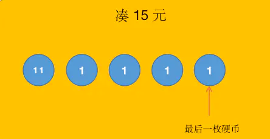
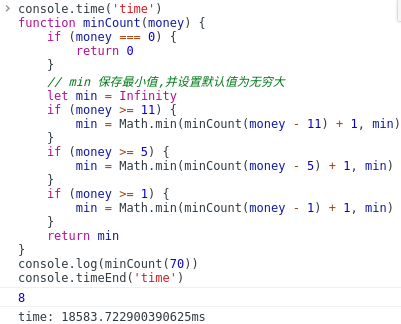
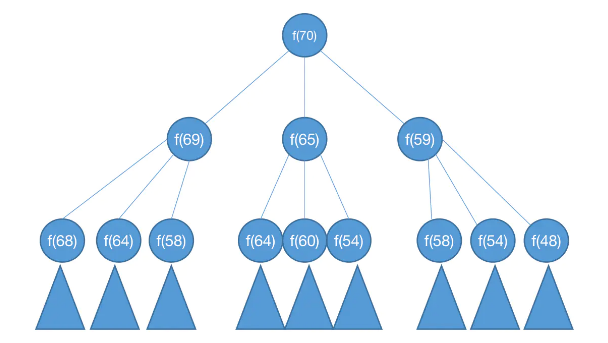
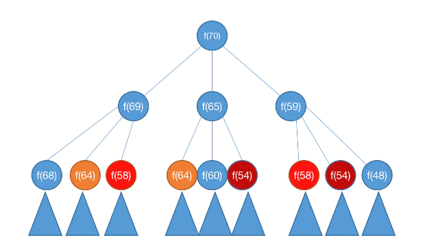
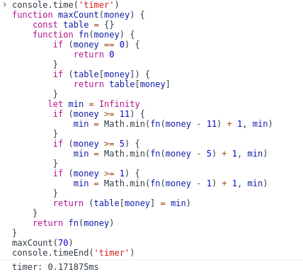
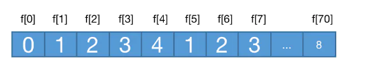
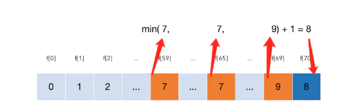

# 贪心算法与动态规划

## 贪心算法

### 概念

-  贪心算法(又称贪婪算法)是指, 在对问题求解时,总是做出在当前看来是最好的选择. 也就是说,不从整体最优上加以考虑, 他所做出的是在某种意义上的局部最优解
- 注意: 贪心算法并不保证会得到最优解,但是在某些问题上贪心算法的解就是最优解. 要会判断一个问题是否用贪心算法来计算.

### 实际问题举例

#### 找零问题

假设你是一个商店老板，你需要给顾客找零n元钱，你手上有的钱的面值为：100元，50元，20元，5元，1元。请问如何找零使得所需要的钱币数量最少？

例子：你需要找零126元，则所需钱币数量最少的方案为100元1找，20元1张，5元1张，1元1张。

```js
let allmoney = [20, 5, 100, 50, 1]
function minMoneyCount(n, allmoney) {
    allmoney.sort((prev, next) => {
        return prev > next ? -1 : 1
    })
    let res = {}
    for (let i = 0; i < allmoney.length; i++) {
        res[allmoney[i]] = 0
        if (n >= allmoney[i]) {
            res[allmoney[i]] = parseInt(n / allmoney[i])
            n = n - res[allmoney[i]]  * allmoney[i]
        }
    }
    return res
}
minMoneyCount(126, allmoney)  // {1: 1, 5: 1, 20: 1, 50: 0, 100: 1}
```


#### 背包问题

> 有一个小偷，他进到了一个店里要偷东西，店里有很多东西，每个东西的价值是v，每个东西的重量是w。但是小偷只有一个背包，他背包总共能承受的重量是W。请问怎么拿东西能让他拿到的价值最大？

背包问题又可以分成两个问题：0-1背包和分数背包。

> **0-1背包**：指的是对于某个商品来说，你要么不拿，要么全拿走，不能只拿一半或者只拿三分之二。可以将商品理解成金砖，你要么整块拿走，要么不拿，不能拿半块。

> **分数背包**：分数背包就是跟0-1背包相反的，你可以只拿一部分，可以拿一半，也可以拿三分之二。可以将商品理解成金砂，可以只拿一部分。

举例:

- 商品1: v1=60 w1=10
- 商品2: v2=100 w2 = 20
- 商品3: v3=120 w3=30
- 背包容量: W=50

我们先假设上面的例子是0-1背包，最贵的是v1，然后是v2，v3。我们先拿v1, 背包还剩40，拿到总价值是60，然后拿v2，背包还剩20，拿到总价值是160。然后就拿不下了，因为v3的重量是30，我们背包只剩20了，装不下了。但是这个显然不是全局最优解，因为我们明显可以看出，如果我们拿v2，v3，背包刚好装满，总价值是220，这才是最优解。**所以0-1背包问题不能用贪心算法。**

但是分数背包可以用贪心，因为我们总是可以拿最贵的。我们先拿了v1, v2，发现v3装不下了，那拿一部分v3就可以了

```js
let shop = [{id: 1, v: 60, w: 10}, {id: 2, v: 100, w: 20}, {id: 3, v: 120, w: 30}]
function maxPrice(w, shop) {
    shop.sort((prev, next) => {
        let diff  = prev.v / prev.w > next.v / next.w
        return diff ? -1 : 1
    })
    let price = 0
    for (let i = 0; i < shop.length; i++) {
        if (w > shop[i].w) {
            w = w - shop[i].w
            price = price + shop[i].v
        } else if (w > 0) {
            price = price + shop[i].v  * (w/ shop[i].w)
            w = 0
        }
    }
    return price
}
maxPrice(50, shop) // 240
```

#### 数字拼接问题

有n个非负整数,将其按照字符串拼接的方式拼接为一个整数,如何拼接可以使得到的整数最大

思路:

首先最容易想到的方式是通过冒泡两两比较数字的大小将大的放到前面, 这里的大小可以理解为(Number的大小或是字符的大小,两种大小是一致的),如 : 586 > 123. 但是该比较方法存在问题, 当两个数字的位数不一致时,结果就可能出现问题 如 5863 > 586 拼接 5863586 , 但实际上 5865863 这种方式的结果更大, 为了解决这个问题, 就可以代入贪心(**贪的是大拼接数**)的思想, 通过将两个数字以不同的方式拼接, 比较字符序大小,拼接结果大的放到前面,整体排序后,得到最终结果

```js
const nums = [32, 94, 128, 1286, 6, 71];
function maxNumber(nums) {
    nums.sort((prev, next) => {
        let str1 = `${prev}${next}`
        let str2 = `${next}${prev}`
        if (str1 > str2) {
            return -1
        } else if (str1 < str2) {
            return 1
        }
        return 0
    })
    return +nums.join('')
}
maxNumber(nums) // 94716321286128
```


#### 活动选择问题

假设有n个活动要占用同一片场地,而场地在同一时刻只能供一个活动使用,每个活动都有一个开始时间s 结束时间f,表示活动在 [s , f]区间占用场地, 问怎么安排活动可以使该场地举办的活动个数最多

| i(序号) | 1    | 2    | 3    | 4    | 5    | 6    | 7    | 8    | 9    | 10   | 11   |
| ------- | ---- | ---- | ---- | ---- | ---- | ---- | ---- | ---- | ---- | ---- | ---- |
| s       | 1    | 3    | 0    | 5    | 3    | 5    | 6    | 8    | 8    | 2    | 12   |
| f       | 4    | 5    | 6    | 7    | 9    | 9    | 10   | 11   | 12   | 14   | 16   |

思路: 

为了尽可能安排多的活动, 我们最先安排的活动结束时间要尽可能的早,这样余下的时间会更长,选择也会更多, 因此,这里贪心贪的就是每次可选活动中,结束时间最早的活动

```js
const activities = [
  {start: 3, end: 5},
  {start: 6, end: 10},
  {start: 0, end: 6},
  {start: 5, end: 7},
  {start: 1, end: 4},
  {start: 3, end: 9},
  {start: 8, end: 12},
  {start: 5, end: 9},
  {start: 8, end: 11},
  {start: 2, end: 14},
  {start: 12, end: 16},
];

function changeActive(activities) {
    // 按结束时间排序活动
    activities.sort((prev, next) => {
        return prev.end > next.end ? 1 : -1
    })
    // lastEnd 保存当前结束时间,用于与start比较 ,res 返回的活动安排
    let lastEnd = 0, res = []
    for (let i = 0; i < activities.length; i++) {
        // 判断结束时间是否超过当前遍历活动的开始时间, 不超过时执行其中代码
        if (lastEnd <= activities[i].start) {
            // 更新lastEnd 添加活动安排
            lastEnd = activities[i].end
            res.push(activities[i])
        }
    }
    return res
}
changeActive(activities)  // [{start: 1, end: 4}, {start: 5, end: 7}, {start: 8, end: 11}, {start: 12, end: 16}]

```


## 动态规划

### 通过找零问题了解动态规划

#### 新的问题

- 在上文中,我们使用贪心算法解决了找零问题 ,但这是建立在钱币面值合理的基础上, 比如,要凑足15元,可以使用现实中的10和5元来凑, 但如果钱币面额不合理 ,比如 面额为 11 , 5, 1此时求最小纸币数量, 如果使用贪心算法, 得到的结果是 一个 11 四个1 共五个币, 但实际上,可以很容易看出,最少的情况是使用三个5元币,凑齐, 那么针对该情况,就应该使用新的解法

#### 递归解决

- 通过分析题目,它的问题其实是「给定一组面额的硬币,我们用现有的币值凑出n最少需要多少个币」。

  我们要凑够这个 n,只要 n 不为0,那么总会有处在最后一个的硬币,这个硬币恰好凑成了 n,比如我们用 `{11,1,1,1,1}` 来凑15,前面我们拿出 `{11,1,1,1}`,最后我们拿出 `{1}` 正好凑成 15。





如果用 `{5,5,5}` 来凑15,最后一个硬币就是5,我们按照这个思路捋一捋,：

- 那么假设最后一个硬币为11的话，那么剩下4，这个时候问题又变成了，我们凑出 n-11 最少需要多少个币,此时n=4，我们只能取出4个面值为1的币
- 如果假设最后一个硬币为 5 的话，这个时候问题又变成了，我们用现有的币值凑出 n-5 最少需要多少个币

由此可以发现, 我们的问题提可以不断被分解为「我们用现有的币值凑出 n 最少需要多少个币」,比如我们用 f(n) 函数代表 「凑出 n 最少需要多少个币」.

把「原有的大问题逐渐分解成类似的但是规模更小的子问题」这就是最优子结构,我们可以通过自底向上的方式递归地从子问题的最优解逐步构造出整个问题的最优解。

这个时候我们分别假设 1、5、11 三种面值的币分别为最后一个硬币的情况：

- 最后一枚硬币的面额为 11: min = f(4) + 1
- 最后一枚硬币的面额为 5: min = f(10) + 1
- 最后一枚硬币的面额为 1: min = f(14) + 1

这个时候大家发现问题所在了吗?最少找零 min 与 `f(4)、f(10)、f(14)` 三个函数解中的最小值是有关的，毕竟后面的「+1」是大家都有的。

假设凑的硬币总额为 n，那么  `f(4) = f(n-11)`、`f(10) = f(n-5)`、`f(14) = f(n-1)`，我们得出以下公式:

```apl
f(n) = min(f(n-11), f(n-5), f(n-1)) + 1
```

我们再具体到上面公式中 `f(n-1)` 凑够它的最小硬币数量是多少,将它单独拆解, 又变成下面这个公式:

```apl
f(n-1) = min(f(n-12), f(n-6), f(n-2)) + 1
```

之后可以以此类推,继续拆分, 这实际上就是递归, 由此得出递归版本代码

```js
function minCount(money) {
    if (money === 0) {
        return 0
    }
    // min 保存最小值,并设置默认值为无穷大 
    let min = Infinity
    if (money >= 11) {
        min = Math.min(minCount(money - 11) + 1, min)
    }
    if (money >= 5) {
        min = Math.min(minCount(money - 5) + 1, min)
    }
    if (money >= 1) {
        min = Math.min(minCount(money - 1) + 1, min)
    }
    return min
}
minCount(15) // 3
```

#### 递归的问题



根据上图测试结果可以看出,当money为70时, 计算结果需要将近19s,如果money更大,就会容易造成更长时间的等待,甚至爆栈(指递归栈的长度超出最大值)

为什么会造成如此长的执行耗时?归根到底是递归算法的低效导致的,如下图:



我们如果计算f(70)就需要分别计算最后一个币为1、5、11三种面值时的不同情况，而这三种不同情况作为子问题又可以被分解为三种情况，依次类推...这样的算法复杂度有 O(3ⁿ) ，即 O(m^n^) m代表币的数量，n代表要凑的值,这是极为低效的。

再次对图进行分析



可以看到,用特殊颜色标出来的计算函数,他们是完全重复的,比如两个f(64), 两个f(58), 两个f(54),而且该图只展示了递归的一部分,还有非常多的重复计算没有在图中展示, 由此可见算力造成了巨大的浪费

####　备忘录与递归

既然已经知道存在大量冗余计算了,那么我们可不可以建立一个备忘录,把计算过的答案记录在备忘录中,在计算之前,我们去备忘录中查找,如果能查找到就直接返回答案,这样就避免了重复计算,这就是算法中典型的空间换时间的思维，我们用备忘录占用的额外内存换取了更高效的计算。

有了思路后,其实代码实现非常简单,我们只需要建立一个缓存备忘录,在函数内部校验校验是否存在在结果,如果存在返回即可。

```js
function maxCount(money) {
    const table = {}
    function fn(money) {
        if (money == 0) {
            return 0
        }
        if (table[money]) {
            return table[money]
        }
        // 注意，最初的min需要在递归内部定义，　如果定义在外面　min 恒为　0 + 1 = 1 不会根据递归的次数去累加
 	   let min = Infinity
        if (money >= 11) {
            min = Math.min(fn(money - 11) + 1, min)
        }
        if (money >= 5) {
            min = Math.min(fn(money - 5) + 1, min)
        }
        if (money >= 1) {
            min = Math.min(fn(money - 1) + 1, min)
        }
        return (table[money] = min)
    }
    return fn(money)
}
maxCount(70)　// 8
```



根据可以看出,优化过后，当money为70时, 得出结果只需 0.17s

实际上利用备忘录来解决递归重复计算的问题叫做「记忆化搜索」

这个方法本质上跟回溯法的「剪枝」是一个目的，就是把上图中存在重复的节点全部剔除,只保留一个节点即可,当然上图没办法把所有节点全部展示出来,如果剔除全部重复节点最后只会留下线性的节点形式:


这个带备忘录的递归算法时间复杂度只有O(n),已经跟动态规划的时间复杂度相差不大了。

既然复杂度相近，那么为什么还要考虑动态规划，这是因为此时依然存在上文提及的**爆栈**问题

编程语言栈的深度是有限的,即使我们进行了剪枝,在五位数以上的情况下就会再次产生爆栈的情况,这导致递归根本无法完成大规模的计算任务。

这是递归的计算形式决定的,我们这里的递归是**「自顶向下」**的计算思路，即从 `f(70) f(69)...f(1)` 逐步分解,这个思路在这里并不完全适用,我们需要一种**「自底向上」**的思路来解决问题。

「自底向上」就是 `f(1) ... f(70) f(69)`通过小规模问题递推来解决大规模问题,动态规划**通常是用迭代取代递归**来解决问题。

> 「自顶向下」的思路在另一种算法思想中非常常见,那就是分治算法

除此之外,递归+备忘录的另一个缺陷就是再没有优化空间了,因为在最坏的情况下，递归的最大深度是 n。

因此，我们需要系统递归堆栈使用 O(n) 的空间,这是递归形式决定的,而换成迭代之后我们根本不需要如此多的的储存空间,我们可以继续往下看。

#### 动态转移方程

还记得上面我们利用备忘录缓存之后各个节点的形式是什么样的吗,我们把它这个「备忘录」作为一张表，这张表就叫做 DP table,如下:





> 注意: 上图中 `f[n]` 代表凑够 n 最少需要多少币的函数,方块内的数字代表函数的结果

我们不妨在上图中找找规律?

我们观察`f[1]`: `f[1] = min(f[0], f[-5], f[-11]) + 1`

由于`f[-5]` 这种负数是不存在的,我们都设为正无穷大,那么`f[1] = 1`。

再看看`f[5]`: `f[1] = min(f[4], f[0], f[-6]) + 1`,这实际是在求`f[4] = 4`、`f[0] = 0`、`f[-6]=Infinity`中最小的值即0，最后加上1，即1，那么`f[5] = 1`。

发现了吗？我们任何一个节点都可以通过之前的节点来推导出来，根本无需再做重复计算，这个相关的方程是:

```apl
f[n] = min(f[n-1], f[n-5], f[n-11]) + 1
```

还记得我们提到的动态规划有更大的优化空间吗?递归+备忘录由于递归深度的原因需要 O(n) 的空间复杂度,但是基于迭代的动态规划只需要常数级别的复杂度。

看下图,比如我们求解 f(70),只需要前面三个解,即 `f(59)` `f(69)` `f(65)` 套用公式即可求得,那么 `f(0)f(1) ... f(58)` 根本就没有用了,我们可以不再储存它们占用额外空间,这就留下了我们优化的空间。





上面的方程就是动态转移方程,而解决动态规划题目的钥匙也正是这个动态转移方程。

当然,如果你只推导出了动态转移方程基本上可以把动态规划题做出来了,但是往往很多人却做不对,这是为什么?这就得考虑边界问题。

#### 边界问题

部分的边界问题其实我们在上面的部分已经给出解决方案了,针对这个找零问题我们有以下边界问题。

**处理f[n]中n为负数的问题**: 针对这个问题我们的解决方案是凡是n为负数的情况,一律将`f[n]`视为正无穷大,因为正常情况下我们是不会有下角标为负数的数组的,所以其实 n 为负数的 `f[n]` 根本就不存在,又因为我们要求最少找零,为了排除这种不存在的情况,也便于我们计算,我们直接将其视为正无穷大,可以最大程度方便我们的动态转移方程的实现。

**处理f[n]中n为0的问题**：`n=0` 的情况属于动态转移方程的初始条件,初始条件也就是动态转移方程无法处理的特殊情况,比如我们如果没有这个初始条件,我们的方程是这样的: `f[0] = min(f[-1], f[-5], f[-11]) + 1`,最小的也是正无穷大,这是特殊情况无法处理,因此我们只能人肉设置初始条件。

处理好边界问题我们就可以得到完整的动态转移方程了:

```apl
f[0] = 0 (n=0)
f[n] = min(f[n-1], f[n-5], f[n-11]) + 1 (n>0)
```

#### 找零问题最终解析

假设给出不同面额的硬币 coins 和一个总金额 amount。编写一个函数来计算可以凑成总金额所需的最少的硬币个数。如果没有任何一种硬币组合能组成总金额，返回 -1。

比如:

```
输入: coins = [1, 2, 5], amount = 11
输出: 3 
解释: 11 = 5 + 5 + 1
```

其实上面的找零问题就是我们一直处理的找零问题的通用化,我们的面额是定死的,即1、5、11，这次是不定的，而是给了一个数组 coins 包含了相关的面值。

有了之前的经验,这种问题自然就不再话下了,我们再整理一下思路。

**确定最优子结构:** 最优子结构即原问题的解由子问题的最优解构成,我们假设最少需要k个硬币凑足总面额n,那么`f(n) = min{f(n-cᵢ)}`, `cᵢ` 即是硬币的面额。

**处理边界问题:** 依然是老套路,当n为负数的时候,值为正无穷大,当n=0时,值也为0.

**得出动态转移方程**:

```
f[0] = 0 (n=0)
f[n] = min(f[n-cᵢ]) + 1 (n>0)

```

我们根据上面的推导,得出以下代码:

```js
function minCount(coins, money) {
    const dptable = new Array(money +1).fill(Infinity)
    dptable[0] = 0
    for (let i = 1; i < dptable.length; i++) {
        for (let coin of coins) {
            if (coin <= i) {
                // 这里右侧动态转移方程中的dptable[i]第一次循环时是默认值，后面的是上次 coin 循环的最小值，
                // dptable[i - coin] + 1 代表当前 coin所得的值
                dptable[i] = Math.min(dptable[i], dptable[i - coin] + 1)
            }
        }
    }
    // 如果值仍为无穷大，代表没有合理方案返回 -1 其他结果直接返回dp 中的值
    return dptable[money] === Infinity ? -1 : dptable[money]
}
```

#### 如何判定是否使用动态规划

其实最准确的办法就是看题目中的给定的问题，这个问题能不能被分解为子问题，再根据子问题的解是否可以得出原问题的解。

当然上面的方法虽然准确,但是需要一定的经验积累,我们可以用一个虽然不那么准确,但是足够简单粗暴的办法,如果题目满足以下条件之一,那么它大概率是动态规划题目:

- 求最大值，最小值
- 判断方案是否可行
- 统计方案个数

