# 一:准备流程

注：疑惑总结：

1.vue-router 的跳转的问题，因为vue组件化，相当于一个组件树，上层组件必定显示在现在，通过路由可以做到同级路由组件的跳转，但是同级组件之间，都会处于共同的上级组件样式基础上

2.vuex有的调用actions方法后，后续代码需要在then中处理，有的不用。这主要取决于，是否要马上使用方法中改变的值，如果不是马上处理，那么后续代码就不需要写在then中

3.main.js为什么要给予样式，因为main.js作为入口文件，它的样式是全局样式，会呈现在所有组件中，而`global.scss`在每个组件中都需要引入是因为，它是scss文件，与其他的`css, js文件不一样`只在main.js引入的话`global.scss`在其他组件中不会生效

## 1.1项目涉及的技术栈

### vue方面 ：

-  vue全家桶
-  vue-cli 3.0
-  vue调试工具 
-  vue-i18n(一款用于vue国际化的插件，可实现多语言切换)

### HTML5

- range 控件    （实现自定义滑块）
- audio 控件    （实现自定义听书播放器）
- LocalStrorage   本地存储，实现本地数据缓存
- IndexDB           实现电子书的离线存储

### CSS 

- 字体图标；Web字体
- keyframes 动画
- scss 
- rem

###  Javascript

- ES6   
- mock.js  (生成随机数据，拦截Ajax请求，用于模拟接口)
- touch 、 mouse 事件 (触摸，点击事件)
- axios

### 阅读器

- epubjs      阅读器引擎
- 科大讯飞api   （语音合成api 用于听书）
- Reader  阅读器组件，自己封装的
- book.js   常见的电子书操作库，自己封装的

### 发布

- Git
- Node.js
- 阿里云
- Nginx

## 1.2基本流程

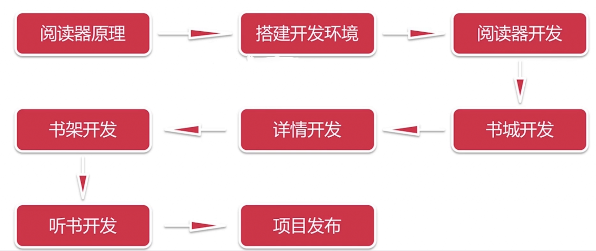

 ## 1.3整体需求分析

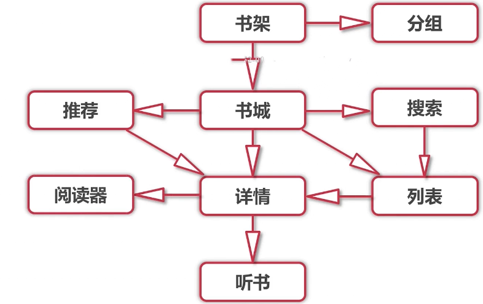

## 1.4epub电子书的介绍

这部分内容可见快速入门web阅读器开发.md

## 1.5关于epub.js阅读器引擎

- 是一个基于JavaScript的开源阅读器引擎 https://github.com/futurepress/epub.js

epbu.js中的常用类

| 类名         | 作用                                                         |
| ------------ | ------------------------------------------------------------ |
| Book         | 阅读器完成对图书的解析                                       |
| Rendition    | 实现阅读器的渲染                                             |
| Locations    | 负责阅读器的定位                                             |
| Navigation   | 存储目录信息                                                 |
| View Manager | 负责管理阅读器渲染出来的视图                                 |
| EpubCFI      | 利用Epub的CFI标准，对Epub中的字符进行定位，可以定义到任意符合要求的字符 |
| Theme        | 负责管理场景的切换                                           |
| Spine        | 负责指定阅读顺序                                             |
| Section      | 负责指定章节，实现全文检索 章节切换                          |
| Contents     | 负责管理某一章节的全部资源内容，如为某一章节添加指定字体     |
| Hook         | 定义了钩子函数 ，用于管理某个类的生命周期                    |
| Annotations  | 负责管理标签，如文字高亮显示                                 |

## 1.6Node.js环境搭建

- 基于V8引擎，可以让代码脱离浏览器运行
- VueCLI3.0需要 Node.js 8.9 版本及以上的支持

### 多个项目node切换版本的解决方案: nvm 

在有多个项目共同进行时，所使用的node版本不一定相同，或者是要用更新的node版本进行试验和学习。这种情况下，对于维护多个版本的node将会是一件非常麻烦的事情，而`nvm`就是为解决这个问题而产生的，他可以方便的在同一台设备上进行多个node版本之间切换

mac环境使用·：https://github.com/nvm-sh/nvm

 ==该项目本身就是mac和linux环境使用的，window想要使用就的下载该链接中的window版本==

windows环境使用：https://github.com/coreybutler/nvm-windows

相关帖子： https://www.jianshu.com/p/d0e0935b150a

### nvm的安装和使用

安装过程中如果出现下图弹窗，证明系统已有node ，NVM询问是否需要由它管理之前的node,选是即可

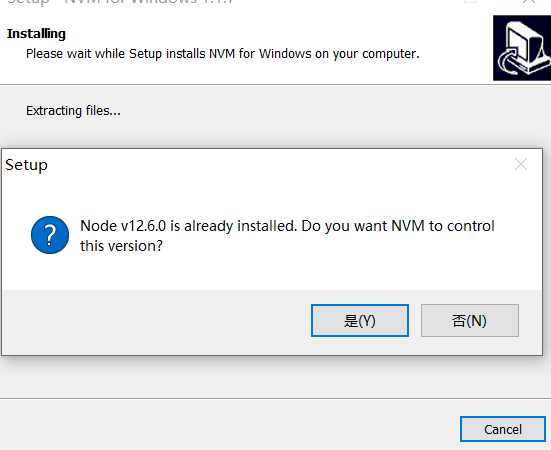

安装完毕后执行 `nvm -v`如果弹出对应版本信息，则安装成功

**常用命令**

- nvm install node 安装最新版本node
- nvm install 12.6.0 安装指定版本node
- nvm use 12.6.0 使用指定版本node
- nvm ls 查看全部已安装的node版本 正在使用的版本前面会有*号
- nvm uninstall 12.6.0 卸载指定版本
- nvm -v 查看nvm版本信息

## 1.7VueCLI3环境配置

### 安装

1.如果有Vue-CLI2存在 需要将其卸载，`npm uninstall vue-cli -g`

2.安装VueCLI3 `npm install @vue/cli -g`

注：在3.x中使用2.x 需安装如下工具
`npm install -g @vue/cli-init`

3.如果需要进行原型开发`npm install @vue/cli-service-global -g`

注：安装原型开发后，就可以直接执行vue单文件 命令`vue serve 文件名`

service: 服务 device ：设备，装置

4.使用图形化界面`vue ui`

## 1.8新建项目

### 新建过程

`vue create 项目名`  

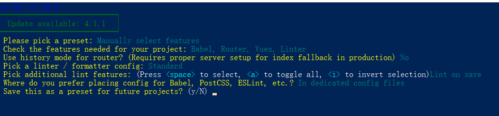

选项分别为：

1.选择自定义风格还是默认风格， 这里选择了自定义

2.选择项目当中需要的插件 这里选择了 Bable Router Vuex Linter

3.询路由是否使用history模式  这里选择no  继续使用原有的hash模式

4.选择eslint的版本 选择了倒数第二个选项，即 Standard

5.什么时候进行lint校验，选择了默认的 Lint on save 

6.Babel PostCss ESLint  etc的配置信息放到那 ，选择放置到专用的文件中

7.是否保存你的配置风格，这里暂不保存，选择 no

### 打包过程

1.使用`npm run bulid`进行打包， 之后打开dist文件夹中的index.html ，查看页面，页面空白

2.通过打开Chrome的检查，观察network 栏发现，由于路径错误引起空白页

3.在项目根目录下新建  `vue.config.js`进行配置

参考网页 https://cli.vuejs.org/zh/config/#publicpath

```javascript
module.exports = {
   / *   vue-cli 3.0.0 用该方法配置
  baseUrl: process.env.NODE_ENV === 'production'? './' : '/'       
     */
              
    // vue -cli 3.3 版本及以上使用 publicPath
    publicPath: process.env.NODE_ENV === 'production'
    ? './'
    : '/'
    
}

```

`publicPath: process.env.NODE_ENV === 'production'  ? './'  : '/'` 部署应用包的基本URL,前面的 production是指 生产环境下，也就是说，生产环境下使用，`./`作为基本路径，其他环境，如开发环境，使用`/`作为基本路径

注： 打包后的dist文件夹中的index.html就属于 生产环境  而打包前 npm run serve 开启的服务器，所用的就是 开发环境

注2： `npm --save-dev`的包就是开发环境的包 `npm --save`的包则是生产环境的包

## 1.9epub.js安装与测试

`npm install epub.js -s`

删除App.vue Home.vue中多余的代码 将测试用的电子书放入 public中 

编写Home.vue组件 

```vue
<template>
  <div class="home">
      // 注意 这里是id ~!!!!
    <div id="read"></div>
  </div>
</template>

<script>
import Epub from 'epubjs'

export default {
  name: 'home',
  mounted() {
    this.book = new Epub('/2018_Book_AgileProcessesInSoftwareEngine.epub')
    this.book.renderTo('read', {
      width: window.innerWidth,
      height: window.innerHeight
    }).display()
  },
  components: {
  }
}
</script>

```

## 1.10技术难点

分页算法： 对阅读器进行分页码，不同屏幕尺寸页码总数不同

全文搜索算法：高效的对阅读器进行全文搜索，并能定位到搜索的结果

引入web字体：Css3新特性，允许用户自定义字体

主题设计：能够更改整个阅读器，乃至于界面

离线存储机制： 用于书架  LocalStorage + IndexedDB

实现各种复杂手势 + 交互动画，如何兼容手势 + 鼠标操作

利用vuex + minin 实现组件解耦 + 复用， 精简代码量

利用es6优雅实现数据结构变化 ：如 数组-》对象  对象-》数组

科大讯飞Web在线语音合成API开发

## 1.11字体图标准备

1.首先在图标的资源网站上（如：https://www.iconfont.cn/）找到想要的图标，下载SVG格式的图标

2.登录icomoon（https://icomoon.io/）新建空的集合，将下载的字体图标导入

3.选中所有需要的图标，点击Generate Font，之后点击Download 将其下载到本地 

4.将下载的icomoon.zip 解压为 icomoon 文件夹 ，文件夹中的fonts文件夹 和 style.css 就是之后项目中需要文件

5.在项目的`scr-assets`下新建styles目录，将4步中的style.css 改名为 icon.css 把它与fonts文件夹拷贝到styles目录中

6.在main.js中通过`import`引入icon.css 之后即可使用

```javascript
import './assets/styles/icon.css'
```

Home.vue中删除先前的epubjs测试内容，对图标进行测试

```vue
<template>
  <div class="home">
    <span class="icon-book"></span>
  </div>
</template>
<script>
export default {
  name: 'home'
}
</script>
<style scoped>
  .icon-book {
    font-size: 30px;
    color: red;
  }
</style>
```

## 1.12项目依赖包下载 + 项目配置

- 下载sass支持包
  - `cnpm install --save-dev node-sass sass-loader`

## 1.13准备Web字体

### 优点

- 在CSS3之前，web设计师必须使用已在用户计算机上安装后的字体。
- 而通过CSS3，则可以使用任意字体
- 将字体文件放到web服务器上，他会在需要时自动下载到用户的计算机
- 字体使用CSS3的@font-face 规则定义

### 使用流程

使用方式一：

1.这里我们使用Google Fonts查找想要的字体（https://fonts.google.com/）

2.点击字体右上角的加号，就可以将其加入到备选栏，在栏中，可以得到字体的引用链接，包括link引入与 @import 引入 可以将链接直接放入项目中使用（注：图中的CUSTOMIZE用于定制字体）

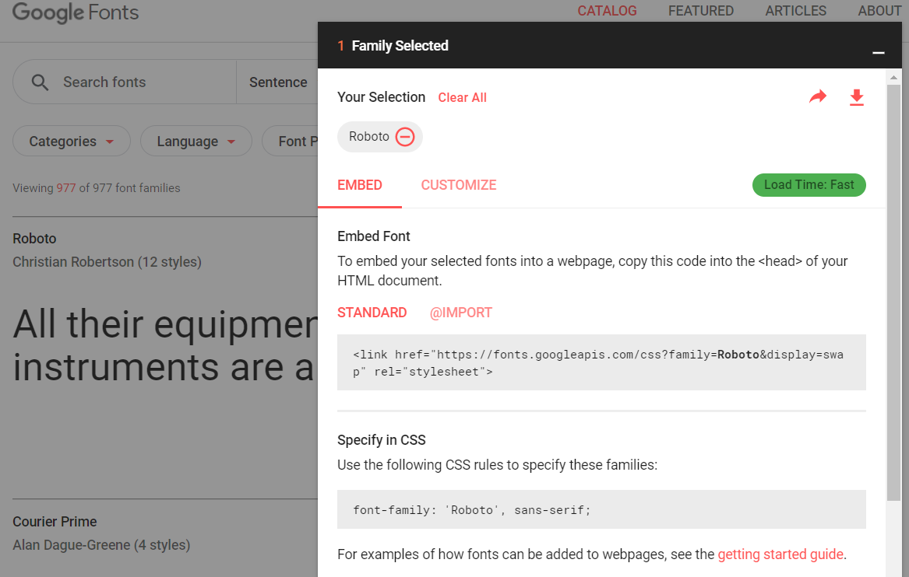

使用方式二：

如果单纯用于自己使用，不需要考虑在其他客户机上查看，可以点击右侧的下载图标，就能够得到，后缀为`.ttf`的文件，该文件能够直接装在电脑上，自己使用。

使用方式三：

由于方式一中使用链接引入，用户难免在不同的网络环境下导致加载字体过慢（墙的问题），所以可以

1.访问给出的字体链接

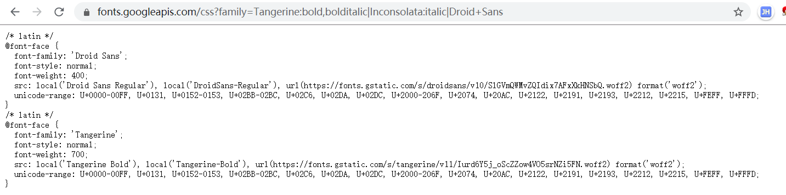

2.选择需要的@font-face,在本机新建一个css文件(名字自取)，将需要的@font-face，保存到这个文件中，注：==*unicode-range*属性是用来 保存使用的unicode码范围，因为不同的字体，支持不同的范围，而不在这个范围中的，就使用默认或其他设置的字体==

相关文章：

https://www.zhangxinxu.com/wordpress/2016/11/css-unicode-range-character-font-face/

3.之后从@font-face下的src属性中，复制对应的链接地址，下载对应的woff2文件（名字最好重命名为与css文件相对应的名字）

4.将上述步骤得到的一个或多个 css 与 woff2文件 放到同一个文件夹下

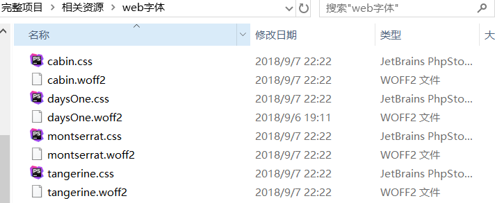

5.将每一个css文件的url地址，都改为对应woff2文件的相对路径

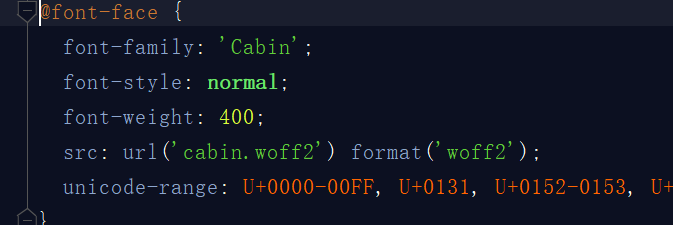

6.将文件夹命名为 fonts 放入 项目`public`目录下

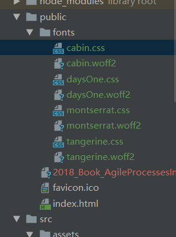

7.在项目中引入字体

- 通过Link 标签，在`index.html`文件中引入
- 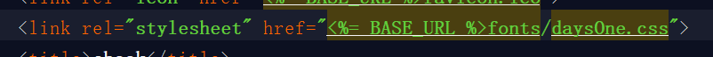

- 通过import 标签，在`main.js`中引入 注： 这里为了方便路径填写，将fonts文件夹复制到了`src-assets`文件夹下
- 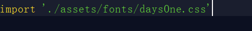


8.使用  这里在Home.vue中进行了测试

```vue
<template>
  <div class="home">
    <span class="test">ABCDE</span>
  </div>
</template>
<script>
export default {
  name: 'home'
}
</script>
<style scoped>
  .test {
    font-family: "Days One";  // 像这样直接使用即可
    color: red;
  }
</style>

```


## 1.14viewport配置

在`index.html`中进行配置

```html
    <meta name="viewport" content="width=device-width,initial-scale=1.0,maximum-scale=1.0,minimum-scale=1.0,user-scalable=no">

```


## 1.15rem设置 - 自适应布局实现思路

由于rem受html的font-size影响，所以在`App.vue`中实现响应式的font-size,单位为px

```javascript
document.addEventListener('DOMContentLoaded', () => {
  const html = document.querySelector('html')
  let fontSize = window.innerWidth / 10
  if (fontSize > 50) fontSize = 50
  html.style.fontSize = fontSize + 'px'
})
```


## 1.16global.scss 和 reset.scss 

### reset.scss

- 在`assets-styles`文件夹下新建`reset.scss`

- 从 https://meyerweb.com/eric/tools/css/reset/ 拷贝css代码到该scss文件中

- 在reset.scss最后添加一些新代码

- ```scss
  html,body {
    width: 100%;
    height: 100%;
    user-select: none; // 文本不可选
    overflow: hidden;
    font-family: 'PingFangSC-Light','PingFang SC','STHeitiiSC-Light','Helvetica-Light','Arial','sans-serif';
  }
  ```

### global.scss

- 在`assets-styles`文件夹下新建`global.scss`

- 引入`reset.scss`并加入一些公共代码

- ```scss
  @import "./reset";
  
  $ratio: 375 / 10;   
  
  
  @function px2rem($px) {
    @return $px / $ratio + rem;
  }
  
  @mixin center {
    display: flex;
    justify-content: center;
    align-items: center;
  }
  
  
  ```

- 将`global.scss`引入 App.vue 

- 注1：可以直接加后缀引入`@import "./assets/styles/global.scss" ` 如果想不加后缀引入，需要在 style标签中加入 `lang=scss` ，这时可以使用·`@import "./assets/styles/global"` 引入

- 注2：

**1.$ratio(比例的意思) 的值可以根据需求(UI设计稿)随意设定 **

**2.当设置为375 / 10 时代表以屏幕375px 为基准**

**注：.因为 1rem等于 html的font-size(这就相当于，如果给某个字体设置了rem比率,如0.6rem，那么 0.6 * html的font-size就等于真实的px值) ,通过1和2的设置，相当于在传入$px时，通过固定的 px值 除以  固定的font-size  的到了rem比率，由此设置了以375为基准的比率，然后又因为上面响应式确定屏幕宽度的得到了 变化的html的font-size,从而可以动态改变，真实的px值**

3.**当屏幕宽度大于375px时 px2rem()计算出来从rem转为px的值会等比例扩大**

4.**当屏幕宽度小于375px时 px2rem()计算出来的值从rem转为px的值会等比例缩小**

- 注3：

- sass文件不能像CSS文件那样，直接在`main.js`中全局导入，如果想要全局导入某个sass文件，需要在vue.config.js中进行配置

- ```javascript
  module.exports = {
      css: {
          loaderOptions: {
              // 给sass-loader 传递选项
              sass: {
                  data: `./src/assets/styles/global.scss`
              }
          }
      }
  }
  
  ```

## 1.17引入Vuex

### Vuex介绍

Vuex相关介绍可查看专门笔记

### 流程

这里由于先前创建项目时，已经引入了vuex，所以这时不需要再次安装,只需要将目录分好即可，目录的分法与先前较为不同，步骤如下：

1.在store文件夹下新建 `moudules`文件夹,`modules`文件夹下新建 `book.js`

2.将index.js中的 `state mutations actions `移入`book.js` 将book.js引入index.js中，并将`book`在`moudles`对象中挂载

3.之后在book.js中编写如下代码

```javascript
export default {
  state: {
    test: 1
  },
  mutations: {
    'CHANGE_TEST'(state, arg) {
      state.test = arg
    }
  },
  actions: {
    changeTest({ commit, state }, arg) {
      return commit('CHANGE_TEST', arg)
    }
  }
}

```

4.在Home.vue即可调用查看结果

```javascript
  mounted () {
    this.$store.dispatch('changeTest', 10).then(() => {
      console.log(this.$store.state.book.test)
    })
  }

```

上述打印我们发现打印test的调用过于繁琐，所以我们可以通过`vuex`中的`getters`来进行优化

5.在store文件夹下新建`getters.js`，代码如下

```javascript
const book = {
  test: (state) => state.book.test
}

export default book

```

将其引入index.js ，挂载到store实例上，作为实例的属性

6.之后在Home.vue 做如下操作

```javascript
import { mapGetters } from 'vuex'


  computed: {
    ...mapGetters(['test'])
  },
  mounted () {
    this.$store.dispatch('changeTest', 10).then(() => {
        // 打印结果相同，优化成功
      console.log(this.$store.state.book.test)  // 10
      console.log(this.test)  // 10
    })
  }

```

### ...mapGetters的实现原理

- 该方法是通过扩展运算符，将属性合并到计算属性中实现的

1.在export defalut 的同级，即不在export default 中，创建`getter`对象用于模拟getter.js中导出的对象

==注： 这里的属性值需要作为回调函数的返回值， 由于Props,methods,data,computed的初始化都在beforeCreated和create生命周期间，该生命周期早于mouted，则该周期组件没有挂载完成，所以属性值如果不用回调函数延后读取，直接读是读不到的，所以只有使用回调函数才能使computed内的对应方法延后执行获取到值==

```js
const getter = {
  a: () => 1,
  b: () => 2
}

```

2.在`computed`中调用我们自定义的函数`fn`，给函数传入一个数组作为参数，并通过扩展运算符，将函数的返回值，合并到`computed`中   注：由此可见，函数的返回值应该是一个对象，只有对象才能直接用扩展运算符进行合并

```js
...fn(['a', 'b', 'c'])

```

3.在mouted钩子函数中调用a, b, c

```javascript
 console.log(this.a, this.b, this.c)

```

4.接下来我们就要进行`fn`函数的编写

```javascript
function fn (keys) {
    const obj = {}
    // 对接收到的数组进行遍历
    keys.forEach((key) => {
        // 判断getter对象中是否存在 对应的属性
        if(getter.hasOwnProperty(key)) {
            obj[key] = getter[key]
        }
    })
    // 返回对象
    return obj
}

```

## 1.18搭建静态资源服务器

参考文章： https://blog.csdn.net/kingscoming/article/details/79042874

### 下载

选用Nginx 作为静态资源服务器 

官网： http://nginx.org/  进入官网后点击右侧边栏的download， 出现如下三类版本

Mainline version 主线版 Stable version  稳定版 Legacy versions 旧版

这里选择稳定版进行下载

下载后解压到任意文件夹

### 配置

1.打开安装目录中的conf文件夹下的nginx.conf 文件

`http`是相关http服务配置，http下的server代表服务器，其中listen属性，代表默认端口号

### 常见命令

注： 下列命令需要在nginx的安装目录下打开dos窗口执行

| 命令                                  | 效果                                                         |
| ------------------------------------- | ------------------------------------------------------------ |
| start nginx                           | 启动nginx，dos窗口会闪一下，之后在任务管理器，详细信息栏，可以看到服务是否启动 |
| tasklist /fi "imagename eq nginx.exe" | 同样可以查看已启动的ngInx服务                                |
| nginx  -t                             | 验证配置是否正确，在修改配置文件后执行，返回的信息最后有successful 即为正确 |
| nginx -V                              | 查看版本信息                                                 |
| nginx -s stop                         | 快速关闭nginx 服务 注意：经测试只能关闭一个，关多个需要任务管理器 |
| nginx -s quit                         | 正常关闭nginx 服务 注意：经测试只能关闭一个，关多个需要任务管理器 |
| nginx -s reload                       | 重启nginx 服务 ，一般用于在nginx启动状态下，修改配置文件后，执行此命令 |

`启动完毕后，由于输入地址 localhost:80即可访问`,这里80是默认的可以再修改

### 配置自己的静态资源服务器

1.在`G:\笔记\移动端书城项目`目录下新建`resource`

2.`G:\Nginx\nginx-1.16.1\conf` 目录下 打开 `nginx.conf`

在原有server 下接着新建一个serve ,内容如下

```shell
    server {
        # 端口号
        listen 81;
        # 服务名称
        server_name resource;
        # 配置文件路径 该路径是相对路径，相对于nginx的安装目录
        root ./resource;
        # 查看resource下的文件列表，也就是当你访问该域名时会列出目录，方便浏览
        autoindex on;
        location / {
            # 增加请求头，该请求头作用是允许跨域访问
            add_header Access-Control-Allow-Origin *;
        }
        # 增加请求头 作用是每次请求都需要重新验证，不能缓存
        add_header Cache-control "no-cache,must-revalidate";
    }

```

# 二：项目开发-阅读器开发

## 2.1阅读器开发部分-需求分析

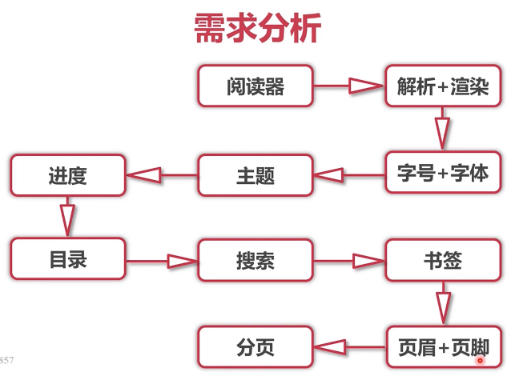

实现该需求要求的技术难点

- equbjs
- vuex + mixin
- vue-i18n
- 动态切换主题 + 书签手势操作

## 2.2准备工作

1.将电子书相关资源文件放入`nginx `目录`resource`中

2.删除项目中先前导入的电子书,将项目其他内容commit，（可以通过点击左下角的Version Control，右键选择commit，填入信息后确定；或者直接点右上角的绿色对勾commit）

3.从刚才打开的版本控制菜单，Log一栏，可以看到项目的提交日志

4.删除先前所有的测试代码

## 2.3电子书导入

1.在App.vue中

```scss
#app {
    width: 100%;
    height: 100%;
    overflow: hidden;
}

```

2.在view文件夹下,新建ebook文件夹，ebook文件夹中新建index.vue 

注意： 需要将设置<style lang="scss" rel="stylesheet/scss" scoped> 并且引入 `   @import "../../assets/styles/global";`

3.设置路由

```javascript
{
    path: '/',
    redirect: '/ebook'
  },
  {
    path: '/ebook',
    component: () => import('../views/Ebook/index')  
  }

```

4.在`src-componets`文件夹下新建`ebook`文件夹,在其中新建`EbookReader.vue`组件

注意： 需要将设置<style lang="scss" rel="stylesheet/scss" scoped> 并且引入 `   @import "../../assets/styles/global";`

5.设置路由

```js
{
    path: '/ebook',
        // 路由懒加载
    component: () => import('../views/Ebook/index') ,
    childeren: [
        // 动态路由
        path: ':fileName',
        component: () => import('../components/ebook/EbookReader')
    ]
}

```

6.在`view-ebook-index.vue`中引入 `EbookRender.vue`

```javascript
// template中
<ebook-reader></ebook-reader>

// script中
import EbookReader from '../../components/ebook/EbookReader'

components{
    EbookReader
}

```

7.在EbookReader.vue

```html
<template>
    <div class="ebook-reader">
        <!-- 测试打印下面这一行之后会删除掉 -->
        <!-- {{$route.params.fileName}} -->
        <div id="read">
            
        </div>
    </div>
</template>

<script>
    // 引入Epub
    import Epub from 'epubjs'
    
    export default {
        methods: {
            initEpub() {
                
            }
        }
        mounted() {
            //nginx 服务器目录在本机的基本网络地址
            const baseUrl = 'http://192.168.199.227:81/epub/'
            // 对输入的字符串格式进行整理
            const fileName = this.$route.params.fileName.splite('|').join('/')
            // 对地址进行拼接 ，注意需要加入文件后缀
            console.log(`${baseUrl}${fileName}.epub`)
        }
    }
</script>

```

8.截止上一步，使用vuex进行url参数传递

在`store-modules-book.js`中加入变量

```javascript
stats: {
    fileName: ''
},
mutations: {
    'SET_FILENAME': (state, fileName) => {
        state.fileName = fileName
    }
},
actions: {
    setFileName: ({commit}, fileName) => {
        return commit('SET_FILENAME', fileName)
    }
}

```

9.在getter.js中

```javascript
fileName: state => state.book.fileName

```

10.EbookReader.vue

```javascript
<script>
    import { mapGetters } form 'vuex'
    // 引入Epub
    import Epub from 'epubjs'
    
    export default {
        computed: {
            ...mapGetters(['fileName'])
        }
        methods: {
            initEpub() {
            const url = 'http://192.168.199.227:81/epub/'+this.fileName+'.epub'
            // console.log(ulr)
            this.book  = new Epub(url)
            this.rendition = this.book.rendTo('read', {
                width: window.innerWidth,
                height: widow.innerHeight,
                // 微信兼容
                method: 'defalut'
            })
            this.rendition.display()
            }
        }
        mounted() {
            this.$store.dispatch(
                'setFileName', this.$route.params.fileName.splite('|').join('/')
                 ).then(() => {
                this.initEpub()
            })
        }
    }
</script>

```

做到此处遇到的一些问题与总结：

1.给Epub实例传入的地址就是nginx服务器的地址，传入的地址必须是完整的，协议也需要有（http）

2.传入这个地址就相当于 从当前页面，对nginx服务器进行了一次跨域请求，由于之前设定了允许跨域，所以该请求是被允许的

3.这里当页面呈现出来后，发现电子书最外层依然有magin，原因是 没有在main.js中引入，global.scss，引入即可解决

## 2.4翻页实现

- 这里实现手势翻页的效果

`EbookRender.vue`

```javascript
// 该代码写在initEpub()方法中
// rendition对象中自带on方法用于绑定事件
// touchstart 当触点与触控设备接触时触发 touchend 当触点离开触控设置时触发
// 以上两个事件，返回event对象，通过event对象中的内容 可实现相应操作
// event.changedTouches 数组形式，有几个触点（手指）接触，就返回几个数组元素
		// 每个数组元素，包含着触摸时的相关数据 如： clientX,clientY（当前触摸的位置）
// event.tiemStamp 操作的时间标记
this.rendition.on('touchstart', event => {
    this.touchStartX = event.changedTouches[0].clientX
    this.touchStartTime = event.timeStamp
})
this.rendition.on('touchend', event => {
    // 横向偏移位置
    const offsetX =  event.changedtouches[0],cliendX - this.touchStartX
    // 时间差
    const time = event.timeStamp - this.touchStartTime
    if(time<500 && offsetX>40) {
        // 向前翻页
       this.prevPage()
    } else if(tiem<500 && offsetX<-40) {
        // 向后翻页
        this.nextPage()
	} else {
        // 展示菜单栏
        this.toggleTitleAndMenu()
    }
    event.preventDefault()
    event.stopPropagation()
})

```

```javascript
// 以下代码加在methods中
prevPage() {
    if(this.rendition) {
       this.rendition.prev()  // 自带的方法
       }
}
nextPage() {
    if(this.rendition) {
       this.rendition.next() // 自带的方法
       }
}
toggleTitleAndMenu() {
    
}

```

==注意！！！！==

这里想要监听touch事件需要开启touch api  (谷歌touch功能目前不可用，这里使用火狐) 

**开启步骤**

1.火狐浏览器 ，打开控制台，点击控制台的手机图标，之后点击图中右上方的小手即可


## 2.5标题栏菜单栏

### 标题栏

一：

在`src-components-ebook`下创建`EbookTitle.vue`

参考`快速入门web阅读器开发.md`进行内容的修改

修改内容（1 删除了class:  icon

2) 图标进行了部分变化

3) 暂时去掉`class="title-wrapper"`中的`v-show="ifTitleAndMenuShow"`

页面：

```html
<template>
<transition name="slide-down">
    <div class="title-wrapper">
      <div class="left">
        <span class="icon-back"></span>
      </div>
      <div class="right">
        <div class="icon-wrapper">
          <span class="icon-shelf"></span>
        </div>
        <div class="icon-wrapper">
          <span class="icon-cart"></span>
        </div>
        <div class="icon-wrapper">
          <span class="icon-more"></span>
        </div>
      </div>
    </div>
  </transition>
</template>

```

样式：

```scss
.title-wrapper {
  position: absolute;
  top: 0;
  left: 0;
  width: 100%;
  height: px2rem(40);
  box-shadow: 0 px2rem(8) px2rem(8) rgba(0, 0, 0, 0.15);
  background-color: rgb(255, 255, 255);
  display: flex;
  z-index: 200;
  .left {
    flex: 0 0 px2rem(60);
    @include center;
  }
  .right {
    flex: 1;
    display: flex;
    justify-content: flex-end;
    .icon-wrapper {
      flex: 0 0 px2rem(40);
      @include center;
      .icon-cart {
        font-size: px2rem(22);
      }
    }
  }
}

```

在index.vue中引入EbookTitle

二：

在`src-assets-styles`下新建`mixin.scss`

将global.scss中的代码剪切到`mixin.scss`中

在将mixin.scss引入global.scss （目的就是将global.scss作为整合样式的一个总文件，并不在其中编写样式）

三： 

在`EbookTitle.vue`中图标的大小进行跳整

如： `.title-wrapper`图标设为`px2rem(20)`个别图标大小设为`px2rem(22)`

左侧返回按钮设置`margin-left` 并给按钮绑定绑定`back`事件

```javascript
methods: {back() { }}   // 暂时不编写，之后完成

```

四： 

==这里出现的一个错误，第一次写时没有将menuVisible放到title-wrapper标签中，而是放到了 transition标签中，导致的问题是标签栏不会隐藏，反而动画样式，会被控制移入移出==

给`title-wrapper`绑定`v-show="menuVisible"`

在`store-modules-book.js`中

```javascript
state: {
    menuVisible: false
},
mutations: {
    'SET_MENUVISIBLE': (state,menuVisible) => {
        state.menuVisible = menuVisible
    }
},
actions: {
    setMenuVisible: ({ commit }, menuVisible) => {
        return commit('SET_MENUVISIBLE', menuVisible)
    }
}

```

`store-getters`中

```getters.js
menuVisible: state => state.book.menuVisible

```


五： 

`EbooTitle.vue`中 

```
import { mapGetters } from 'vuex'

computed: {
	...mapGetters(['menuVisible'])
}

```

`EbookReader.vue`

```javascript
...mapGetter([
    'menuVisible'
])


toggleTitleAndMenu() {
    this.$store.dispath('setMenuVisible', !this.menuVisible)
}

```

六：

在`src-assets-styles`下新建`transition.scss`设置过渡动画, 之后将其导入`global.scss`

```scss
.slide-down-enter,.slide-down-leave-to {
  transform: translate3d(0,-100%,0);  // ?下拉相当于x轴负半轴 所以-100%
}
.slide-down-enter-to,.slide-down-leave,
.slide-up-enter-to,.slide-up-leave {
  transform: translate3d(0,0,0);
}
.slide-down-enter-active,.slide-down-leave-active,
.slide-up-enter-active,.slide-up-leave-active,
.fade-enter-active, .fade-leave-active,
.slide-right-enter-active, .slide-right-leave-active {
  transition: all .3s linear; // !这里时间不能省略s
}
.slide-up-enter,.slide-up-leave-to {
  transform: translate3d(0,px2rem(90),0); // ?上升相当于x轴正半轴 所以100% 最新?这里改为px2rem(90)
}

.fade-enter,.fade-leave-to {
  opacity: 0;
}
.fade-enter-to,.fade-leave {
  opacity: 1;
}
.slide-right-enter,.slide-right-leave-to {
  transform: translate3d(-100%, 0, 0);
}

```


### 菜单栏

一：

在`src-components-ebook`下创建`EbookMenu.vue`

参考`快速入门web阅读器开发.md`进行内容的修改

1.删除了icon 重新设置了图标大小fotn-size: px2rem(20) 且对progress bright 图标大小进行微调

2.方法名改为showSetting

3.A图标已经引入所以删除原来span标签里的A

页面：

```html
<transition name="slide-up">
      <!-- 注意这里的 :class 中的 类名称需要用引号引用起来，不能直接写 -->
      <div class="menu-wrapper" v-show="menuVisible" :class="{
        'hide-box-shadow':!menuVisible}">
        <div class="icon-wrapper">
          <span class="icon-menu"  @click="showSetting(3)"></span>
        </div>
        <div class="icon-wrapper">
          <span class="icon-progress" @click="showSetting(2)"></span>
        </div>
        <div class="icon-wrapper">
          <span class="icon-bright" @click="showSetting(1)"></span>
        </div>
        <div class="icon-wrapper">
          <span class="icon-A" @click="showSetting(0)"></span>
        </div>
      </div>
    </transition>

```

样式

```scss
  .menu-wrapper {
    position: absolute;
    bottom: 0;
    left: 0;
    width: 100%;
    height: px2rem(40);
    box-shadow: 0 px2rem(-8) px2rem(8) rgba(0, 0, 0, 0.15);
    background-color: rgb(255, 255, 255);
    display: flex;
    z-index: 200;
    &.hide-box-shadow {
      box-shadow: none;
    }
    .icon-wrapper {
      flex: 1;
      @include center;
      .icon-progress {
         font-size: px2rem(24)   
      }
      .icon-bright {
         font-size: px2rem(22)   
      }  
    }
  }

```

script

```javascript
import { mapGetters} from 'vuex'
export default {
    computed: {
      ...mapGetters(['menuVisible'])  
    },
    methods: {
        showSetting(key) {}
    }
}

```

将该组件引入`Ebook-index.vue`

二： 

在`mixin.scss`中加入如下代码,之后样式会用到

```scss
@mixin left {
  display: flex;
  justify-content: flex-start;
  algin-items: center;
}
@mixin right {
  display: flex;
  justify-content: flex-end;
  algin-items: center
}

```

三：

在`EbookReader.vue`中新建方法

用于翻页自动隐藏标题菜单栏

```javascript
methods: {
    // 隐藏标题菜单
    hideTitleAndMenu{
        this.$store.dispath('setMenuVisible', false)
    }
    prevPage() {
        // 翻页时隐藏
        this.hideTitleAndMenu()
    }
    nextPage() {
        this.hideTitleAndMenu()
    }
}

```

四： 完成到此步时存在的问题，--》大量的引入了`{ mapGetters }` 与 重复的在 `computed`中调用对应方法,代码重复率很高，所以此时通过 **混入mixin **，优化代码

1.在src目录下创建 `utils`文件夹，并在该文件夹下新建`mixin.js`

2.`mixin.js`写入如下代码

```javascript
import {mapGetters} form 'vuex'

export const ebookMixin {
    computed: {
        ...mapGetters([
            'fileName',
            'menuVisible'
        ])
    }
}

```

3.之后在`EbookReader.vue EbookTitle.vue EbookMenu.vue ` 中删除原有的引入,添加如下代码

```javascript
import { ebookMixin } from '../../util/mixin'

export default {
    mixins: [ebookMixin]
}

```

五：**通过mapActions 和 mixin简化方法调用**

1.在EbookReader.vue中

```javascript
methods: {
  toggleTitleAndMenu() {
    this.setMenuVisible(!this.menuVisible)
  }  
  hideTitleAnadMenu() {
    this.setMenuVisible(false)
  }  
}
mounted() {
    this.setFileName(this.$route.params.fileName.split('|').join('/')).then(() => {
        this.initEpub()
    })
}


```

2.在`store`文件夹下，新建`actions.js`

 将book.js中`actions`属性的内容全部放到`actions.js`中

```javascript
const actions = {
    setFileName({ commit }, fileName) {
      return commit('SET_FILENAME', fileName)
    },
    setMenuVisible({ commit }, menuVisible) {
      return commit('SET_MENUVISIBLE', menuVisible)
    }
}

export default actions

```

`store-index` 

```javascript
import actions from './actions'

export default new Vuex.Store({
    actions
})

```

3.在`mixin.js`中

```javascript
import { mapActions } from 'vuex'

methods: {
    ...mapActions(['setMenuVisible','setFileName'])
}

```

## 2.6字号及字体设置

参考`快速入门web阅读器开发.md`进行内容的修改

将字号设置， 主题设置 ， 进度条都设置为单独的组件

### 字号设置

1.在`src-component-ebook`文件夹下新建`EbookSettingFont`

标签：

```html
    <transition name='slide-up'>
      <div class="setting-wrapper" v-show="menuVisible && settingVisible === 0">
        <div class="setting-font-size">
          <div class="prev left" :style="{'font-size': fontSizeList[0].fontSize+'px'}">a</div>
          <div class="select">
            <div class="select-wrapper"
            v-for="(item,index) in fontSizeList"
            @click="setFontSize(item.fontSize)"
            :key="index">
              <div class="line"></div>
              <div class="point-wrapper">
                <div class="point"
                v-show='defaultFontSize === item.fontSize'>
                  <div class="small-point"></div>
                </div>
              </div>
              <div class="line"></div>
            </div>
          </div>
          <div class="prev right" :style="{'font-size': fontSizeList[fontSizeList.length-1].fontSize+'px'}">A</div>
        </div>
      </div>
    </transition>

```

样式：

```scss
  .setting-wrapper {
      position: absolute;
      bottom: px2rem(40);
      left: 0;
      width: 100%;
      height: px2rem(50);
      box-shadow: 0 px2rem(-8) px2rem(8) rgba(0, 0, 0, 0.15);
      background-color: rgb(255, 255, 255);
      z-index: 190;
    .setting-font-size {
      display: flex;
      height: 100%;
      .prev {
        flex: 0 0 px2rem(30);
        height: 100%;
        @include center;
        position: relative;
        &.left {
          left: calc(((100%-60px)/12 + 30px)/2 - 15px);
        }
        &.right {
          right: calc(((100%-60px)/12 + 30px)/2 - 15px);
        }
      }
      .select {
        flex: 1;
        display: flex;
        .select-wrapper {
          flex: 1;
          &:first-child {
            .line {
              &:first-child {
                border:none
              }
            }
          }
          &:last-child {
            .line {
              &:last-child {
                border:none
              }
            }
          }
          @include center;
          .line {
            flex: 1;
            height: 0;
            border-top: px2rem(1) solid hsl(0, 0%, 80%);
          }
          .point-wrapper {
            position: relative;
            width: 0;
            height: px2rem(4);
            border-left: px2rem(1) solid hsl(0, 0%, 80%);
            .point {
              position: absolute;
              top: px2rem(-8);
              left: px2rem(-10);
              width: px2rem(20);
              height: px2rem(20);
              background-color: white;
              border-radius: 50%;
              border: px2rem(1) solid rgba( 0, 0, 0, .15);
              display: flex;
              @include center;
              .small-point {
                width: px2rem(5);
                height: px2rem(5);
                border-radius: 50%;
                background-color: black;
              }
            }
          }
        }
      }
    }
  }

```

2.在`book.js`中创建变量   **2-5,7步用于切换显示的设置栏**

```javascript
state: {
    settingVisible: -1  // -1,表示不显示， 0；字号 1：主题 2： 进度条 3.目录
}
mutations: {
    'SET_SETTINGVISIBLE': (state, settingVisible) => {
        state.settingVisible = settingVisible
    }
}

```

3.在actions.js中

```javascript
setSetingVisible: ({ commit }, settingVisible) => {
    retrun commit('SET_SETTINGVISIBLE', settingVisible)
}

```

4.在getters.js中

```javascript
settionVisible: state => state.book.settionVisible

```

5.在mixin.js中

```javascript
...mapGetters([
    'settingVisible'
])
...mapActions([
    'setSettingVisible'
])

```

6.`EbookSettingFont.vue`:    js   **引入和调用方法**

```javascript
import ebookMixin from '../../utils/mixin'
import { FONT_SIZE_LIST } from '../../utils/book'

export default{
	mixins: [ebookMixin],
   	data() {
        return {
            // 使用第8步创建的静态变量
            fontSizeList: FONT_SIZE_LIST
    },
    methods: {
        setFontSize(fontSize) {   /// 之后补充   }
    }
}

```

7.实现EbookMenu.vue

```javascript
import EbookSettingFont from './EbookSettingFont'

//showSetting方法
showSetting(key) {
    this.setSettingVisible(key)
}

components: {
    EbookSettingFont
}

```

之后将组件在<template>标签中使用,注意这里需要在最外层包裹一个div

8.在`utils`下新建`book.js`用于保存静态变量   **8,9用于设置字号**

```javascript
export const FONT_SIZE_LIST =  [
        {fontSize: 12},
        {fontSize: 14},
        {fontSize: 16},
        {fontSize: 18},
        {fontSize: 20},
        {fontSize: 22},
    	{fontSize: 24}
   ]

```

9.

在`moudule-book.js`中

```javascript
state: {
    defaultFontSize: 16
}
mutations: {
    'SET_DEFAULT_FONT_SIZE': (state, defaultFontSize) => {
         state.defaultFontSize = defaultFontSize
    }
}

```

在`actions.js`中

```javascript
setDefaultFontSize: ({commit}, defaultFontSize) => {
    return commit('SET_DEFAULT_FONT_SIZE', defaultFontSize)
}

```

在`getters.js`中

```javascript
defaultFontSize: state => state.book.defaultFontSize

```

在`utils-mixin.js`中

```javascript
...mapGetter([
    'defaultFontSize'
])
...mapActions([
    'setDefaultFontSize'
])

```

10.**菜单栏阴影覆盖问题**

给`EbookMenu.vue`中的标签添加判断条件

```html
      <div class="menu-wrapper" v-show="menuVisible" :class="{
        'hide-box-shadow':!menuVisible || settingVisible >= 0}">

```

11.由于之后要添加字体选择功能所以将设置栏高度增加`EbookSettingFont.vue`

```scss
height: px2rem(90);

```

相应的过渡动画中的移动距离要改为`transition.scss`

```scss
transform: tarnlate3d(0, px2rem(130), 0)

```

12.`EbookRender.vue`隐藏标题菜单栏增加条件

```javascript
toggleTitleAndMenu() {
    if (this.menuVisible) {   // 新增此if判断隐藏设置行
        this.setSettingVisible(-1) 
    }
    this.setMenuBisible(!this.menuVisible)
}
hideTitleAndMenu() {
    this.setMenuVisible(false)
    this.setSettingVisible(-1) // 新增这一行，隐藏设置栏
}

```

13.`EbookSettingFont.vue`

```javascript
methodes: {
    setFontSize(fontSize) {
        this.book.rendition.themes.fontSize(fontSize)  // 写法错误，之后更改
    }
}

```

注： 这里的this.book取不到EbookRender中的book对象，所以改用vuex管理


==从2.6.1 到现在为止遇到的错误 ：引入组件EbookSettingFont一直失败，原因是，该组件中的混入引入错误，多加了{},导致引入了不存在的mixin==


==以下几个文件都是一次性加入了之后会用到的所有变量与方法，注，直接在先前已有的变量方法后面加即可==

`module-book.js`  

```javascript
state: {
    defaultFontFamily: 'Default',  // 保存默认字体 
    fontFamilyVisible: false,   // 字体弹出菜单的显示与否
    defaultTheme: 'Default',
    bookAvailable: false,
    progress: 0,   
    section: 0,
    isPaginating: true,
    currentBook: null,   // 保存equb实例对象
    navigation: null,
    cover: null,
    metadata: null,
    paginate: '',
    pagelist: null,
    offsetY: 0,
    isBookmark: null,
    speakingIconBottom: realPx(58)
}
mutations: {
    'SET_DEFAULT_FONT_FAMILY': (state, font) => {
      state.defaultFontFamily = font
    },
    'SET_FONT_FAMILY_VISIBLE': (state, visible) => {
      state.fontFamilyVisible = visible
    },
    'SET_DEFAULT_THEME': (state, theme) => {
      state.defaultTheme = theme
    },
    'SET_BOOK_AVAILABLE': (state, bookAvailable) => {
      state.bookAvailable = bookAvailable
    },
    'SET_PROGRESS': (state, progress) => {
      state.progress = progress
    },
    'SET_SECTION': (state, section) => {
      state.section = section
    },
    'SET_IS_PAGINATING': (state, isPaginating) => {
      state.isPaginating = isPaginating
    },
    'SET_CURRENT_BOOK': (state, currentBook) => {
      state.currentBook = currentBook
    },
    'SET_NAVIGATION': (state, navigation) => {
      state.navigation = navigation
    },
    'SET_COVER': (state, cover) => {
      state.cover = cover
    },
    'SET_METADATA': (state, metadata) => {
      state.metadata = metadata
    },
    'SET_PAGINATE': (state, paginate) => {
      state.paginate = paginate
    },
    'SET_PAGELIST': (state, pagelist) => {
      state.pagelist = pagelist
    },
    'SET_OFFSETY': (state, offsetY) => {
      state.offsetY = offsetY
    },
    'SET_IS_BOOKMARK': (state, isBookmark) => {
      state.isBookmark = isBookmark
    },
    'SET_SPEAKING_ICON_BOTTOM': (state, speakingIconBottom) => {
      state.speakingIconBottom = speakingIconBottom
    }
}

```

`actions.js`

```javascript
  setFontFamilyVisible: ({ commit }, visible) => {
    return commit('SET_FONT_FAMILY_VISIBLE', visible)
  },
  setDefaultFontFamily: ({ commit }, font) => {
    return commit('SET_DEFAULT_FONT_FAMILY', font)
  },
  setDefaultTheme: ({ commit }, theme) => {
    return commit('SET_DEFAULT_THEME', theme)
  },
  setBookAvailable: ({ commit }, bookAvailable) => {
    return commit('SET_BOOK_AVAILABLE', bookAvailable)
  },
  setProgress: ({ commit }, progress) => {
    return commit('SET_PROGRESS', progress)
  },
  setSection: ({ commit }, section) => {
    return commit('SET_SECTION', section)
  },
  setIsPaginating: ({ commit }, isPaginating) => {
    return commit('SET_IS_PAGINATING', isPaginating)
  },
  setCurrentBook: ({ commit }, book) => {
    return commit('SET_CURRENT_BOOK', book)
  },
  setNavigation: ({ commit }, navigation) => {
    return commit('SET_NAVIGATION', navigation)
  },
  setCover: ({ commit }, cover) => {
    return commit('SET_COVER', cover)
  },
  setMetadata: ({ commit }, metadata) => {
    return commit('SET_METADATA', metadata)
  },
  setPaginate: ({ commit }, paginate) => {
    return commit('SET_PAGINATE', paginate)
  },
  setPagelist: ({ commit }, pagelist) => {
    return commit('SET_PAGELIST', pagelist)
  },
  setIsBookmark({ commit }, isBookmark) {
    return commit('SET_IS_BOOKMARK', isBookmark)
  },
  setOffsetY({ commit }, offsetY) {
    return commit('SET_OFFSETY', offsetY)
  },
  setSpeakingIconBottom({ commit }, speakingIconBottom) {
    commit('SET_SPEAKING_ICON_BOTTOM', speakingIconBottom)
  }

```

`getters.js`

```javascript
  defaultFontFamily: state => state.book.defaultFontFamily,
  fontFamilyVisible: state => state.book.fontFamilyVisible,
  defaultTheme: state => state.book.defaultTheme,
  bookAvailable: state => state.book.bookAvailable,
  progress: state => state.book.progress,
  section: state => state.book.section,
  isPaginating: state => state.book.isPaginating,
  currentBook: state => state.book.currentBook,
  navigation: state => state.book.navigation,
  cover: state => state.book.cover,
  metadata: state => state.book.metadata,
  paginate: state => state.book.paginate,
  pagelist: state => state.book.pagelist,
  offsetY: state => state.book.offsetY,
  isBookmark: state => state.book.isBookmark,
  speakingIconBottom: state => state.book.speakingIconBottom

```

`mixin.js`

```javascript
...mapGetters([
      'defaultFontFamily',  // 默认字体
      'fontFamilyVisible',   // 字体弹出菜单的显示隐藏
      'defaultTheme',   // 默认主题
      'bookAvailable',  // 进度条是否可用
      'progress',     // 
      'section',
      'isPaginating',
      'currentBook',
      'navigation',
      'cover',
      'metadata',
      'paginate',
      'pagelist',
      'offsetY',
      'isBookmark',
      'speakingIconBottom'
])


...mapActions([
      'setDefaultFontFamily',
      'setFontFamilyVisible',
      'setDefaultTheme',
      'setBookAvailable',
      'setProgress',
      'setSection',
      'setIsPaginating',
      'setCurrentBook',
      'setNavigation',
      'setCover',
      'setMetadata',
      'setPaginate',
      'setPagelist',
      'setOffsetY',
      'setIsBookmark',
      'setSpeakingIconBottom'
])

```


引入所有文件后，继续13步，使用`currentBook SET_CURRENT_BOOK setCurrentBook` 

在`EbookReader.vue`中

```javascript
this.book = new Epub(url) // 原有代码
// 新代码
this.setCurrentBook(this.book)


```

`EbookSettingFont.vue`

```javascript
setFontSize(fontSize) {
    this.setDefaultFontSize(fontSize)  // 改变默认字号，从而控制圆点的显示隐藏
    this.currentBook.rendition.themes.fontSize(fontSize)   // 将改变的字号传入themes下面的方法，从而撤底改变电子书字号
}

```

###  字体设置

`EbookSettingFont.vue`

一：

页面设计

```html
// 与setting-font-size 标签同级，紧跟在它后面
<div class="setting-font-family" >
    <div class="setting-font-family-text-wrapper">   
         						// 这里的defaultFontFamily引入的上面vuex中保存的变量
        <span class="setting-font-family-text">{{defaultFontFamily}}</span>
    </div>
    <div class="setting-font-family-icon-wrapper">
        <span class="icon-forward"></span>
    </div>
</div>

```

样式实际

```scss
.setting-wrapper {
    display: flex;      //增设flex布局，方向为竖向
    flex-direction: column;
    .setting-font-size {
        flex: 2;
    }
    .setting-font-family {
        flex: 1;
        font-size: px2rem(14);
        @include center;
        .setting-font-family-text-wrapper {
            @include center;
        }
        .setting-font-family-icon-wrapper {
            @include center;
        }
    }
}

```

二：

给`setting-font-family`标签绑定单击事件

```html
// 点击该标签会出现一个弹出菜单 ， 所以方法命名中有  Popup(弹出菜单)
<div class="setting-font-family" @click="showFontFamilyPopup" > 

```

```javascript
showFontFamilyPopup() {
    
}

```

三： 

完成弹出菜单

1.在`components-ebook`下新建 `EbookSettingFontPopup`

2.将组件引入`EbookMenu.vue`

```javascript
import EbookSettingFontPopup from './EbookSettingFontPopup'

compontents: {
    EbookSettingFontPopup
}

```

使用

```html
// 放在ebook-setting-font标签后面，与其是同级元素
<ebook-setting-font-popup></ebook-setting-font-popup>

```

3. `EbookSettingFontPopup`布局

页面设计

```html
<template>
   // fontFamilyVisible 由vuex管理
    <div class="ebook-popup-list" v-show="fontFamilyVisible">
		<div class="ebook-popup-title">
        	<div class="ebook-popup-title-icon" @click="hide">
            <span class="icon-down2"></span> // 图标
            </div>
            <span class="ebook-popup-title-text">选择字体</span>
        </div>
        <div class="ebook-popup-list-wrapper">
            
        </div>
    </div>
</template>

```

```javascript
// 由于已经写出了fontFamilyVisible ，所以此时可以完成`EbookSettingFont.vue中的如下方法
showFontFamilyPopup() {
    this.setFontFamilyVisible(true)  // 该方法由vuex管理
}

```

`EbookSettingFontPopup`中方法

```javascript
import { ebookMixin } from "../../utils/mixin"

methods: {
    minxins: [ebookMixin],
    hide() {
        this.setFontFamilyVisible(false)  // 该方法由vuex管理
    }
}

```

`EbookSettingFontPopup`中样式

```scss
<style lang="scss" rel="stylesheet/scss" scoped>
  @import "../../assets/styles/global";
.ebook-popup-list {
    position: absolute;
    bottom: 0;
    left: 0;
    z-index: 300;  
    width: 100%;  // 这里不设置高度，自适应即可
    box-shadow: 0 px2rem(-4) px2rem(6) rgba(0, 0, 0, 0.1);
    .ebook-popup-title {
        position: relative;
        padding: px2rem(15);
        box-sizing: border-box;
        border-bottom: px2rem(1) solid #b8b9bb;
        text-algin: center;
        @include center;
        .ebook-popup-title-icon {
            position: absolute;
            left: px2rem(15);
            top: 0;
            height: 100%;
            font-size: px2rem(16);
            font-weight: bold;
            @include center
        }
        .book-popup-title-text {
            font-size: px2rem(14);
            font-weight: bold;
        }
    }
    .ebook-popup-list-wrapper {
    }
}
</style>

```

4.在`EbookSettingFontPopup`最外层div，加上动画标签

```html
<transition name="popup-slide-up"></transition>

```

在`transition.scss`中

```scss
.popup-slide-up-enter, .popup-slide-up-leave-to {
  transform: translate3d(0, 100%, 0);
  opacity: 0;
}
.popup-slide-up-enter-to, .popup-slide-up-leave {
  transform: translate3d(0, 0, 0);
  opacity: 1;
}
// 过渡时间 注意：直接与先前的类共享样式即可
.popup-slide-up-enter-active, .popup-slide-up-leave-active {
  transition: all .3s linear // 这里时间也可以统一改成.2s 加快动画速度
}

```

5.`EbookSettingFontPopup`中

方法  **设置字体列表**

```javascript
import { FONT_FAMILY } from '../../utils/book.js'
data() {
    return {
        fontFamilyList: FONT_FAMILY
    }
}

```

将该数组写在`utils-book.js`中

```javascript
export const FONT_FAMILY = [
  { font: 'Default' },
  { font: 'Cabin' },
  { font: 'Days One' },
  { font: 'Montserrat' },
  { font: 'Tangerine' }
]

```

之后可继续做如下布局

```html
<div class="ebook-popup-list-wrapper">
    // 对字体列表进行循环遍历
	<div class="ebook-popup-item" v-for="(item,index) in fontFamilyList" :key="index">
        // 左侧文字 选中改变样式
        <div class="ebook-popup-item-text" :class="{'selected': 
                                                   isSelected(item)}" >
            {{itme.font}}
        </div>
        // 右侧图标
        <div class="ebook-popup-item-check" v-if="isSelected(item)">
            <span class="icon-check"></span>
        </div>
    </div>
</div>

```

方法:**选中方法改变样式**

```javascript
isSelected(item) {
    return this.defaultFontFamily === item.font
}

```

样式：

```scss 
.ebook-popup-list-wrapper {
    .ebook-popup-item {
	    display: flex;
        padding: px2rem(15);
        .ebook-popup-item-text {
            flex: 1;
            font-size: px2rem(14);
            text-algin: left;
            &.selected {
             color： #346cb9;
             font-weight: bold;
            }
        }
        .ebook-popup-item-check {
            flex: 1;
            text-algin: right;
            font-size: px2rem(14);
            font-weight: bold;
            color： #346cb9;
        }
    }
}

```

6. 点击屏幕中间，字体弹出菜单隐藏

在`EbooReader.vue`中

```javascript
// 修改toggleTitleAndMenu 和 hideTitleAndMenu 方法
toggleTitleAndMenu() {
    if (this.menuVisible) {   
        this.setSettingVisible(-1) 
        this.setFontFamilyVisible(false) // 新增这一行，隐藏字体弹出菜单
    }
    this.setMenuBisible(!this.menuVisible)
}
hideTitleAndMenu() {
    this.setMenuVisible(false)
    this.setSettingVisible(-1) 
    this.setFontFamilyVisible(false)   // 新增这一行，隐藏字体弹出菜单
}

```

7.**点击字体切换选中样式**

```html
	<div class="ebook-popup-item" v-for="(item,index) in fontFamilyList" :key="index" @click="setFontFamily(item.font)"> // 增加click事件

```

```javascript
methods: {
    setFontFamily(font) {
        this.setDefaultFontFamily(font)
    }
}

```

注：**此时选择新字体号外部设置菜单字体名称也一同改变**

8，

**点击字体时，修改整个阅读器字体**

```javascript
setFontFamily(font) {
    this.setDefaultFontFamily(font)
    if (font === 'Default') {
        // 默认字体
        this.currentBook.rendition.themes.font('Times New Roman')
    } else {
        // 注意：光添加此行无效，因为epubjs本质上创建了一个iframe，必须在这个iframe里面引入字体，才能改变整个字体
    this.currentBook.rendition.themes.font(font) 
    }
}

```

需要做如下操作

`EookReader.vue`

```javascript
// 在实例化epub方法的最后，也就是在触摸绑定的方法后面接着写
// hook钩子函数 content表示等阅读器资源加载完毕后，调用register注册方法并执行
this.rendition.hooks.content.register(contents => {
    // contents是默认参数,表示上下文资源，addStylesheet表示添加样式文件
    // 注意：这里的样式，必须传入url连接，所以可以将web字体存入nginx服务器中
    // 即把fonts文件夹 复制到 G:\Nginx\nginx-1.16.1\resource 目录下
    contents.addStylesheet('http://192.168.1.5:81/fonts/daysOne.css
')
    contents.addStylesheet('http://192.168.1.5:81/fonts/cabin.css
')
    contents.addStylesheet('http://192.168.1.5:81/fonts/montserrat.css
')
    contents.addStylesheet('http://192.168.1.5:81/fonts/tangerine.css
')
})

```

9. vue cli的环境变量与模式

参考链接 [https://cli.vuejs.org/zh/guide/mode-and-env.html#%E6%A8%A1%E5%BC%8F](https://cli.vuejs.org/zh/guide/mode-and-env.html#模式)

注：一个VueCli有三个模式： `development`模式 `production`模式 `test`模式

第8步的URL地址，以及起初导入电子书时填入的URL地址，都是处于开发环境，如果在生产环境，地址将不同，而且每次的开发环境，由于网络状态（动态ip）的不同，每一次的URL地址也不一定相同，所以为了解决 **（1 ： 与生产环境、测试环境区分的问题 （2 ： 开发环境下URL地址的快捷更改 **我们需要创建环境变量

创建步骤：

```shell
.env                # 在所有的环境中被载入
.env.local          # 在所有的环境中被载入，但会被 git 忽略
.env.[mode]         # 只在指定的模式中被载入
.env.[mode].local   # 只在指定的模式中被载入，但会被 git 忽略

```

1.在项目根目录下创建，`.env.development`文件

2.写入变量

```shell
# 注意这里的变量名称:必须以VUE_APP开头 开头之后的名称随意,这里选择得RES是resourse(资源)的简写
VUE_APP_RES_URL=http://192.168.1.5:81  

```

之后保存，并重启服务器即可

==注：环境变量的载入需要重启服务器，才能生效==

3.使用:只举一个例子，其余相同的链接，照此例子改即可

```javascript
contents.addStylesheet(`${process.env.VUE_APP_RES_URL}/fonts/daysOne.css
`)

```

### 字号字体的本地缓存

一：原生localStorage

常用方法

```javascript
// 存储数据项目
localStorage.setItem('test',JSON.stringify({a:1}))
// 使用数据项目
JSON.parse(localStorage.getItem('test'))
// 删除指定数据项
localStorage.removeItem('test')
// 输出所有数据项
localStorage.clear()

```

==注：这里存入数据前使用JSON.parse方法的原因是，本地存储只能保存字符串，如果不转换，存入对象的数据将变成“[object object]”,是不符合预期的，所有只有用JSON.parse存，用JSON.stringift,对取出的数据转换，才能正确显示结果==

二：通过工具库使用 本地存储

- 工具库，**解决了每次都需要手动转换JSON的麻烦**

1.安装本地存储库 `npm i web-storage-cache -s`

2.在`src-utils`下新建`localStorage.js`

```javascript
import Storage from 'web-storage-cache'

const localStorage = new Storage()
// 增加数据
export function setLocalStorage(key, value) {
    return localStorage.set(key, value)
}
// 查询数据
export function getLocalStorage(key) {
    return localStorage.get(key)
}
// 删除数据
export function removeLocalStorage(key) {
    return localStorage.delete(key)
}
// 删除所有数据
export function clearLocalStorage() {
    return localStorage.clear()
}
//setBookObject函数用于保存不同电子书的所有配置 filename代表不同的电子书
export function setBookObject(failName, key, value) {
    let book = getLocalStorage(`${failName}-info`)
    if(!book) {
        book = {}
    }
    book[key] = value
    setLocalStorage(`${failName}-info`, book)
}
//getBookObject函数用于取出对应电子书的所有配置
export function getBookObject(failName, key){
    let book = getLocalStorage(`${failName}-info`)
    if(!book) {
        return null
    } else {
        return book[key]
    }
}
// 保存对应电子书的字体配置
export function saveFontFamily(fileName, font) {
    setBookObject(failName,'fontFamily',font)
}
// 取出对应电子书的字体配置
export function getFontFamily(fileName) {
    return getBookObject(failName, 'fontFamily')
}


```

`EbookSettingFontPopup.vue`

```javascript
import { saveFontFamily } from '../../utils/localStorage.js'

setFontFamily(font) {
    this.setDefaultFontFamily(font) 
    saveFontFamily(this.fileName, font)  // 新增这一行
}

```

`EbookRender.vue`

```javascript
import { saveFontFamily, getFontFamily } from '../../utils/localStorage.js'

//在initEpub函数中 
// 注：由于display方法支持 promise,所有可以对它加then执行后续
this.rendition.display().then(() => {
    let font = getFontFamily(this.fileName)
    if (font) {
        this.setDefaultFontFamily(font)
        if (font === 'Default') font = 'Times New Roman'
        this.rendition.themes.font(font)
    } else {
        this.rendition.themes.font('Times New Roman')
        saveFontFamily(this.fileName, this.defaultFontFamily)
    }
})


```

之后是**字号保存**，首先先把之后会用到的所有方法定义好

`localStorage.js`

```javascript
export function getHome() {
  return getLocalStorage('home')
}

export function saveHome(home) {
  return setLocalStorage('home', home, 1800)
}

export function getLocale() {
  return getLocalStorage('locale')
}

export function saveLocale(locale) {
  return setLocalStorage('locale', 'locale', locale)
}

export function getLocation(fileName) {
  return getBookObject(fileName, 'location')
}

export function saveLocation(fileName, location) {
  setBookObject(fileName, 'location', location)
}

export function getBookmark(fileName) {
  return getBookObject(fileName, 'bookmark')
}

export function saveBookmark(fileName, bookmark) {
  setBookObject(fileName, 'bookmark', bookmark)
}

export function getReadTime(fileName) {
  return getBookObject(fileName, 'time')
}

export function saveReadTime(fileName, theme) {
  setBookObject(fileName, 'time', theme)
}

export function getProgress(fileName) {
  return getBookObject(fileName, 'progress')
}

export function saveProgress(fileName, progress) {
  setBookObject(fileName, 'progress', progress)
}

export function getNavigation(fileName) {
  return getBookObject(fileName, 'navigation')
}

export function saveNavigation(fileName, navigation) {
  setBookObject(fileName, 'navigation', navigation)
}

export function getMetadata(fileName) {
  return getBookObject(fileName, 'metadata')
}

export function saveMetadata(fileName, metadata) {
  setBookObject(fileName, 'metadata', metadata)
}

export function getCover(fileName) {
  return getBookObject(fileName, 'cover')
}

export function saveCover(fileName, cover) {
  setBookObject(fileName, 'cover', cover)
}
// 取出对应电子书的主题配置
export function getTheme(fileName) {
  return getBookObject(fileName, 'theme')
}
// 保存对应电子书的主题配置
export function saveTheme(fileName, theme) {
  setBookObject(fileName, 'theme', theme)
}
// 取出对应电子书的字号配置
export function getFontSize(fileName) {
  return getBookObject(fileName, 'fontSize')
}
// 保存对应电子书的字号配置
export function saveFontSize(fileName, fontSize) {
  setBookObject(fileName, 'fontSize', fontSize)
}

```

接下来只需要使用`saveFontSize` 和 `getFontSize`即可

`EbookSettingFont.vue`

```javascript
import { saveFontSize } from '../../utils/localStorage'

//setFontSize方法中，添加这一行
saveFontSize(this.fileName, fontSize)

```

`EbookRender.vue`

```javascript
import { saveFontSize, getFontSize } from '../../utils/localStorage'

//该内容与上文相同，在display().then()中写
let fontSize = getFontSize(this.fileName)
if(fontSize) {
   this.rendition.themes.fontSize(fontSize)
   this.setDefaultFontSize(fontSize)
} else {
    this.rendition.themes.fontSize(this.defaultFontSize)
    saveFontSize(this.failName, this.defaultFontSize)
}

```

**最后可以对上述初始化的代码进行封装，使结构更加清晰**

`EbookRender.vue`

```javascript
// 新增初始化字号
initFontSize() {
  	let fontSize = getFontSize(this.fileName)
    if(fontSize) {
       this.rendition.themes.fontSize(fontSize)
       this.setDefaultFontSize(fontSize)
    } else {
        this.rendition.themes.fontSize(this.defaultFontSize)
        this.saveFontSize(this.failName, this.defaultFontSize)
    }  
}
// 新增初始化字体
initFontFamily() {
    let font = getFontFamily(this.fileName)
    if (font) {
        this.setDefaultFontFamily(font)
        if (font === 'Default') font = 'Times New Roman'
        this.rendition.themes.font(font)
    } else {
        this.rendition.themes.font('Times New Roman')
        saveFontFamily(this.fileName, this.defaultFontFamily)
    }
}
// 之后display().then即可改成如下
this.rendition.display().then(() => {
    this.initFontSize()
    this.initFontFamily()
})

```


## 2.7语言国际化

- 通过vue-i18n包实现

**国际化步骤**

1.在`src`目录下新建`lang`文件夹，将准备好的中英文对照文件粘贴进去

2.安装vue-i18n `cnpm i -s vue-i18n`

3.在`lang`下新建`index.js`

```javascript
import Vue from 'vue'
import VueI18N from 'vue-i18n'
import en from './en'
import cn from './cn'
// 加载插件
Vue.use(VueI18N)
// messages 保存语言对应的文本
const messages = {
    en,
    cn
}

const locale = 'cn'

//新建VUEI18N实例
const  I18N = new VueI18N({
    // 当前使用的语言
    locale,
    // 语言对应的文本
    messages
})

export default i18n

```

4.在main.js中引入插件

```javascript
import i18n from './lang'

new Vue({
    i18n
})

```

5.在具体文件引用

`EbookSettingFontPopup`

```html
 // 旧 <span class="ebook-popup-title-text">选择字体</span>
// 新  解析：$t('')是固定写法 book.selectFont是对应文字所在的对象和属性名
<span class="ebook-popup-title-text">{{$t('book.selectFont')}}</span>

```

6.保存国际化的语言配置（locale），通过本地存储实现

`localStorage.js`

```javascript
// 新建了 getLocale 和 saveLocale 两个方法，实现见上文

```

7.对`lang`下`index.js`进行重构

```javascript
// ...省略部分代码

let local = getLocale()
if(!locale) {
    locale = 'cn'
    saveLocal(local)
}
// ...省略部分代码

```


## 2.8主题设置

在`src-component-ebook`文件夹下新建`EbookSettingTheme`

### 页面设计

- 参考`快速入门web阅读器开发.md`进行内容的修改

`EbookSettingTheme`

**1.页面布局**

```html
<transition name='slide-up'>
    <div class="setting-wrapper" v-show="menuVisible && settingVisible === 1">
        <div class="setting-theme" >
            <div class="setting-theme-item"
                 v-for="(item,index) in themeList" :key="index"
                 @click="setTheme(index)">
                // preview(预览)
            <div class="preview"
               :class="{'selected': item.name === defaultTheme}"
               :style="{'background':item.style.body.background}"></div>
          	<div class="text"
                 :class="{'selected': item.name === defaultTheme}">{{item.alias}}</div>
            </div>
        </div>
    </div>
</transition>

```

**2.themeList常量的设计**

- 在`utils-book.js`新建函数常量

```javascript
export function themeList(vue) { // 引入vue实例，方便后面使用
  return [
    {   // 通过使用vue实例，获取国际化文件中的book.themeDefault，作为这里的别名
      alias: vue.$t('book.themeDefault'),
      name: 'Default',
      style: {
        body: {
          'color': '#4c5059', // 颜色
          'background': '#cecece' // 背景颜色
        }   
      }
    },
    {
      alias: vue.$t('book.themeGold'),
      name: 'Gold',
      style: {
        body: {
          'color': '#5c5b56',
          'background': '#c6c2b6'
        }
      }
    },
    {
      alias: vue.$t('book.themeEye'),
      name: 'Eye',
      style: {
        body: {
          'color': '#404c42',
          'background': '#a9c1a9'
        }
      }
    },
    {
      alias: vue.$t('book.themeNight'),
      name: 'Night',
      style: {
        body: {
          'color': '#cecece',
          'background': '#000000'
        }
      }
    }
  ]
}

```


`EbookSettingTheme`

**3.页面javaScript 与 SCSS 样式**

```javascript
import ebookMixin from '../../utils/mixin'
import { themeList } from '../../utils/book'

export default {
  mixins: [ebookMixin],
  computed: {
      // 这里没有使用data定义themList,而是通过计算属性返回，好处是避免了频繁调用
    themList() {
      return themList(this)
    }
  }
}

```

```scss
.setting-wrapper {
  position: absolute;
  bottom: px2rem(40);
  left: 0;
  width: 100%;
  height: px2rem(80);
  box-shadow: 0 px2rem(-8) px2rem(8) rgba(0, 0, 0, 0.15);
  background-color: rgb(255, 255, 255);
  z-index: 190;
  .setting-theme {
    display: flex;
    height: 100%;
    .setting-theme-item {
      flex: 1;
      display: flex;
      flex-direction: column;
      box-sizing: border-box;
      padding: px2rem(5);
      .preview {
        flex: 1;
        &.selected {
          box-shadow: 0 px2rem(4) px2rem(6) 0 rgba(0, 0, 0, .1);
          border: px2rem(2) solid #5e6369;
        }
      }
      .text {
        flex: 0 0 px2rem(20);
        font-size: px2rem(16);
        color: #ccc;
        &.selected {
          color: #000;
        }
        @include center;
      }
    }
  }
}

```

### 阅读器主体部分主体切换

**1.通过vuex定义默认主题变量和方法**

```javascript
defaultTheme setDefaultTheme //具体实现见上文

```

**2.在`EbookMenu中引入`**

```javascript
import EbookSettingTheme from './EbookSettingTheme'

components: {
    EbookSettingTheme
}
// 之后加到字体弹窗组建的后面 
// !   <ebook-setting-theme></ebook-setting-theme>

```

**3.点击事件的实现**

```javascript
setTheme(index) {
    const theme = this.themeList[index]
    this.setDefaultTheme(theme.name)
}

```

**4.实现阅读器主体部分切换背景效果**

（1）.初始化背景`EbookRender.vue`

```javascript
// 在先前提到过电子书渲染的回调中调用initTheme方法
this.rendition.display().then(() => {
    // 该方法用于将所有的背景注册并制定默认背景
  	this.initTheme()
})


```

（2）.`EbookRender.vue`引入常量`themList`，由于在`EbookSettingTheme`中已经引入了一次常量，所以可以将引入的过程提取出来放到`mixin.js`中

`mixin.js`

```javascript
import { themeList } from './book'

computed: {
    themeList() {
        return themeList(this)
    }
}

```

（3）`EbookRender.vue`

```javascript
// 实现上文提到的，initTheme方法
initTheme() {
    this.themList.forEach( theme => {
        // 对所有背景进行注册
        this.rendition.themes.register(theme.name, theme.style)
        // 初始化默认背景
        this.rendition.themes.select(this.defaultTheme)
    })
}

```

（4）实现阅读背景切换`EbookSettingTheme.vue`

```javascript
// 继续对第3步进行完善
setTheme(index) {
    const theme = this.themeList[index]
    // 由于vuex的actions是异步方法，为了保证执行 新代码时顺序的问题，所以新代码在它的then中执行（vuex支持promise）   注：如果这里不使用then，新代码直接写在下面，可能会导致新主题(setDefaultTheme设置方法)没有设置完毕,就提前应用了主题，从而导致应用的是旧主题. 而其余的一些之后提到的一些其他的actions方法没有使用then的原因通常是没有像这里一样直接马上应用改变的值，或者是在其他异步中方法中调用，这些情况都能保证，值得正确改变
    this.setDefaultTheme(theme.name).then(() => {
        //以下为新增代码
   		 this.currentBook.rendition.themes.select(this.defaultTheme)
    })
    
}

```

**5.对背景进行缓存**

注意：缓存所需的`getTheme与 saveTheme`前文已经编写完毕

```javascript
//EbookReader.vue中
import { getTheme,saveTheme} from '../../utils/localStorage'


initTheme() {
    // 对原方法进行重写
    //注:这里调用函数,得到电子书的主题名并赋予defaultTheme，this.fileName变量代表了不同的电子书
    let defaultTheme = getTheme(this.fileName)
    // 这里代表如果之前没有保存相应的主题，那么将主题列表的第一个赋予变量defaultTheme，并将主题保存
    if(!defaultTheme) {
        defaultTheme = this.themeList[0].name
        saveTheme(this.fileName, defaultTheme)
    }
    // 将defaultTheme保存的主题与vue中的this.defaultTheme变量同步  === 标注1 ===
    this.setDefaultTheme(defaultTheme)
    
    this.themList.forEach( theme => {
        // 对所有背景进行注册
        this.rendition.themes.register(theme.name, theme.style)
        // 初始化默认背景  由于上文的标注1中重写设置了this.defaultTheme且他是异步设置(vuex),所以这里为了保证，执行结果无错，参数不能传入this.defaultTheme，改为传入defaultTheme
        this.rendition.themes.select(defaultTheme)
    }) 
    
}

```

```javascript
// EbookSettingTheme.vue
import { saveTheme} from '../../utils/localStorage'

// 在原方法上新增加代码
setTheme(index) {
    // 增加的代码直接加最后即可
    saveTheme(this.failName, theme.name)
    
}

```

### 阅读器其余部分主题切换

- 通过动态切换全局样式,完成其余部分主题切换（其余部分主题的切换实际上就是样式的切换）
- 步骤

1.在`utils-book.js`中添加方法，用于获取css

```javascript
export function addCss(href) {
    // 1） 创建link节点
    const link = document.createElement('link')
    // 2) 设置节点相关属性
    link.setAttribute('rel', 'stylesheet')
    link.setAttribute('type', 'text/css')
    link.setAttribute('href', href)
    // 3) 将节点添加到head标签的最后
    document.getElementsByTagName('head')[0].appendChild(link)
}

```

2.在`EbookRender.vue`中

```javascript
import { addCss } from '../../utils/book'

// 在先前提到过电子书渲染的回调中调用initGlobalStyle 方法
this.rendition.display().then(() => {
    // 该方法用于初始化全局样式
  	this.initGlobalStyle()
})


```

3.准备好四个主题相关的样式文件

`theme_default.css theme_eyes.css theme.gold.css theme_night.css`

新建`theme`文件夹，将这四个文件放入其中，之后将其放到静态资源服务器的资源目录下`G:\Nginx\nginx-1.16.1\resource`

4.`EbookRender.vue`中

```javascript
//  创建上面调用的方法

initGlobalStyle() {
    // 通过swith函数来判断具体加载哪一种样式文件,swich判断的依据是 this.defaultTheme变量，由于该变量已经被保存在本地存储中，所以每次加载都不一样
    switch(this.defaultTheme) {
        case 'Default': 
          addCss(`${process.env.VUE_APP_RES_URL}/theme/theme_default.css`)
        case 'Eye': 
          addCss(`${process.env.VUE_APP_RES_URL}/theme/theme_eye.css`)
        case 'Gold': 
          addCss(`${process.env.VUE_APP_RES_URL}/theme/theme_gold.css`)
        case 'Night': 
          addCss(`${process.env.VUE_APP_RES_URL}/theme/theme_night.css`)
        default:
          addCss(`${process.env.VUE_APP_RES_URL}/theme/theme_default.css`)
            break
    }
}

```

5.因为在`EbookSettingTheme`也需要 `initGlobalStyle`方法,所以将其放到`mixin.js`中实现复用

`mixin.js`中

```javascript
import { addCss } from './book'

methods: {
    initGlobalStyle() {
        //...与上文相同，省略
    }
}

```

在`EbookSettingTheme`

```javascript
methods: {
    setTheme(index) {
    	this.setDefaultTheme(theme.name).then(() => {
        	//新增加此句
        	this.initGlobalStyle()
    	})
    }
}

```

6.所带来的问题，由于`addCss`使用`appendChild`添加标签，所以第5步，在多次点击切换后就会多次添加很多样式

解决方法：

**创建一个清除css的方法**

`utils-book.js`

```javascript
// 该函数用于删除多个href地址相同的link标签
export function removeCss(href) {
    // 获取所有link标签
    const links = document.getElementsByTagName('link')
    for(let i = links.length; i>=0; i--) {
        const link = links[i]
        if(link && link.getAttribute('href') && link.getAttribute('href') === href) {
            // link.parentNode 获取了head标签的DOM元素
            link.parentNode.removeChild(link)
        }
    }
}
// 该函数通过多次调用removeCss，达到删除所有种类的以及每个种类，所有的link标签
export function removeAllCss() {
    removeCss(`${process.env.VUE_APP_RES_URL}/theme/theme_default.css`)
    removeCss(`${process.env.VUE_APP_RES_URL}/theme/theme_eye.css`)
    removeCss(`${process.env.VUE_APP_RES_URL}/theme/theme_gold.css`)
    removeCss(`${process.env.VUE_APP_RES_URL}/theme/theme_night.css`)
}

```

`mixin.js`

```javascript
import { initGlobalStyle } from './book'

initGlobalStyle() {
    //...在switch前面添上这句
    removeAllCss()
}

```


## 2.9进度条设置

### 页面设计

在`src-component-ebook`文件夹下新建`EbookSettingProgress`

参考`快速入门web阅读器开发.md`进行内容的修改

`EbookSettingProgress`

html

```html
<template>
  <transition name='slide-up'>
    <div class="setting-wrapper" v-show="menuVisible && settingVisible === 2">
      <div class="setting-progress">
          // 新增阅读进度
        <div class="read-time-wrapper">
          <span class="read-time-text"></span>
          <sppn class="icon-forward"></span>
        </div>
        <div class="progress-wrapper">
             // 新增左箭头，用于章节向前跳转
          <div class="progress-icon-wrapper">
            <span class="icon-back" @click="prevSection"></span>
          </div>
          <input class="progress" type="range"
                 max="100"
                 min="0"
                 step="1"
                 :value="progress"
                 @change="onProgressChange($event.target.value)"
                 @input="onProgressInput($event.target.value)"
                 :disabled="!bookAvailable"
                 ref="progress">
                // 新增右箭头，用于章节向后跳转
          <div class="progress-icon-wrapper">
            <span class="icon-forward" @click="nextSection"></span>
          </div>
            
          <div class="text-wrapper"><span>{{!bookAvailable?`加载中...`:progress+"%"}}</span></div>
        </div>
      </div>
    </div>
  </transition>
</template>

```

JavaScript

```javascript
<script>
import { ebookMixin } from '../../utils/book'

export default {
  mixins: [ebookMixin],
  methods: {
    // 进度条拖动松手时调用的方法
    onProgressChange() {
    },
    // 进度条拖动过程中调用的方法
    onProgressInput() {
    },
    // 上一章节
    prevSection() {
    },
    // 下一章节
    nextSection() {
        
    }
  }
}
</script>

```

scss

```scss
<style lang="scss" rel="stylesheet/scss" scoped>
@import "../../assets/styles/global";
.setting-wrapper {
  position: absolute;
  bottom: px2rem(40);
  left: 0;
  width: 100%;
  height: px2rem(80);
  box-shadow: 0 px2rem(-8) px2rem(8) rgba(0, 0, 0, 0.15);
  background-color: rgb(255, 255, 255);
  z-index: 190;
  .setting-progress {
    width: 100%;
    height: 100%;
    position: relative;
      // 阅读进度样式
    .read-time-wrapper{
      position: absolute;
      left: 0;
      top: 0;
      width: 100%;
      height: px2rem(40);
      font-size: px2rem(14);
      @include center;
    }
    .progress-wrapper {
      width: 100%;
      height: 100%;
      @include center;
      padding: 0 px2rem(15);
      box-sizing: border-box;
        // 左右箭头样式
      .progress-icon-wrapper {
        font-size: px2rem(20)   
      }
      .progress {
        width: 100%;
        -webkit-appearance: none;
        height: px2rem(2);
          // 这里将背景的css删除掉，因为在主题样式中，已经对这部分进行了设置
        //background: -webkit-linear-gradient(#999, #999) no-repeat, #ddd;
        //background-size: 0 100%!important;
        margin: 0 px2rem(10)
        &:focus {
          outline: none
        }
            //这里如果想要同时兼容火狐和谷歌，需要分开写样式，不能用逗号，用逗号逗号前面的会失效，注意：使用浏览器测试时发现，如果切换成手机模拟，滑块不支持拖动，正常模式可以
        &::-webkit-slider-thumb {
          -webkit-appearance: none;
          height: px2rem(20);
          width: px2rem(20);
          border-radius: 50%;
          background: white;
          box-shadow: 0 4px 4px 0 rgba(0, 0, 0, .15);
          border: px2rem(1) solid #ddd;
        }
        &::-moz-range-thumb {
          -moz-appearance: none;
          height: px2rem(20);
          width: px2rem(20);
          border-radius: 50%;
          background: white;
          box-shadow: 0 4px 4px 0 rgba(0, 0, 0, .15);
          border: px2rem(1) solid #ddd;
        }
      }
      .text-wrapper {
        position: absolute;
        @include center;
        bottom: px2rem(10);
        span {
          font-size: px2rem(14);
          color: #999;
        }
      }
    }
  }
}
</style>

```

### 参数设计

1.通过vuex新建`progress:0  , bookAvailable:false`相关变量和对应方法

2.`EbookMenu.vue`

```javascript
import EbookSettingProgress from './EbookSettingProgress'

<ebook-setting-progress></ebook-setting-progress>

components: {
    EbookSettingProgress
}

```

### 实现分页

1.`EbookRender.vue`方法重构

阅读器初始化相关的代码此时过于复杂，可以对其进行重构，将功能相近的代码提取成方法

```javascript
// (1) 新建initRendition()方法，将initEpub中部分代码，迁移到该方法中
initRendition() {
      this.rendition = this.book.renderTo('read', {
        width: window.innerWidth,
        height: window.innerHeight,
        method: 'default'
      })
      this.rendition.display().then(() => {
        this.initTheme()
        this.initFontSize()
        this.initFontFamily()
        this.initGlobalStyle()
      })
      this.rendition.hooks.content.register(contents => {
        contents.addStylesheet(`${process.env.VUE_APP_RES_URL}/fonts/cabin.css`)
        contents.addStylesheet(`${process.env.VUE_APP_RES_URL}/fonts/daysOne.css`)
        contents.addStylesheet(`${process.env.VUE_APP_RES_URL}/fonts/montserrat.css`)
        contents.addStylesheet(`${process.env.VUE_APP_RES_URL}/fonts/tangerine.css`)
      })
}
// (3) 新建 initGesture() 方法，将initEpub中部分代码，迁移到该方法中 注： Gesture(手势)
initGesture() {
      this.rendition.on('touchstart', event => {
        this.touchStartX = event.changedTouches[0].clientX
        this.touchStartTime = event.timeStamp
      })
      this.rendition.on('touchend', event => {
        const offsetX = event.changedTouches[0].clientX - this.touchStartX
        const time = event.timeStamp - this.touchStartTime
        if (time < 500 && offsetX > 40) {
          this.prevPage()
        } else if (time < 500 && offsetX < -40) {
          this.nextPage()
        } else {
          this.toggleTitleAndMenu()
        }
        event.preventDefault()
        event.stopPropagation()
      })
}
// (2) initEpub中
initEpub(url) {
    this.book = new Epub(url)
    this.setCurrentBook(this.book)
    this.initRendition()
    this.initGesture()
}

```

2.`EbookRender.vue`

分页实现

```javascript
//  initEpub中
initEpub(url) {
    this.book = new Epub(url)
    this.setCurrentBook(this.book)
    this.initRendition()
    this.initGesture()
    
    this.book.ready.then(() => {
        // 注意：这里传入的参数代表多少字一页  
        // 750 * (window.innerWidth / 375) * (getFontSize(this.fileName) / 16)：
        //代表如果屏幕宽度为375,默认字号为16，则750字每页，如果屏幕宽度大于或小于375，或者字号大于小于16，则字数也随这两者的比例增加或减少
        // 该分页的问题是不够精确，如果电子书中有图片或者大的标题文字会影响分的字数
        // 注： getFontSize(this.fileName)获取的是本地存储中的字号
        return this.book.locations.generate(750 * (window.innerWidth / 375) * (getFontSize(this.fileName) / 16))
    }).then(locations => {
        // 这里的locations保存着所有的epubcfi信息，能够定位到电子书的任意位置
        console.log(locations)
    // 传入true使 `EbookSettingProgress`中的进度条按钮可用 （即当epubcfi生成完毕，执行这一步）
        this.setBookAvailable(true)
    })
}

```

`EbookSettingProgress`

```javascript
// progress 传递的是进度条按钮的值  该方法实现拖动完毕后，界面以及百分比变化
onProgressChange(progress) {
    // 通过vuex设置变量this.progress的值，之后通过异步then执行后续操作
    this.setProgress(progress).then(() => {
        // 根据cfi对电子书进行定位渲染
        this.displayProgress()
        
        //调用3.的方法
        this.updateProgressBackground()
    })
}
displayProgress() {
    // 获取当前this.progress对应的epubcfi信息，将其保存到cfi常量中
    // 注意这里的参数是百分数，因为this.progress保存的是进度条的值，进度条取值范围是0-100，所以这里需要除100
    const cfi = this.currentBook.locations.cfiFromPercentage(this.progress / 100 )
    // 传入cfi对页面进行渲染
    this.currentBook.rendition.display(cfi)
}

onProgressInput(progress) {
// 这里重复上面的调用，可以实现拖动时，页面和百分比值也发生变化
  /* this.setProgress(progress).then(() => { 
        this.displayProgress
    }) */
    // 注：由于实时拖动页面显示会有一些延迟，所以这里只使用百分比值拖动变化
    this.setProgress(progress)
     //调用3.的方法
    this.updateProgressBackground()
}
```

3.`EbookSettingProgress`

```javascript
// 进度条的背景色变化，（按钮左边拖动过的部分颜色深，按钮右边未拖动的部分颜色浅）
updateProgressBackground() {
    // `${this.progress}% 100%` 前面的值为左侧背景所占百分比值，右侧100%为固定值，代表右侧背景的百分比
    this.$refs.progress.style.backgroundSize = `${this.progress}% 100%`
}

// 由于主题样式原因，刷新页面后，可以发现初始时的背景色是不对的，所以在updated时对进度条背景进行设置
// updated生命周期钩子
updated() {
    this.updateProgressBackground()
}
```


