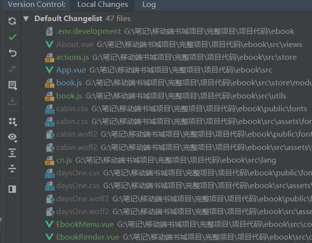

# 一：项目流程 - 2

# 二：项目开发-阅读器开发

## 2.1进度条设置相关功能

### 1.页面设计

在`src-component-ebook`文件夹下新建`EbookSettingProgress`

参考`快速入门web阅读器开发.md`进行内容的修改

`EbookSettingProgress`

html

```html
<template>
  <transition name='slide-up'>
    <div class="setting-wrapper" v-show="menuVisible && settingVisible === 2">
      <div class="setting-progress">
          // 新增阅读时间
        <div class="read-time-wrapper">
            // 在此处通过getReadTimeText()方法显示阅读时间  注意：这里执行方法需要有空号，计算属性才可以没括号
          <span class="read-time-text">{{getReadTimeText()}}</span>
          <sppn class="icon-forward"></span>
        </div>
        <div class="progress-wrapper">
             // 新增左箭头，用于章节向前跳转
          <div class="progress-icon-wrapper">
            <span class="icon-back" @click="prevSection"></span>
          </div>
          <input class="progress" type="range"
                 max="100"
                 min="0"
                 step="1"
                 :value="progress"
                 @change="onProgressChange($event.target.value)"
                 @input="onProgressInput($event.target.value)"
                 :disabled="!bookAvailable"
                 ref="progress">
                // 新增右箭头，用于章节向后跳转
          <div class="progress-icon-wrapper">
            <span class="icon-forward" @click="nextSection"></span>
          </div>
            
          <div class="text-wrapper">
              // 新增章节名称
              <span class="progress-section-text">{{getSectionName}}</span>
              
              <span>({{!bookAvailable?`加载中...`:progress+"%"}})</span>
          </div>
        </div>
      </div>
    </div>
  </transition>
</template>

```

JavaScript

```javascript
<script>
import { ebookMixin } from '../../utils/book'

export default {
  mixins: [ebookMixin],
  methods: {
    // 进度条拖动松手时调用的方法
    onProgressChange() {
    },
    // 进度条拖动过程中调用的方法
    onProgressInput() {
    },
    // 上一章节
    prevSection() {
    },
    // 下一章节
    nextSection() {
        
    }
  }
}
</script>

```

scss

```scss
<style lang="scss" rel="stylesheet/scss" scoped>
@import "../../assets/styles/global";
.setting-wrapper {
  position: absolute;
  bottom: px2rem(40);
  left: 0;
  width: 100%;
  height: px2rem(80);
  box-shadow: 0 px2rem(-8) px2rem(8) rgba(0, 0, 0, 0.15);
  background-color: rgb(255, 255, 255);
  z-index: 100;
  .setting-progress {
    width: 100%;
    height: 100%;
    position: relative;
      // 阅读时间样式
    .read-time-wrapper{
      position: absolute;
      left: 0;
      top: 0;
      width: 100%;
      height: px2rem(40);
      font-size: px2rem(14);
      @include center;
    }
    .progress-wrapper {
      width: 100%;
      height: 100%;
      @include center;
      padding: 0 px2rem(15);
      box-sizing: border-box;
        // 左右箭头样式
      .progress-icon-wrapper {
        font-size: px2rem(20)   
      }
      .progress {
        width: 100%;
        -webkit-appearance: none;
        height: px2rem(2);
          // 这里将背景的css删除掉，因为在主题样式中，已经对这部分进行了设置
        //background: -webkit-linear-gradient(#999, #999) no-repeat, #ddd;
        //background-size: 0 100%!important;
        margin: 0 px2rem(10)
        &:focus {
          outline: none
        }
        &::-webkit-slider-thumb {
          -webkit-appearance: none;
          height: px2rem(20);
          width: px2rem(20);
          border-radius: 50%;
          background: white;
          box-shadow: 0 4px 4px 0 rgba(0, 0, 0, .15);
          border: px2rem(1) solid #ddd;
        }
      }
      .text-wrapper {
        position: absolute;
        @include center;
        bottom: px2rem(10);
        width: 100%;
        padding: 0 px2rem(15);
        box-sizeing: border-box;
        span {
          font-size: px2rem(14);
          color: #999;
        }
          // 为避免章节名过长，这里通过css使其不超过一行显示
        .progress-section-text {
           @include ellipsis;
        }
      }
    }
  }
}
</style>


// 补充 ；封装一个文字溢出省略号显示的mixin 
// 在 mixin.scss中
@mixin ellipsis {
    text-overflow: ellipsis; // 超出使用省略号
    overflow: hidden;    // 溢出隐藏
    white-space: nowrap; // 不换行
}

```

### 2.参数设计

1.通过vuex新建`progress:0  , bookAvailable:false`相关变量和对应方法

2.`EbookMenu.vue`

```javascript
import EbookSettingProgress from './EbookSettingProgress'

<ebook-setting-progress></ebook-setting-progress>

components: {
    EbookSettingProgress
}

```

### 3.实现分页及进度条拖拽跳转

1.`EbookRender.vue`方法重构

阅读器初始化相关的代码此时过于复杂，可以对其进行重构，将功能相近的代码提取成方法

```javascript
// (1) 新建initRendition()方法，将initEpub中部分代码，迁移到该方法中
initRendition() {
      this.rendition = this.book.renderTo('read', {
        width: window.innerWidth,
        height: window.innerHeight,
        method: 'default'
      })
      this.rendition.display().then(() => {
        this.initTheme()
        this.initFontSize()
        this.initFontFamily()
        this.initGlobalStyle()
      })
      this.rendition.hooks.content.register(contents => {
        contents.addStylesheet(`${process.env.VUE_APP_RES_URL}/fonts/cabin.css`)
        contents.addStylesheet(`${process.env.VUE_APP_RES_URL}/fonts/daysOne.css`)
        contents.addStylesheet(`${process.env.VUE_APP_RES_URL}/fonts/montserrat.css`)
        contents.addStylesheet(`${process.env.VUE_APP_RES_URL}/fonts/tangerine.css`)
      })
}
// (3) 新建 initGesture() 方法，将initEpub中部分代码，迁移到该方法中 注： Gesture(手势)
initGesture() {
      this.rendition.on('touchstart', event => {
        this.touchStartX = event.changedTouches[0].clientX
        this.touchStartTime = event.timeStamp
      })
      this.rendition.on('touchend', event => {
        const offsetX = event.changedTouches[0].clientX - this.touchStartX
        const time = event.timeStamp - this.touchStartTime
        if (time < 500 && offsetX > 40) {
          this.prevPage()
        } else if (time < 500 && offsetX < -40) {
          this.nextPage()
        } else {
          this.toggleTitleAndMenu()
        }
        event.preventDefault()
        event.stopPropagation()
      })
}
// (2) initEpub中
initEpub(url) {
    this.book = new Epub(url)
    this.setCurrentBook(this.book)
    this.initRendition()
    this.initGesture()
}

```

2.`EbookRender.vue`

分页实现

```javascript
//  initEpub中
initEpub(url) {
    this.book = new Epub(url)
    this.setCurrentBook(this.book)
    this.initRendition()
    this.initGesture()
    
    this.book.ready.then(() => {
        // 注意：这里传入的参数代表多少字一页  
        // 750 * (window.innerWidth / 375) * (getFontSize(this.fileName) / 16)：
        //代表如果屏幕宽度为375,默认字号为16，则750字每页，如果屏幕宽度大于或小于375，或者字号大于小于16，则字数也随这两者的比例增加或减少
        // 该分页的问题是不够精确，如果电子书中有图片或者大的标题文字会影响分的字数
        // 注： getFontSize(this.fileName)获取的是本地存储中的字号
        return this.book.locations.generate(750 * (window.innerWidth / 375) * (getFontSize(this.fileName) / 16))
    }).then(locations => {
        // 这里的locations保存着所有的epubcfi信息，能够定位到电子书的任意位置
        console.log(locations)
    // 传入true使 `EbookSettingProgress`中的进度条按钮可用 （即当epubcfi生成完毕，执行这一步）
        this.setBookAvailable(true)
    })
}

```

`EbookSettingProgress`

```javascript
// progress 传递的是进度条按钮的值  该方法实现拖动完毕后，界面以及百分比变化
onProgressChange(progress) {
    // 通过vuex设置变量this.progress的值，之后通过异步then执行后续操作
    this.setProgress(progress).then(() => {
        // 根据cfi对电子书进行定位渲染
        this.displayProgress()
        
        //调用3.的方法
        this.updateProgressBackground()
    })
}
displayProgress() {
    // 获取当前this.progress对应的epubcfi信息，将其保存到cfi常量中
    // 注意这里的参数是百分数，因为this.progress保存的是进度条的值，进度条取值范围是0-100，所以这里需要除100
    const cfi = this.currentBook.locations.cfiFromPercentage(this.progress / 100 )
    // 传入cfi对页面进行渲染
    this.currentBook.rendition.display(cfi)
}

onProgressInput(progress) {
// 这里重复上面的调用，可以实现拖动时，页面和百分比值也发生变化
  /* this.setProgress(progress).then(() => { 
        this.displayProgress
    }) */
    // 注：由于实时拖动页面显示会有一些延迟，所以这里只使用百分比值拖动变化
    this.setProgress(progress)
     //调用3.的方法
    this.updateProgressBackground()
}
```

3.`EbookSettingProgress`

```javascript
// 进度条的背景色变化，（按钮左边拖动过的部分颜色深，按钮右边未拖动的部分颜色浅）
updateProgressBackground() {
    // `${this.progress}% 100%` 前面的值为左侧背景所占百分比值，右侧100%为固定值，代表右侧背景的百分比
    this.$refs.progress.style.backgroundSize = `${this.progress}% 100%`
}

// 由于主题样式原因，刷新页面后，可以发现初始时的背景色是不对的，所以在updated时对进度条背景进行设置
// updated生命周期钩子
updated() {
    this.updateProgressBackground()
}
```

### 4.实现章节跳转

注： 首先需要在vuex中定义相关变量`section`及其对应的方法，变量默认值为0

`EbookSettingProgress.vue`

```javascript
// 上一章
preSection() {
    // 首先跳转条件是 this.section大于0 且 电子书已解析完毕
    if (this.section > 0 && this.bookAvailable) {
        // 修改this.section的值，通过vuex
        this.setSection(this.section-1).then(() => {
            // 将section的值，传入epbu实例对象中的section方法，即可 返回对应章节信息(类型是obj)
      //      const sectionInfo = this.currentBook.section(this.section)
            // sectionInfo对象中有href属性，将属性传入display方法，即可展示页面
        //    if (sectionInfo && sectionInfo.href) {
          //      this.currentBook.rendition.display(sectionInfo.href)
          // }
            
            this.displaySection()
        })
    }
}
// 下一张
nextSection() {
    // this.currentBook.spine 返回对象，其中存放着阅读进度相关的信息，该对象的length属性，返回的就是章节总数 ，因为section是从0开始，所以length需要减1 ，所以这里this.section小于 length-1
    if (this.section < this.currentBook.spine.length - 1 && this.bookAvailable) {
        this.setSection(this.section + 1).then(() => {
            // 这部分代码与preSection重复
     /*       const sectionInfo = this.currentBook.section(this.section)
            if (sectionInfo && sectionInfo.href) {
                this.currentBook.rendition.display(sectionInfo.href)
            }             */
            this.displaySection()
        })
    }
}


/// 由于上面的章节展示代码重复，所以可以对其进行封装
displaySection() {
    const sectionInfo = this.currentBook.section(this.section)
    if (sectionInfo && sectionInfo.href) {
        // 传入href信息，对页面进行渲染   节点1:
        this.currentBook.rendition.display(sectionInfo.href)
    }
}
```


### 5.章节跳转与进度同步

`EbookSettingProgress.vue`

```javascript
// 新建刷新进度的方法
refreshLocation() {
    // 首先需要获取当前的进度对象，通过rendition对象下的currentLocation方法获得该对象
    // 得到的返回值 currentLocation对象 中包括 end与 start 两个子对象，这两个对象分别保存着当前页面结束以及开始的定位信息，
  // start，end 的具体属性：cfi: 保存cfi定位信息 index: 章节序号 location；代表在总页数里的页码
  //displayed：又分为两个子属性，page 当前页面在当前章节中所对应的页码 total:当前章节总页数
  //percentage: 该页面在整个电子书中所处的百分比
    const currentLocation = this.currentBook.rendition.currentLocation()
    // 前面拖拽滚动条使用了 cfiFromPercentage方法，传入 百分比返回 cfi
    // 这里使用 percentageFromCfi方法，传入cfi 数据，从而得到对应的百分比
    // currentLocation.start.cfi代表，当前页面开头第一个字符的cfi定位
    const progress = this.currentBook.locations.percentageFromCfi(
        currentLocation.start.cfi)
    // 之后用得到的百分比progress * 100 并向下取整，将这个数作为新的this.progress
    this.setProgress(Math.floor(progress * 100))
    
    
    
    
    // 补充： 这里经过测试 发现 不需要通过percentageFromCfi 得到百分比，实际在currentLocation对象中，使用start.percentage 就可以得到相同的百分比
    console.log(currentLocation.start.percentage)
    // 也就是代码可以做如下简化，同样可以做到进度条同步
    this.setProgress(Math.floor(currentLocation.start.percentage * 100))
    
    
    
}
// 在displaySection() 方法中调用
// 注意：新代码添加到原来的渲染代码（节点1：）的then中
this.currentBook.rendition.display(sectionInfo.href).then(() => {
    this.refreshLocation() {}
})
```

### 6.获取当前章节名

1.页面布局见上文

2.`EbookSettingProgress.vue`

```javascript
// 计算属性
computed: {
   getSectionName() {
       if (this.section && this.bookAvailable) {
           const sectionInfo = this.currentBook.section(this.section)
           if (sectionInfo && sectionInfo.href && this.currentBook && this.currentBook.navigation) {
 // 这里使用了 navigation 目录对象，通过该对象的get方法，传入sectionInfo.href，得到相应的章节信息对象，该对象的lable属性即为章节名
               return this.currentBook.navigation.get(sectionInfo.href).label
           }	
       }
       return ''
   }
}
```

### 7.阅读进度的本地存储

首先经过分析确定三种情况下，保存阅读进度

（1）对手动翻页的进度进行保存

（2）对拖拽进度条的进度进行保存

（3）对章节切换进行保存

`EbookSettingProgress.vue`

```javascript
// 情况3 可通过修改refreshLocation实现
refreshLocation() {
    const currentLocation = this.currentBook.rendition.currentLocation()
    const startCfi = currentLocation.start.cfi
    const progress = this.currentBook.locations.percentageFromCfi(startCfi)
    this.setProgress(Math.floor(progress * 100))
    // 该方法通过localStorage.js定义
    saveLocation(this.fileName, startCfi)
}
// 情况2 
displayProgress() {
    //省略部分不变代码...
    // 这里直接在渲染方法的then中调用 refreshLocation即可
    this.currentBook.rendition.display(cfi).then(() => {
        this.refreshLocation()
    })
}

// 情况 1 则 同样需要调用 refreshLocation方法，只不过这时是在EbookRender.vue中调用
// 初始化渲染
initRendition() {
    this.rendition.display().then(() => {
        //...
        this.rfreshLocation()
    })
}
// 上一页
prevPage() {
    //...
    this.rendition.prev.then(() => {
        this.refreshLocation()
    })
}
// 下一页
nextPage() {
    //...
    this.rendition.next.then(() => {
        this.refreshLocation()
    })
}

// 总结： 由于上述三种情况当通过refreshLocation保存 progress进度，所以可以将该方法，提取出来放入到 utils/mixin.js中
import { saveLocation } from './localStorage'

refreshLocation() {
    const currentLocation = this.currentBook.rendition.currentLocation()
    const startCfi = currentLocation.start.cfi
    const progress = this.currentBook.locations.percentageFromCfi(startCfi)
    this.setProgress(Math.floor(progress * 100))
    // 对章节信息进行刷新
    this.setSection(currentLocation.start.index)
    // 该方法通过localStorage.js定义
    saveLocation(this.fileName, startCfi)
}
// 之后在组件中按需调用，调用方式如上文，没有变化
```

上面已经针对不同情况对进度做了保存，接下来就是使用，在页面刷新时调用进度进行跳转

```javascript
// 新建display方法,该方法使用次数较多，于是新建在mixin.js中
// 第二个参数为回调函数，如果传值时，该函数存在，可以直接调用
display(target, callback) {
    if (target) {
        this.currentBook.rendition.display(target).then(() => {
            this.refreshLocation()
            if(callback) callback()
        })
    } else {
        this.currentBook.rendition.display().then(() => {
            this.refreshLocation()
            if(callback) callback()
        })
    }
}

// 之后就可以对先前的代码就行优化
// EbookRender.vue 优化
import { getLocation } from '../../utils/localStorage'

initRendition() {
    //...省略部分不变代码
    //原代码
    this.rendition.display().then(() => {
        this.initTheme()
        this.initFontSize()
        this.initFontFamily()
        this.initGlobalStyle()
        this.refreshLocation()
    })
    //新代码
    const location = getLocation(this.fileName)
    // 注意由于分页算法的问题，有时重新刷新页面显示的页面会与先前的阅读进度有一页的误差
    this.display(location, () => {
        this.initTheme()
        this.initFontSize()
        this.initFontFamily()
        this.initGlobalStyle()
    })
}
// EbookSettingProgress.vue 优化
displaySection() {
    const sectionInfo = this.currentBook.section(this.section)
    if (sectionInfo && sectionInfo.href) {
        // 原代码
        this.currentBook.rendition.display(sectionInfo.href).then(() => {
            this.refreshLocation()
        })
        // 新代码
        this.display(sectionInfo.href)
    }
}
displayProgress() {
    const cfi = this.currentBook.locations.cfiFromPercentage(this.progress / 100)
    // 原代码
    this.currentBook.rendition.display(cfi)
    // 新代码 
    this.display(cfi)
},
    
    
//完成上述代码后，刷新页面发现，电子书跳转到指定位置，但是进度条没有变化

    /* 通过对refreshLocation当中的 常量进行打印
    可以发现  currentLocation   startCfi 都存在 ，但是 progress 为空
    refreshLocation() {
    const currentLocation = this.currentBook.rendition.currentLocation()
    const startCfi = currentLocation.start.cfi
    const progress = this.currentBook.locations.percentageFromCfi(startCfi)
    this.setProgress(Math.floor(progress * 100))
    this.setSection(currentLocation.start.index)
    saveLocation(this.fileName, startCfi)
}
  */
    // 因为progress为空,所以证明locations对象没有完全生成完毕，即原因是，这时分页并没有完成
 // 解决方法：在分页完毕后再次调用 refreshLocation
    //EbookReader.vue
    this.book.ready.then(() => {
        return this.book.locations.generate(750 * (window.innerWidth / 375) *
                                            (getFontSize(this.fileName) / 16))
    }).then(locations => {
        this.setBookAvailable(true)
        this.refreshLocation()
    })
```

### 8. 阅读时间功能

时间从阅读器载入就开始计时，所以在 

`views/ebook/index.vue`中完成计时操作

```javascript
//下面为新增的代码
import { ebookMixin } from '../../utils/mixin'
import { getReadTime,saveReadTime } from '../../utils/localStorage'

mixins: [ebookMixin],
methods: {
    // loop(循环) 该方法用于计算阅读时间
    startLoopReadTime() {
        // getReadTime方法通过本地存储设置
        // 方法效果是将当前电子书的阅读时间保存到指定变量中
        let readTime = getReadTime(this.fileName)
        // 如果该变量不存在则将其设置为0
        if (!readTime) {
            readTime = 0
         }
        // task(任务) 开启定时器，并将其保存在this.task中方便关闭
        this.task = setInterval(()=>{
            // 每一秒readTime自增1，所以readTime值即为，定时器已启动的时间
            readTime++
            // 每过30s 对阅读时间进行保存
            if (readTime % 30 === 0) {
                saveReadTime(this.fileName, readTime)
            }
        }, 1000) 
    }
},
 // 在当前组件创建时，调用计时方法，对阅读时间进行计算
mounted() {
    this.startLoopReadTime()
}
// 当组件销毁前，关闭定时器，停止计时
beforeDestory() {
    if (this.task) {
        clearInterval(this.task)
    }
}
```

展示时间

`EbookSettingProgress`

```javascript
// html 部分的代码写在中，具体实现见上文

import { getReadTime } from '../../utils/localStorage'

// 方法部分
// 该方法的返回值显示在页面上
getReadTimeText() {
    // 这里显示可以加入国际化 $t('book.haveRead')的中文字符串是 : 已读$1分钟，英文字符串同样有$1,所以这里可以将$1替换为具体分钟
   return this.$t('book.haveRead').replace('$1', this.getReadTimeByMinute())
}
// 该方法得到本地存储的秒数，将其转为分钟
getReadTimeByMinute() {
    const readTime = getReadTime(this.fileName)
    if(!readTime) {
        return 0
    } else {
        return Math.ceil(readTime / 60)
    }
}
```

补充：==该方法实现的展示阅读时间，不能做到页面上的自动更新，而是每次切换菜单栏标题栏的状态时进行更新，这时每次都会重新创建组件，所以更新==

### 9.git提交

截止目前进度条相关功能已全部完成，在此进行一次git提交

注意: webStorm的版本控制栏中



绿色表示新增文件但已经添加到git中的文件（也就是执行了git add）；

灰色表示被删除的文件；

 蓝色表示之前已存在，现在有更新的文件

红色表示新增文件，但没有添加到git的文件（这里由于设置了自动git add 所以没有红色文件）

之后可以直接执行一次commit,添加 备注信息 :*字号、字体、主题 设置*

在`webstorm`的log选项就可以看到目前提交后的，本地仓库及相关日志信息

## 2.2目录相关设置

### 1.实现基本的蒙版组件

(1): `src/components/ebook`新建`EbookSlide.vue`

html

```html
<template>
    // 设置过渡动画 第（3） 定义，这里在第（5）改变了布局
    <transition name="fade-slide-right">
        // 控制该组件的显示隐藏
        <div class="slide-content-wrapper" v-show="menuVisible && settingVisible === 3">
            <div class="content">
                <div class="content-page-wrapper">
                    <div class="content-page"></div>
                    <div class="content-page-tab">

                    </div>
                </div>
            </div>
            // 点击背景组件隐藏 第(4)定义
            <div class="content-bg" @click="hideTitleAndMenu()">

            </div>
        </div>
    </transition>
</template>
```

scss

```scss
// 注意： scss中没有设置，相关的背景颜色，是因为在主题的css中都已经设置完毕
@import "../../assets/styles/global";
.slide-content-wrapper {
    position: absolute;
    top: 0;
    left: 0;
    z-index: 300;
    display: flex;
    width: 100%;
    height: 100%
    .content {
        flex: 0 0 85%;
        width: 85%;
        height: 100%;
        .content-page-wrapper {
            .content-page {
            }
            .content-page-tab {
            }
        }
    }
    .content-bg {
        flex: 0 0 15;
        width: 15%;
        height: 100%;
    }
}
```

javaScript

```javascript
import { ebookMixin } from '../../utils/mixin'
export default {
    mixins: [ebookMixin]
}
```


(2) 将该组件引入`EbookMenu.vue`

```javascript
<ebook-slide> </ebook-slide>

import EbookSlide from './EbookSlide'

components: {
    EbookSlide
}
```

(3) 对动画进行定义`transition.scss`

```scss
// 初次进入 隐藏的时候
.fade-slide-right-enter, .fade-slide-right-leave-to {
    transform: translate3d(-100%, 0, 0);
    opacity: 0;
}
//显示的时候
.fade-slide-right-enter-to, .fade-slide-right-leave {
    transform: translate3d(0, 0, 0);
    opacity: 1;
}
.fade-slide-right-enter-active, .fade-slide-right-leave-active {
    transition: all .2s linear;
}
```

补充： ==对于动画目前的总结， 对于 translate3d(x, y, z) 这样的3d变换来说，页面头部下拉为 -y 底部上拉为y 左部向右拉为 -x 右步向左拉为 x;  即 上右下左 -y x y -x==

(4) 定义隐藏`EookSlide`组件方法 hideTitleAndMenu()

由于早先在`EbookRender.vue`组件中定义了`hideTitleAndMenu`方法

```javascript
// 该方法与此时我们要实现的hideTitleAndMenu方法较为类似，所以可以将该方法移到mixin中
hideTittleAndMenu() {
    this.setMenuVisible(false)
    this.setSettingVisible(-1)
    this.setFontFamilyVisible(false)
}
// mixin.js
// ...直接移进来的，方法没有变化
```

(5) 为了做出先显示蒙版后显示，目录的效果，所以这里进行分部动画，舍弃第三部和原有的动画布局

注：==原有动画相当于 背景和蒙版一同出现，现有动画相当于0.2s 出现背景 0.2+0.2 出现目录，也就是说，transition动画会有一个叠加效果==

```html
注： 下面动画之前在快速阅读web阅读器开发中已经提及过，在先前的动画导入中也已经导入
// 最外层动画改为如下 
<transition name="fade">
    //... 
    // 在class=content标签外层，加上新的动画，补充说明一点，下面的v-if是必须加的，因为动画需要一个切换条件，如果没有v-if 该层动画不会生效
    <transition name="slide-right">
        <div class="content" v-if="settingVisible === 3">
            //...
        </div>
    </transition>
    //...
</transition>
```

### 2.详细实现  content-page-tab 类标签的相关功能

（1）`EbookSlide`

.content-page-wrapper 类样式写入

```scss
.content-page-wrapper {
    display: flex;
    flex-direction: column;
    width: 100%;
    height: 100%;
    .content-page {
        // 自动设置高度为除去content-page-tab外剩余部分
        flex: 1;
        width: 100%;
        // 如果高度溢出显示滚动条
        overflow: hidden;
    }
    .content-page-tab {
        // 设置固定高度
        flex: 0 0 px2rem(48);
        width: 100%;
        hegiht: px2rem(48);
        display: flex;
        .content-page-tab-item {
            flex: 1;
            font-size: px2rem(12);
            @include center
        }
    }
}
```

html

```html
// 对应样式在（1）中
<div class="content-page-tab">
    // 该标签代表着点击项，此项为 `目录` 由于国际化中有该项的中英文，所以直接引入国际化
    // :class 控制被选中项的样式 ，selected类在样式css文件中规定
    // @click 中的方法控制 currentTab变量的值，以及后续对应页面的显示
    <div class="content-page-tab-item" 
         :class="{'selected': currentTab === 1}"
         @click="selectTab(1)">{{ $t(book.navigation) }}</div>
    // 此项为 `书签`   
    <div class="content-page-tab-item" 
         :class="{'selected': currentTab === 2}"
          @click="selectTab(2)">{{ $t(book.bookmark) }}</div>
</div>
```

javaScript

```javascript
export default {
    data() {
        return {
            currentTab: 1
        }
    },
    selectTab(tab) {
        this.currentTab = tab
    }
}
```

### 3.详细实现  content-page 类标签的相关功能

`EbookSlide.vue`

注： ==这里使用到了动态组件切换 固定的写法就是 `<component :is="这里就是可选的组件名"></component>`==

html

```html
<div class="content-page">
    //③  :is 专用于动态组件切换 此处的含义为如果 currentTab为 1 加载 content 组件，如果不为1 加载bookmark组件
    <component :is="currentTab === 1 ? content : bookmark"></component>
</div>
```

javaScript

```javascript
// ① 
import EbookSlideContents from './EbookSlideContents'

data() {
    return {
        // 注意：此为步骤②  ！！！ 动态组件切换步骤，引入组件为 ①步 ，之后将其赋予变量②步 ，最后html编写如上文第 ③步
        content: EbookSlideContents,
        bookmark: null
    }
}
```

在: `src/components/ebook`新建`EbookSlideContents.vue`

html

```html
<template>
    <div class="ebook-slide-contents">
        abcd
    </div>
</template>
```

### 4.`EbookSlideContents.vue`详细实现

#### 搜索输入框的实现

html

```html
<template>
    <div class="ebook-slide-contents">
        
        // 上半部分搜索栏 包括整个搜素输入框，以及取消搜素按钮
        <div class="slide-contents-search-wrapper">
            // 整个搜素输入框
            <div class="slide-contents-search-input-wrapper">
                // 搜索框内图标
                <div class="slide-contents-search-icon">
                    <span class="icon-search"></span>
                </div>
                // 该标签为输入框，默认值做了国际化处理
                <input class="slide-contents-search-input"
                       type="text"
                       @click="showSearchPage"   //单击显示取消按钮，展示搜索页
                       :placeholder="$t('book.searchHint')">
            </div>
            // 取消(cancel)搜素按钮 按钮内容做了国际化处理
            <div class="slide-contents-search-cancel"
                 @click="hiddenSearchPage" // 单击隐藏取消按钮，隐藏搜索页
                 v-if="searchVisible" // 取消按钮的控制
                 >
                {{$t('book.cancel')}}      
            </div>
        </div>
            
            
    </div>
</template>
```

scss

```scss
.ebook-slide-contents {
    width: 100%;
    font-size: 0;  // 用于消除 span.progress 标签换行时，在页面中产生的空格。
    .slide-contents-search-wrapper {
        width: 100%;
        height: px2rem(36);
        margin: px2rem(20) 0 px2rem(10) 0;
        padding: 0 px2rem(15);
        box-sizing: border-box;
        display: flex;
        .slide-contents-search-input-wrapper {
            flex: 1;
            @include center;
            .slide-contents-search-icon {
                flex: 0 0 px2rem(20);
                font-size: px2rem(12);
                @include center;
            }
            .slide-contents-search-input {
            	flex: 1;
                font-size: px2rem(14);
                @include center;
                border: none;
                outline: none;
                background-color: transparent; 
            }
        }
        .slide-contents-search-cancel {
            flex: 0 0 px2rem(40);
            font-size: px2rem(14);
            @include right;
        }
    }
}
```

```javascript
import ebookMixin from '../../utils/mixin'

export default {
    mixins: [ebookMixin],
    data() {
       return {
           // 该变量通过控制取消按钮的显示隐藏，从而将搜索结果页面显示隐藏
           searchVisible: false
       }
    },
    methods: {
        showSearchVisible() {
            this.searchVisible = true
        },
        hiddenSearchVisible() {
            this.searchVisible = false
        }
    }
}
```

#### 书籍信息展示

```html
<!-- 该部分代码为 slide-contents-search-wrapper 的同级class -->

<div class="slide-contents-book-wrapper">
    <div class="slide-contents-book-img-wrapper">
        // 这里的cover代表图片路径，通过vuex定义 默认为null
        
    </div>
    // 显示电子书相关信息，上方标题 下方作者
    <div class="slide-contents-book-info-wrapper">
        <div class="slide-contents-book-title">  // 注2：
            {{metadata.tittle}}
        </div>
        <div class="slide-contents-book-author">
            {{metadata.creator}}
        </div>
    </div>
    <div class="slide-contents-book-progress-wrapper">
        // 此处为阅读进度
        <div class="slide-contents-book-progress">
            // 进度百分比 这里的progress 已经通过vuex管理，并通过本地存储了下来，可以直接用
            <span class="progress">{{ progress + '%'}}</span>
            // `已读`  文字的国际化
            <span class="progress-text">{{$t('book.haveRead2')}}</span>
        </div>
        // 此处为阅读时间  注1：
      	<div class="slide-contents-book-time">
            {{getReadTimeText()}}
        </div>
    </div>
</div>
```

````javascript
// 注1： 中调用阅读时间与先前在 `EbookSettingProgress.vue`中的部分方法功能重复，所以对该组件中的方法进行改造

//① 将getReadTimeText()方法放到 mixin.js的methods对象下
// 原：
getReadTimeText() {
    return this.$t('book.haveRead').replace('$1', this.getReadTimeByMinute())
}
// 新：
import { getReadTimeByMinute } from './book'
getReadTimeText() {
    return this.$t('book.haveRead').replace('$1', getReadTimeByMinute(this.fileName))
}

//② 将getReadTimeByMinute()方法放到 utils/book.js中 变为通用方法
// 原： 
// 删除进度面板中localStorage引入
getReadTimeByMinute() {
    const readTime = getReadTime(this.fileName)
    if (readTime) {
        return Math.ceil(readTime / 60)
    } else {
        return 0
    }
}
// 新： 
import { getReadTime } from './localStorage'
export function getReadTimeByMinute(fileName) {
    const readTime = getReadTime(fileName)
    if (readTime) {
        return Math.ceil(readTime / 60)
    } else {
        return 0
    }
}
````

```javascript
// 注2 
// EbookRender.vue 组件中
// 创建对应parseBook
parseBook() {
    // 获取封面信息  loaded对象保存相关资源信息， cover封面信息
    this.book.loaded.cover.then(cover => {
        //此时的cover不是一个链接，如：/OEBPS/A978-3-319-25718-1_CoverFigure.jpg 
        // 想要得到链接需要做如下操作:使用book下的archive对象下的createUrl方法，传入cover
        this.book.archive.createrUrl(cover).then(url => {
            // 传入vuex
            this.setCover(url)
        })
    })
    // 获取标题和作者信息  metadata中保存中书籍相关的元数据，包括作者信息以及标题
    this.book.loaded.metadata.then(metadata => {
        // 传入vuex
        this.setMetadata(metadata)
    })
},
initEpub() {
    //...
    this.parseBook()
    // this.book.ready...
}

```

样式：

```scss
.slide-contents-book-wrapper {
    display: flex;
    width: 100%;
    height: px2rem(90);
    padding: px2rem(10) px2rem(15) px2rem(20) px2rem(15);
    box-sizing: border-box;
    .slide-contents-book-img-wrapper {
        flex: 0 0 px2rem(45);
        .slide-contents-book-img {
            width: px2rem(45);
            height: px2rem(60);
        }
    }
    .slide-contents-book-info-wrapper {
        flex: 1;
        padding: 0 px2rem(10);
        box-sizing: border-box;
        .slide-contents-book-title {
            // 宽度默认按375的屏幕宽度计算 0.85为左侧弹窗所占百分比,50最外部左右边距与自身左右边距之和 45 左侧图片 70右侧进度
            // 375*0.85-50-45-70 = 153.75
            width: px2rem(153.75)
            font-size: px2rem(14);
            line-height: px2rem(16); 
            // 注三
            @inclue ellipsis2(2);// 可以解决指定为二行时，第三行还露出一点头的问题
        }
        .slide-contents-book-author {
            width: px2rem(153.75);
            margin-top: px2rem(5);
            font-size: px2rem(12);
            line-height: px2rem(12);
            @include ellipsis; // 注意： 使用省略的图层必须定宽，否则无效
        }
    }
    .slide-contents-book-progress-wrapper {
        flex: 0 0 px2rem(70);
        display: flex;
        flex-direction: column;
        justify-content: center;
        align-items: flex-start;
        .slide-contents-book-progress {
            .progress {
                font-size: px2rem(14);
            }
            .progress-text {
                font-size: px2rem(12);
            }
        }
        .slide-contents-book-time {
            font-size: px2rem(12);
            margin-top: px2rem(5);
        }
    }
}
```

```scss
// 注三：
// 以下代码添加到mixin.scss中
@mixin ellipsis2($line) {
    display: -webkit-box; 
    -webkit-box-orient: vertical; // 盒子内容垂直布局
    -webkit-line-clamp: $line; // 将块容器中的内容限定为指定行数
    white-space: normal; // 允许正常换行
    overflow: hidden; // 溢出隐藏
    text-overflow: ellipsis; // 溢出的文字，省略号显示
    word-break: break-all; //指定了怎样在单词间换行，默认normal 这里的break-all表示在任意字符间断行，也就是换行时完整的单词也会被断开 如果设置为keep-all则是必须完整单词断行

}
```

#### 目录信息显示

1.获取目录资源 `EbookRender.vue`

```javascript
import { flatten } from '../../utils/book'

parseBook() {
    //... 
    // 调用loaded 下的navigation对象
    this.book.loaded.navigation.then(nav => {
        // 返回值nav 对象中包含目录相关信息 ; nav.toc数组下包含所有一级目录,一级目录下的subitems属性中包含所有二级目录，以此类推 ; 每级目录中的label属性代表目录内容 ; parent属性值，与上级目录的id值相同 ; 每级目录中的href属性包含目录的地址信息，传入display函数 可以对页面进行重新跳转渲染
        // 难点在于如何让使所有目录显示在左侧，所有目录(上下级目录之和)数量可以通过nav对象下的length得出， 首先我们要做的是，需要先将多维数组转为一维数组  见注1：
        
        // 经过注1 与 第2步的分析后我们进行代码的编写
        //console.log(flatten(nav.toc))  这里就得到了一组一维数组
        // 接下来要做的就是判断目录的等级，我们可以通过parent属性来判定 ：如果parent属性为undefined 则为一级目录 如果不是undefined，则根据该名称找到id相同的数组元素，继续观察该元素的parent从而判断出具体为几级目录   此处代码的理解见注2
        const navItem = flatten(nav.toc)  // 多维转一维
        // 赋予等级：这里的代码相对 注2 又进行了一些简化，使用三目运算符进行了简化
        function find(item, level = 0) {
            return !item.parent ? level : find(navItem.filter(parentItem => parentItem.id === item.parent)[0], ++level)
        }
        navItem.forEach(item => {
            item.level = find(item)
        })
        // 将目录信息保存到vuex
        this.setNavigation(navItem)
    })
}
```

```javascript
// 注1 相当于将如下数组转换为一维数组
const nav = [
    {
        id: 1,
        subitems: [
            {
                id: 2,
                subitems: [
                    {
                        id: 3,
                        subitems: [],
                        parent: 2
                    },
                    {
                        id: 4,
                        subitems: [],
                        parent: 2
                    }
                ],
                parent: 1
            },
            {
                id: 5,
                subitems: [],
                parent: 1
            }
        ],
        parent: undefined
    },
    {
        id: 6,
        subitems: [],
        parent: undefined
    }
]
// 需要使用以下两个条件
// 1. 数组拆分
...[1,3,5]  // 返回 1 3 5
// 2.拆分后合并，使用concat
[0].concat(...[1, 2])  // 返回 [0, 1, 2]

// 于是创建如下方法  flatten(变平)
function flatten(array) {
    // 三维数组变一维(该写法第二维只能有一个item,如果有多个，第二维之间不能合并)
    //return array.map(item => [].concat(item, ...item.subitems))
    
    // 多维数组变一维(该写法第二维只能有一个item,如果有多个，第二维之间不能合并)
    // return array.map(item => [].concat(item, ...flatten(item.subitems)))
    
    // 最终： 多维数组变一维(二维也能合并)
    return [].concat(...array.map(item => [].concat(item, ...flatten(item.subitems))))
}

// 这时使用 nav对象进行测试可以看到函数编写成功
const navigation = flatten(nav) 


// 注2 ：该步紧接着注1进行操作 
function find(item, level = 0) {
    if (!item.parent) {
        return level
    } else {
        // find递归的找到此时item的父item,之后将其作为数组返回，因为每个数组只有一个元素，所以每次返回第 [0]  个即可，之后，每次递归将 level自增 ，最终通过上面的if返回最后的level等级
        return find(navigation.filter(parentItem => parentItem.id === item.parent)[0], ++level)
    }
}
navigation.forEach(item => {
    // 给所有的元素添加一个level属性，该属性值通过 find函数求出
    item.level = find(item)
})

console.log(navigation) // 打印navigation即可看到相应结果
```

2.将上述分析得到的函数封装到`utils/book.js`中

```javascript
export function flatten(array) {
    return [].concat(...array.map(item => [].concat(item, ...flatten(item.subitems))))
}
```

3.在`EbookSlideContents.vue`中进行目录的具体实现

(1)在`components`下新建`common`文件夹，将准备好的滚动条组件`Scroll.vue` 放到该文件夹中

(2) 在`utils`下新建`utils.js`文件,新建如下方法

```javascript
// px 转 rem方法 与scss中定义的方法相同
export function px2rem(px) {
    const ratio = 375 / 10
    return px / ratio
}
// 给定像素值，根据屏幕缩放比例计算出真实像素
// 注意：这里最大宽度以500为边界的原因是，在App.vue中 我们定义了缩放比例为10的情况下，fontSize最大为50
// 该方法在`components/common`文件夹下的`Scroll.vue`组件中使用
export function realPx(px) {
    const maxWidth = window.innerWidth > 500 ? 500 : window.innerWidth
    return px * (maxWidth / 375)
}
```

(3)

页面布局

```html
<!-- 与slide-contents-book-wrapper同级，在其下方 -->
<!-- top 66+90 -->
<scroll class="slide-contents-list"
        :top="156"
        :bottom="48"
        ref="scroll">
    <div class="slide-contents-item" v-for="(item, index) in navigation" :key="index">
        <!-- contentItemStyle(item) 用于动态计算缩进，调整不同目录的缩进-->
        <!-- :class="{'selected': section === index}" 用于控制当前目录是否高亮显示，selected的样式写在了主题样式文件中，index为循环的索引值，section为之前在progress中用到的 section变量，该变量已经保存在了vuex中可以直接使用-->
        <!--displayContent用于根据目录进行跳转，并隐藏侧边栏-->
        <span class="slide-contents-item-label" 
              :style="contentItemStyle(item)"
              :class="{'selected': section === index}"
              @click="displayContent(item.href)">{{{item.label}}</span>
        <span class="slide-contents-item-page"></span>
    </div>
</scroll>
```

script

```javascript
import Scroll from '../common/Scroll'
import { px2rem } from '../../utils/utils' // 引入新创建的px2rem方法

export default {
    components: {
        Scroll
    },
    methods: {
        //..
        // 调整目录缩进样式
        contentItemStyle(item) {
            return {
                marginLeft: `${px2rem(item.level * 15)}rem`
            }
        },
        // 调用display方法后，页面成功跳转并渲染，但是侧边栏没有隐藏，我们应该在点击之后让侧边栏隐藏，所以对封装了displayContent方法，在回调中进行隐藏
        //（注：没有直接在原方法中隐藏的原因，原display方法在mixin.js中，它被EbookSettingProgress.vue组件引用，该组件不希望在渲染后隐藏，所以隐藏不具有通用性，不能直接改在原方法上）
        displayContent(target) {
            this.display(target, () => {
                this.hideTitleAndMenu()
            })
        }
    }
}
```

SCSS样式

```scss
.slide-contents-list {
    padding: 0 px2rem(15);
    box-sizing: border-box;
    .slide-contents-item {
        padding: px2rem(20);
        box-sizing: border-box;
        display: flex;  
        .slide-contents-item-label{
            flex: 1;
            font-size: px2rem(14);
            line-height: px2rem(16); // 可以解决部分字母显示不全的问题 比如字母g
            
 // 想要此行生效，同样需要定宽，除了上文提到的方法，还可以给他的父类设置display:flex,之后把该类设置 flex:1; 即可定宽     补充：：！！！！ 经测试发现火狐中添加上述此行还是不能生效，还是得定宽
            @include ellipsis;
            width: px2rem(268);
        }
        .slide-contents-item-page {
            
        }
    }
}
```

(4) 截止目前新出现的问题 控制面板章节名称与 侧边栏章节名称不对应的问题

```javascript
// EbookSettingProgress.vue
// 原getSectionName的写法 只能获取到一级目录的内容，不能像侧边栏那样，获取多级目录
// 该写法废弃
getSectionName() {
    if (this.section && this.bookAvailable) {
        const sectionInfo = this.currentBook.section(this.section)
        if (sectionInfo && sectionInfo.href && this.currentBook && this.currentBook.navigation) {
            return this.currentBook.navigation.get(sectionInfo.href).label
        }
    }
    return ''
}
// 新写法
getSectionName() {
    return this.section ? this.navigation[this.section].label : ''
}
```

```javascript
// 在mixin.js中 refreshLocation 方法中
// 在定义了变量currentLocation后 添加if判断，防止currentLocation为undefined
if (currentLocation && currentLocation.start) {
    //...
}
```

## 2.3 全文搜索的实现

### 1.实现全文搜索的算法

该算法在epub.js项目的 wiki中已经实现，可以将其拷贝到`EbookSlideContents.vue`并做出一定修改

```javascript
methods {
    // 搜索算法 测试使用见 注 1
    // 简单理解， item 这里的item得到的是一个个的Section对象 ; item.load(this.currentBook.load.bind(this.currentBook)) 是调用对象的load方法 将对应章节的上下文内容作为参数传入,这时的Section对象就得到了所有的文本资源 ; 之后 .then(item.find.bind(item, q)) 传入查询关键字q 实现当前章节的检索 ;  .finally(item.unload.bind(item))) 检索完毕后调用unload方法对占用的章节资源进行释放，节省内存 ; 外部的map方法代表遍历所有的章节，并最终通过then,将返回的二维数组变平为一维数组，通过promise抛出  变平方法的理解见注 2： 
    doSearch(q) {
    return Promise.all(
        this.currentBook.spine.spineItems.map(
            item => item.load(this.currentBook.load.bind(this.currentBook))
                                              .then(item.find.bind(item, q))
                                              .finally(item.unload.bind(item)))
    ).then(results => Promise.resolve([].concat.apply([], results)));
}
}

```

注 1： 

```javascript
// 以下为测试代码 ，用于测试search算法
mounted() {
    this.currentBook.ready.then(() => {
        // 结果为注2降维后的数组，每个数组元素为一个匹配到的对象，对象包含cfi属性及excerpt(摘录)属性，结果通过异步的返回值返回 
        this.doSearch('added').then(results => {
            console.log(results)
        })
    })
}
```


注2：

```javascript
// 二维数组变一维
const a = [1, 2, 3]
const b = [4, 5, 6]
console.log([].concat(a, b))  // [[1, 2, 3], [4, 5, 6]]不能变一维
const c = [[1, 2, 3], [4, 5, 6]]
console.log([].concat.apply(c)) // [[1, 2, 3], [4, 5, 6]]不能变一维

// 通过apply 并且第一个参数一个空一维数组 [] 即可降维
console.log([].concat.apply([], c)) // [1, 1, 2, 3, 4, 5, 6]成功变一维
```

### 2.页面实现相关

`EbookSlideContents.vue`

html

```html
<!-- slide-content-book-wrapper 与  slide-contents-list 当先前定义的 searchVisible 为false 时显示-->
<div class="slide-contents-book-wrapper" v-show="!searchVisible">
<scroll class="slide-contents-lists" 
        :top="156" :bottom="48" ref="scroll" 
        v-show="!searchVisible">
    
<!-- 通过 V-model 将 新增的 searchText变量与 input 进行绑定-->
<!-- 通过enter事件 绑定搜索search方法,这里的enter事件还添加了修饰符.exact(精确地),添加.exact后，组合键不会再触发事件（如 ctrl+enter）,只有光按下enter时才触发事件-->
<input class="slide-contents-search-input"
       v-model="searchText"
       @keyup.enter.exact="search()">
    
<!-- 在上两层DIV下新增同级目录搜索结果列表目录 -->
    <!-- 注意这里展示搜索结果不能使用{{item.excerpt}}  该写法，因为这种写法不能识别html代码，对于这种情况，采用 v-html对文本进行插入，就可以解析html代码 -->
    <!-- 通过@click="displayContent" 实现单击搜索结果后，对页面进行跳转渲染，第一个参数为cfi地址，第二个参数传入true ，使对应文字高亮-->
<scroll class="slide-search-list" :top="66" :bottom="48" v-show="searchVisible">
	<div class="slide-search-item" 
         v-for="(item, index) in searchList" 
         :key="index"
         v-html="item.excerpt"
         @click="displayContent(item.cfi, true)">
    </div>
</scroll>
```

javaScript

```javascript
data() {
    return {
        // 搜索列表变量
        searchList: null,
        // 搜索文本
        searchText: ''
    }
}

method: { 
    // 对该方法进行修改
    hideSearchPage() {
        this.searchVisible = false
        this.searchText = ''
        this.searchList = null
    },
    // 搜索方法
    search() {
        // 这里排除对空元素的全文检索，空元素检索内容太多，过于耗时
        if (this.searchText && this.searchText.length > 0) {
            this.doSearch(this.searchText).then(list => {
                // 将查询得到的数组赋予 searchList变量
                this.searchList = list
                // 遍历数组中每个对象，将对象摘录信息里包含的关键字替换成高亮形式:注： 这里高亮的class样式在主题css中定义
                this.searchList.map(item => {
                    item.excerpt = item.excerpt.replace(this.searchText, `<span class="content-search-text">${this.searchText}</span>`)
                })
            })
        }
    }
}
```

scss

```scss
.slide-search-list {
    width: 100%
    padding: 0 px2rem(15);
    box-sizing: border-box;
    .slide-search-item {
        font-size: px2rem(14);
        line-height: px2rem(16);
        padding: px2rem(20) 0;
        box-sizing: border-box;
    }
}
```

书籍正文搜索文字的高亮 `EbookSlideContents.vue`

```javascript
// 通过修改displayContent方法实现
// 新增默认控制是否高亮的参数 highlight ，默认不高亮
displayContent(target, highlight = false) {
    this.display(target, () => {
        this.hideTitleAndMenu()
        if (highlight) {
            // 这里调用annotations类下的 highlight方法,即可实现高亮
            this.currentBook.rendition.annotations.highlight(target)
        }
    })
}
```

## 2.4读取目录时通用加载动画的实现

1.`BookSlide.vue`设置侧边栏内容部分的显示条件 ；  并新增 v-else 展示内容

```html
<div class="content-page-wrapper" v-if=“bookAvailable”></div>

<div class="content-empty" v-else>
    // 引入步骤2 创建的EbookLoading组件，由于content-empty引入了 @include center ,所以该组件居中
    <ebook-loading></ebook-loading>
</div>
```

对应样式

```scss
.content-empty {
    width: 100%;
    height: 100%;
    @include center
}
```

javaScript

```javascript
import EbookLoading from './EbookLoading'
export default {
    components: {
        EbookLoading
    }
}
```


2.新建 `components/ebook/EbookLoading.vue` '

html

```html
    <!--图书动画最外层的框-->
<div class="ebook-loading">
    <!-- 整体的内容部分 -->
    <div class="ebook-loading-wrapper">
        <!--左边三条线和右边的三条线，通过创建data保存左右各三条线-->
        <div class="ebook-loading-item" v-for="(item, index) in data" :key="index">
            <!-- 具体的每一条线-->
            <div class="ebook-loading-line-wrapper" 
                 v-for="(subItme, subIndex) in item" :key="subIndex">
                <div class="ebook-loading-line" ref="line"></div>
                <div class="ebook-loading-mask" ref="mask"></div>
            </div>
        </div>
        <!--中间的竖线-->
        <div class="ebook-loading-center">
            
        </div>
    </div>
</div>
```

javaScript

```javascript
export default {
    data() {
        return {
            data: [
                // 左侧三条线
                [{}, {}, {}],
                // 右侧三条线
                [{}, {}, {}]
            ],
            //保存mask所有宽度，共六条
            maskWidth: [
                {value: 0},
                {value: 0},
                {value: 0},
                {value: 0},
                {value: 0},
                {value: 0}
            ],
            //保存line所有宽度，共六条
            lineWidth: [
                {value: 16},
                {value: 16},
                {value: 16},
                {value: 16},
                {value: 16},
                {value: 16}
            ],
            // 通过定义add 控制当前宽度增加减少  end控制切换条件
            add: true,
            end: false
        }
    },
    mounted() {
        // 动画的实现 阶梯式增长减少 由注1 进行改写 
        this.task = setInterval(() => {
            this.$refs.mask.forEach((item, index) => {
                // 获取所有 mask 和 line 的 DOM元素
                const mask = this.$refs.mask[index]
                const line = this.$refs.line[index]
                // 获取所有 mask 和 line 的 对应的宽度对象
                let maskWidth  = this.maskWidth[index]
                let lineWidth = this.lineWidth[index]
                // 第一个元素直接增加或减少
                if (index === 0) {
                    if (this.add && maskWidth.value < 16) {
                   		 maskWidth.value++
                    	 lineWidth.value--
                	} else if (!this.add && lineWidth.value < 16) {
                         maskWidth.value--
                         lineWidth.value++
                    }
                } else {
                    if (this.add && maskWidth.value < 16) {
                        // 获取上一个元素 宽度对象
                        let preMaskWidth = this.maskWidth[index-1]
                        if (preMaskWidth.value >= 8) {
                            maskWidth.value++
                            lineWidth.value--
                        }
                    } else if (!this.add && lineWidth.value < 16) {
                        let preLineWidth = this.lineWidth[index-1]
                        if (preLineWidth.value >= 8) {
                            maskWidth.value--
                            lineWidth.value++
                        }
                    }
                }
                mask.style.flex = `0 0 ${px2rem(maskWidth.value)}rem`
                line.style.flex = `0 0 ${px2rem(lineWidth.value)}rem`
                if (index === this.maskWidth.length - 1) {
                    if (this.add) {
                        if (maskWidth.value === 16) {
                            this.end = true
                        }
                    }  else {
                        if (maskWidth.value === 0) {
                            this.end = true
                        }
                    }
                }
                if (this.end) {
                    this.add = !this.add
                    this.end = false
                }
            })
        }, 20)
    }
}
```

scss

```scss
.ebook-loading {  //该图层居中是由于父元素的样式设置
    position: relative; // 因为底部动画的显示需要用到绝对定位，所以这里使用相对定位
    z-index: 400;  // 因为侧边栏整体是300 所以这里400
    width: px2rem(63);
    height: px2rem(40);
    background: transparent; // 背景透明色
    border: px2rem(1.5) solid #d7d7d7;
    border-radius: px2rem(3);
    .ebook-loading-wrapper {  // 整体内容部分使用flex布局，将下面的item平分
        display: flex;
        width: 100%;
        height: 100%
        .ebook-loading-item { 
            flex: 1;
            display: flex;  // 左右item同样采用flex布局，并且纵向排列接下来的每条线
            flex-direction: column;
            padding: px2rem(7) 0;
            box-sizing: border-box;
            .ebook-loading-line-wrapper {
            	flex: 1;
                padding: 0 px2rem(7);
            	box-sizing: border-box;
            	@include left;
            // 由于flex布局的原因，line和mask同处于一行，通过动态改变line mask 宽度就可以产生动画效果
                .ebook-loading-line {   // 动态改变line的宽度
            		flex: 0 0 px2rem(16);
            		height: px2rem(2);
            		background: #d7d7d7
                }
                .ebook-loading-mask { //动态改变mask宽度
                    flex: 0 0 0;
                    height: px2rem(2)
                }
            }
        }
        .ebook-loading-center {
            position: absolute;
            left: 50%;
            top: 0;
            width: px2rem(1.5);
            height: 100%;
            background: #d7d7d7;
        }
    }
}
```

==注1==

```javascript
//同步增长减少
this.task = setInterval(() => {
    this.$refs.mask.forEach((item, index) => {
        // 获取所有 mask 和 line 的 DOM元素
        const mask = this.$refs.mask[index]
        const line = this.$refs.line[index]
        // 获取所有 mask 和 line 的 对应的宽度对象
        let maskWidth  = this.maskWidth[index]
        let lineWidth = this.lineWidth[index]
        if (this.add) {
            maskWidth.value++
            lineWidth.value--
        } else {
            maskWidth.value--
            lineWidth.value++
        }
        mask.style.flex = `0 0 ${px2rem(maskWidth.value)}rem`
        line.style.flex = `0 0 ${px2rem(lineWidth.value)}rem`
        if (index === this.maskWidth.length - 1) {
            if (this.add) {
                if (maskWidth.value === 16) {
                    this.end = true
                }
            }  else {
                if (maskWidth.value === 0) {
                    this.end = true
                }
            }
        }
        if (this.end) {
            this.add = !this.add
            this.end = false
        }
    })
}, 100)
```

==去掉mask后的代码==

```html
<template>
<div class="ebook-loading">
  <div class="ebook-loading-wrapper">
    <div class="ebook-loading-item" v-for="(item, index) in data" :key="index">
      <div class="ebook-loading-line-wrapper"
           v-for="(subItme, subIndex) in item" :key="subIndex">
        <div class="ebook-loading-line" ref="line"></div>
      </div>
    </div>
    <div class="ebook-loading-center"></div>
  </div>
</div>
</template>

<script>
import { px2rem } from '../../utils/utils'

export default {
  data () {
    return {
      data: [
        [{}, {}, {}],
        [{}, {}, {}]
      ],
      lineWidth: [
        { value: 16 },
        { value: 16 },
        { value: 16 },
        { value: 16 },
        { value: 16 },
        { value: 16 }
      ],
      add: true,
      end: false
    }
  },
  mounted () {
    this.task = setInterval(() => {
      this.$refs.line.forEach((item, index) => {
        const line = this.$refs.line[index]
        let lineWidth = this.lineWidth[index]
        if (index === 0) {
          if (this.add && lineWidth.value > 0) {
            lineWidth.value--
          } else if (!this.add && lineWidth.value < 16) {
            lineWidth.value++
          }
        } else {
          if (this.add && lineWidth.value > 0) {
            let preLineWidth = this.lineWidth[index - 1]
            if (preLineWidth.value <= 8) {
              lineWidth.value--
            }
          } else if (!this.add && lineWidth.value < 16) {
            let preLineWidth = this.lineWidth[index - 1]
            if (preLineWidth.value >= 8) {
              lineWidth.value++
            }
          }
        }
        line.style.flex = `0 0 ${px2rem(lineWidth.value)}rem`
        if (index === this.lineWidth.length - 1) {
          if (this.add) {
            if (lineWidth.value === 0) {
              this.end = true
            }
          } else {
            if (lineWidth.value === 16) {
              this.end = true
            }
          }
        }
        if (this.end) {
          this.add = !this.add
          this.end = false
        }
      })
    }, 20)
  }
}
</script>

<style lang="scss" rel="stylesheet/scss" scoped>
@import "../../assets/styles/global";

.ebook-loading {
  position: relative;
  z-index: 400;
  width: px2rem(63);
  height: px2rem(40);
  background: transparent;
  border: px2rem(1.5) solid #d7d7d7;
  border-radius: px2rem(3);
  .ebook-loading-wrapper {
    display: flex;
    width: 100%;
    height: 100%;
    .ebook-loading-item {
      flex: 1;
      display: flex;
      flex-direction: column;
      padding: px2rem(7) 0;
      box-sizing: border-box;
      .ebook-loading-line-wrapper {
        flex: 1;
        padding: 0 px2rem(7);
        box-sizing: border-box;
        @include left;
        .ebook-loading-line {
          flex: 0 0 px2rem(16);
          height: px2rem(2);
          background: #d7d7d7
        }
      }
    }
    .ebook-loading-center {
      position: absolute;
      left: 50%;
      top: 0;
      width: px2rem(1.5);
      height: 100%;
      background: #d7d7d7;
    }
  }
}
</style>

```


