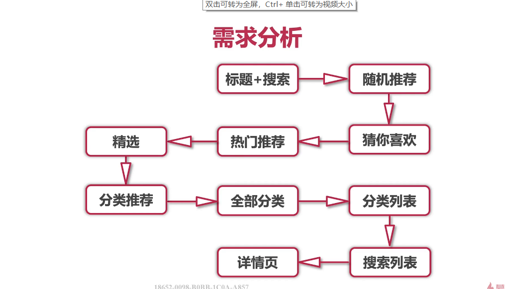
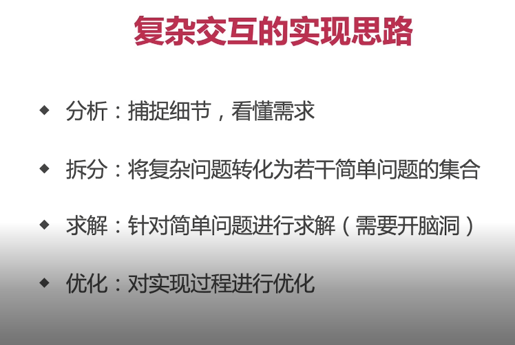
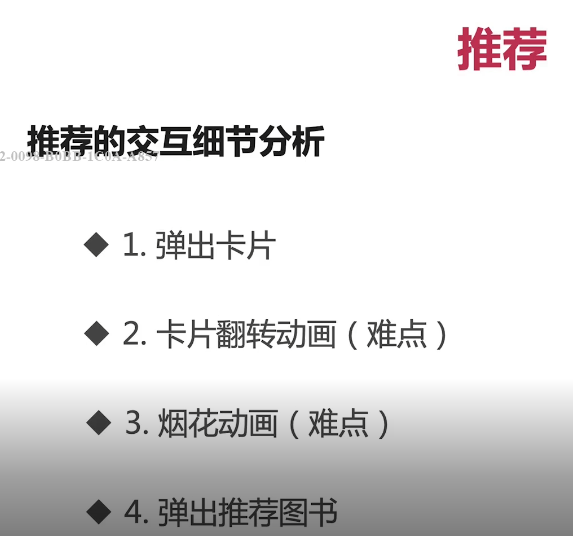

# 书城首页、搜索页、列表页、详情页开发

## 1.1 书城首页开发

### 需求分析



### 根页面搭建

在`src/views`下新建`store/index.vue`

```html
<template>
    <div class="store">
        <router-view></router-view>
    </div>
</template>
```

```scss
.store {
    width: 100%;
    height: 100%;
    background: white;
}
```

### 书城首页搭建

在`src/views/store`新建`StoreHome.vue`

```html
<div class="store-home">
    <search-bar></search-bar>
</div>
```

```scss
.store-home {
    width: 100%;
    height: 100%;
}
```

```javascript
import SearchBar from '../../components/home/searchBar'

export default {
    components: {
        SearchBar
    }
}
```


### 路由改写

`router/index.js`

```javascript
const routers = [
    // ...已有代码省略
    {
        path: '/',
        redirect: '/store'
    },
    {
        path: '/store',
        //！！！！！注意：vue中是 components，而这里则是component
        componet: () => import('../view/store/index.vue'),
        redirect: '/store/home'
        children: [
        	{ // 这里路径不能加/ 加了代表根路径
        		path: 'home',
        		componet: () => import('../view/store/StoreHome.vue')
    		}
        ]
    }
]
```

### 首页子组件标题和搜索框的完成

在`components`下新建`home`文件夹

- 在`home`文件夹下新建`SearchBar`组件

html

```html
// 当search-bar-title-wrapper 隐藏，那么就改变 search-bar的高度为 52，从而使下方内容上移
//hide-title改变高度 hide-shadow 添加阴影
<div class="search-bar" 
     :class="{'hide-title': !titleVisible, 'hide-shadow': !shadowVisible}">
    // 给标题添加动画
    <transition name="title-move">
        // 标题部分 titleVisible控制标题栏的显示隐藏，从而方便实现下文中交互动画的第1步
        <div class="search-bar-title-wrapper" v-show="titleVisible">
            <div class="title-text-wrapper">
                <span class="title-text title">{{$t('home.title')}}</span>
            </div>
            <div class="title-icon-shake-wrapper">
                <span class="icon-shake icon"></span>
            </div>
        </div>
    </transition>
    // 为了使返回按钮不消失，需要将其单独放出来，通过定位确定位置
    <div class="title-icon-back-wrapper" :class="{'hide-title': !titleVisible}">
        <span class="icon-back icon"></span>
    </div>
    // 搜索框部分
    // hide-title 类 用于动态改变top值
    <div class="search-bar-input-wrapper" :class="{'hide-title': !titleVisible}">
        // 设置一个占位的div达到变窄的效果 占位的大小为返回图标的左边距15加上返回图标的宽度16 共31
        <div class="search-bar-blank" :class="{'hide-title': !titleVisible}"></div>
        <div class="search-bar-input">
            <span class="icon-search icon"></span>
            <input type="text" 
                   class="input" 
                   :placeholder="$t('home.hint')"
                   v-model="searchText">
        </div>
    </div>
</div>
```

```scss
 // 搜索栏的布局 flex 和绝对定位均可，这里使用了绝对定位
.search-bar{
    // 设置z-index使其移动时不会处于文字下方
    z-index: 150;
    position: relative;
    width: 100%;
    height: px2rem(94);
    box-shadow: 0 px2rem(2) px2rem(2) rgba(0, 0, 0, .1);
    &.hide-title {
        height: px2rem(52);
    }
    &.hide-shadow {
        box-shadow: none;
    }
    .search-bar-title-wrapper {
        width: 100%;
        height: px2rem(42);
        position: absolute;
        top: 0;
        left: 0;
        .title-text-wrapper {
            // 两边定位，中间直接居中就可以不需要定位
            height: px2rem(42);
            width: 100%;
            @include center
        }
        .title-icon-shake-wrapper {
            position: absolute;
            right: px2rem(15);
            top: 0;
            height: px2rem(42);
            @include center
        }
    }
    .title-icon-back-wrapper {
        position: absolute;
        height: px2rem(42);
        left: px2rem(15);
        top: 0;
        z-index: 200;
        // 动画过渡
        transition: top $animationTime linear;
        @include center;
        &.hide-title {
            // 改变高度
            height: px2rem(52)
        }
    }
    .search-bar-input-wrapper {
        position: absolute;
        left: 0;
        top: px2rem(42);
        width: 100%;
        height: px2rem(52);
        padding: px2rem(10);
        box-sizing: border-box;
        // 给top的改变添加动画过渡
        transition: top $animationTime linear;
        display: flex;
        &.hide-title {
            top: 0;
        }
        .search-bar-blank {
            // 默认为0 为了右侧search-bar-input能够自适应宽度，所以占位div使用flex布局
            flex: 0 0 0;
            // 动画过渡
            transition: top $animationTime linear;
            &.hide-title {
                flex: 0 0 px2rem(31)
            }
        }
        .search-bar-input {
            flex: 1;
            width: 100%;
            background: #f4f4f4;
            border-radius: px2rem(20);
            border: px2rem(1) solid #eee;
            padding: px2rem(5) px2rem(15);
            box-sizing: border-box;
            @include left;
            .icon-search {
                color: #999;
            }
            .input {
                width: 100%;
                height: px2rem(22);
                border: none;
                margin-left: px2rem(10);
                font-size: px2rem(12);
                background: transparent;
                &:focus {
                    outline: none;
                }
                // placeholder通过伪元素改变样式 
                // 谷歌低版本为 ::-webkit-input-placeholder
                // 火狐低版本为 :: -moz-placeholder
                &::placeholder {
                    color: #ccc;
                }
            }
        }
    }
}
```


- 在`mixin.scss`中为上面的icon, title类定义统一的样式

```scss
.icon {
    color: #666;
    font-size: px2rem(16);
}
.title {
    color: #666;
    font-size: px2rem(16);
    font-weight: bold;
}
```

### 标题和搜索框的复杂交互动画



目前要实现的动画步骤：

从往下滚动会产生的动画进行分析

- 1.标题和右侧图标向下渐隐，并最终消失
- 2.搜索框向上移动到标题位置
- 3.搜索框在向上移动的过程中，逐渐的变窄，适应屏幕
- 4.左侧返回按钮会向下有轻微的移动，并居中
- 5.移动完毕后标题栏的下方会出现一个轻微的阴影，复位后阴影消失

详细说明：

- 在`StoreHome`中使用scroll组件，将偏移量保存到vuex 的 offsetY变量

- 在`SearchBar`中进行判断，当偏移量大于0时，设置变量 titleVisible为false 标题栏消失(返回按钮不消失)，将titleVisible绑定在search-bar上，如果titleVisible为false,则改变整体高度，从而下方滚动条部分上移

- 在`SearchBar`给search-bar-title-wrapper类添加动画 title-move

- 调整search-bar类整体z-index值为150,使其滚动动时不会有下方文字覆盖的效果，通过绝对定位保留标题左侧的返回按钮，使其不会一并消失

- 目前由于输入框部分也采用绝对定位，所以它不会随着整体高度减小而上移，所以我们需要改变他的位置，思路有两种：一是改变通过translate3d（不可行，因为该属性不触发重排,不影响布局），这里希望影响布局，所以采用方法二 ： 直接改变他的 top值（top值通过titleVisible类改变）,并在css中设置 transition

- 余下的问题：

- 由于上拉，下方内容移动上升，滚动条高度不够，最底部会空余一部分，所以将:top设为 动态变量

- 实现输入框的变窄 通过一个占位div

- 返回按钮向移，监听滚动，改变高度即可

- 将scss中的动画事件与类型定在`mixin.scss`为统一的变量，方便更改

  - `mixin.scss`

  - ```scss
    $animationTime: .2s;
    $animationType: linear;
    ```

- 阴影的添加，通过新建类实现，这里需要新建变量和方法（新建而不是直接在原有的titleVisible相关类方法变量上改的原因是，之后的热门搜索页面，也会有阴影的显示，所以这里单独提取出来）

1.

`StoreHome.vue`

```html
<!-- search-bar类下方，创建它的兄弟类 -->
<!--top设定Y轴偏移量 这里设为动态变量  onScroll接收子组件传递的Y轴偏移量变化 $refs的设置是为了调用刷新滚动条的方法-->
<scroll :top="scrollTop" @onScroll="onScroll" $ref="scroll">
    <!--因为 Scroll 组件定义了插槽，所以这里可以直接插入一些元素-->
    <div>
        
    </div>
</scroll>
```

```javascript
import Scroll from '../../components/common/Scroll'
import { storeHomeMixin } form '../../utils/mixin'
// 已有代码省略
export default {
    mixins: [storeHomeMixin],
    components: {
        Scroll
    },
    data() {
      return {
          scrollTop: 94
      }  
    },
    methods: {
        // 由于之前在vuex中保存过设置过offsetY变量完成添加书签，所以这里可以再次使用它来保存偏移量，相对的我们需要创建一个首页的混入，见下文
        onScroll(offsetY) {
            // 因为子组件传递了偏移量，所以可以直接设置
            this.setOffsetY(offsetY)
            // 如果偏移量大于0 改变scrollTop变量的值
            if (offsetY) {
                this.scrollTop = 52
            } else {
                this.scroolTop = 94
            }
            // 调用更新滚动条的方法
            this.$refs.scroll.refresh()
        }
    }
}
```


`SearchBar.vue`

javaScript

```javascript
import { storeHomeMixin } from '../../utils/mixin'

export default {
    mixins: [storeHomeMixin],
    data() {
        return {
            searchText: '',
            titleVisible: true,
            showVisible: false
        }
    },
    watch: {
        // 在这里使用watch来监听offsetY的变化,在成功监听之后，即可完成继续动画的第一步
        offsetY(offsetY) {
            if (offsetY > 0) {
                // 隐藏标题
                this.hideTitle()
                // 显示阴影
                this.showShadow()
            } else {
                // 显示标题
                this.showTitle()
                //隐藏阴影
                this.hideShadow()
            }
        }
    },
    methods: {
        hideTitle() {
            this.titleVisible = false
        },
        showTitle() {
            this.titleVisible = true
        },
        hideShadow() {
            this.shadowVisible = false
        },
        showShadow() {
            this.shadowVisible = true
        }
    }
}
```


在`utils/minx.js`中创建混入

```javascript
export const storeHomeMixin = {
    computed: {
        ...mapGetters(['offsetY'])
    },
    methods: {
        ...mapActions(['setOffsetY'])
    }
}
```


动画效果的编写

transition.scss

```scss
// 这里给标题添加动画的原因是为了不让标题的消失十分突兀， px2rem(10) 中的10 不固定，数越大动画效果越快
// enter-to最终显示的状态
.title-move-enter-to, .title-move-leave {
    transform: translate3d(0, 0, 0);
    opactiy: 1;
}
//leave-to最终消失的状态
.title-move-enter, .title-move-leave-to {
    transform: translate3d(0, px2rem(10), 0);
    opacity: 0;
}
// 动画时间
.title-move-enter-active, .title-move-leave-active {
    transition: all.2s linear
}
```

### 热门搜索页面

**所有做的交互**

- 点击搜索栏 淡入热门搜索
- 点击返回按钮 淡出热门搜索
- 滑动页面时会出现阴影，回到顶部，阴影消失
- 返回之后再次进入热门搜索，滑动位置会清除，位置仍在顶部，但首页滑动位置不会清除

#### 界面创建

将准备好的`HotSearch.vue`与 `HostSearchList.vue`引入`components/home`目录下

`HostSearchList.vue`

```html
// 注意：因为HostSearchList是放在 SearchBar组件里的,所以storeHome.vue组件中的滚动内容被直接挤到了页面最下面看不到的地方

<template>
    // 加载动画
  <transition name="hot-search-move">
      // 滚动条
    <scroll class="hot-search-wrapper"
            :top="52"
            @onScroll="onScroll"
            ref="scroll">
        // 热门搜索内容
      <hot-search :label="$t('home.hotSearch')"
                  :btn="$t('home.change')"
                  :hotSearch="searchList.hotSearch"></hot-search>
        // 中间的分割线
      <div class="line"></div>
        // 搜索历史内容，复用了热门搜索组件
      <hot-search :label="$t('home.historySearch')"
                  :btn="$t('home.clear')"
                  :hotSearch="searchList.historySearch"></hot-search>
    </scroll>
  </transition>
</template>

<script>
import Scroll from '../common/Scroll'
import HotSearch from './HotSearch'
import { storeHomeMixin } from '../../utils/mixin'

export default {
  mixins: [storeHomeMixin],
  components: {
    Scroll,
    HotSearch
  },
  data() {
    return {
        // searchList向组件传递的变量
      searchList: {
        hotSearch: [
            // .....
        ],
        historySearch: [
         	//....
        ]
      }
    }
  },
  methods: {
      //设置滚动距离
    onScroll(offsetY) {
      this.setHotSearchOffsetY(offsetY)
    },
      // 跳转到滚动条开头
    reset() {
      this.$refs.scroll.scrollTo(0, 0)
    }
  }
}
</script>

<style lang="scss" rel="stylesheet/scss" scoped>
  @import "../../assets/styles/global";

  .hot-search-wrapper {
    width: 100%;
    height: 100%;
    background: white;
    .line {
      width: 100%;
      height: 0;
      border-top: px2rem(1) solid #eee;
      margin: px2rem(10) 0;
    }
  }
</style>
```

`HotSearch.vue`

```html
<template>
  <div>
      // 标题部分，包括左侧标签与右侧按钮
    <div class="hot-search-title">
      <span class="label">{{label}}</span>
      <span class="btn">{{btn}}</span>
    </div>
      // 列表部分 循环展示数据
    <div class="hot-search-list">
      <div class="hot-search-item" v-for="(item, index) in hotSearch" :key="index">
        <div class="icon-wrapper">
          <span class="icon-book icon" v-if="item.type === 1"></span>
          <span class="icon-search icon" v-if="item.type === 2"></span>
        </div>
        <div class="hot-search-text-wrapper">
          <div class="text" ref="searchText">{{item.text}}</div>
          <div class="num" v-if="item.num">{{item.num}}人搜索</div>
        </div>
      </div>
    </div>
  </div>
</template>

<script>
import { realPx } from '../../utils/utils'

export default {
  props: {
    label: String,
    btn: String,
    hotSearch: Array
  },
  mounted() {
    this.$refs.searchText.forEach(item => {
      item.style.width = window.innerWidth - realPx(20) - realPx(40) + 'px'
    })
  }
}
</script>

<style lang="scss" rel="stylesheet/scss" scoped>
  @import "../../assets/styles/global";

  .hot-search-title {
    display: flex;
    width: 100%;
    font-size: px2rem(13);
    padding: px2rem(10);
    box-sizing: border-box;
    .label {
      flex: 1;
      text-align: left;
      font-weight: bold;
      color: #666;
    }
    .btn {
      flex: 1;
      text-align: right;
      font-weight: bold;
      color: #409EFF;
    }
  }
  .hot-search-list {
    width: 100%;
    padding: 0 px2rem(10);
    box-sizing: border-box;
    .hot-search-item {
      padding: px2rem(10) 0;
      display: flex;
      .icon-wrapper {
        flex: 0 0 px2rem(40);
        @include center;
        .icon-book {
          font-size: px2rem(16);
        }
        .icon-search {
          font-size: px2rem(16);
        }
      }
      .hot-search-text-wrapper {
        flex: 1;
        height: px2rem(35);
        @include columnLeft;
        .text {
          flex: 1;
          height: 100%;
          font-size: px2rem(14);
          font-weight: bold;
          color: #666;
          @include ellipsis;
          @include left;
        }
        .num {
          font-size: px2rem(12);
          color: #999;
          margin-top: px2rem(5);
        }
      }
    }
  }
</style>

```


**vuex相关变量的管理**

- 在`store/modules`下新建 `store.js`

```javascript
const store = {
    state: {
        hotSearchOffsetY: 0
    },
    mutations: {
        SET_HOT_SEARCH_OFFSETY(state, offsetY) {
            state.hotSearchOffsetY = offsetY
        }
    }
}
export default store
```

- `store/index.js`

```javascript
// 已有代码省略
import store from './modules/store'

export default new Vuex.Store({
    modules: {
        store
    }
})`
```

`store/getters`    `store/actions`   `utils/mixin.js`  三个文件同理


**mixin.scss 新增的样式**

```scss
// 纵向flex布局,居左排列
@mixin columnLeft {
    display: flex;
    flex-direction: column;
    justify-content: center;
    align-items: flex-start;
}
```

#### 引入SearchBar.vue

`SearchBar.vue`

```html
// 最外层添加div
<div>
    // 该组件为原有最外层组件的兄弟组件
    <hot-search-list></hot-search-list>
</div>
```

#### 交互动画的详细实现

`SearchBar.vue`

```html
// 最外层添加div
<div>
        //...已有代码省略
				// 返回事件
            <div class="title-icon-back-wrapper" @click="back">
            </div>

					//展示热搜
                <input class="input"
                       @click="showHotSearch">

    // 控制显示状态
    <hot-search-list v-show="hotSearchVisible" ref="hotSearch"></hot-search-list>
</div>
```

```javascript
export default {
    data() {
        return {
            hotSearchVisible: false
        }
    },
    watch: {
      hotSearchOffsetY(offsetY) {
          if (offsetY) {
            this.showShadow()
          } else {
            this.hideShadow()
          }
      }  
    },
    methods: {
        back() {
            this.hideHotSearch()
        },
        showHotSearch() {
            this.hideTitle()
            this.hotSearchVisible = true
            //移动状态下，点击，标题下方的阴影没有隐藏 所以这里需要隐藏
            this.hideShadow()
           // 这里重置操作必须放在nextTick中，否则无效，因为该操作需要在DOM加载完成后，才会成功，所以使用nextTick可以完成此操作
            this.$nextTick(() => {
                 // 每次展示时重置滚动条位置到初值
                this.$refs.hotSearch.reset()
            })
        },
        hideHotSearch() {
            this.hotSearchVisible = false
            // 隐藏时应该判断是否有阴影，标题是否隐藏
            if (this.offsetY) {
                this.hideTitle()
                this.showShadow()
            } else {
                this.showTitle()
                this.hideShadow()
            }
        }
    }
}
```

- 过渡动画

`transition.scss`

```scss
.hot-search-move-enter-active, .hot-search-move-leave-active {
    transition: all .2s linear; 
}

.hot-search-move-enter-to, .hot-search-move-leave {
    transform: translate3d(0, 0, 0);
    opacity: 1;
}
// 这里的30主要是指显示的时候往哪跑，网上跑就是正
.hot-search-move-enter, .hot-search-move-leave-to {
    transform: translate3d(0, px2rem(30), 0);
    opacity: 0;
}
```


### 推荐页的实现



#### 卡片弹出，翻转动画，烟花动画的实现

一：在`components/home`下新建`FlipCard.vue`  （flipCard 翻转卡片）

二： 在`StoreHome.vue`中引入该组件

```html
// 放在searchbar与滚动条之间即可
<flip-card></flip-card>


<script>
import FlipCard from '../../components/home/FlipCard'

export default {
    components: {
        FlipCard
    }
}
</script>
```

三： Vuex中相关变量

`store/moudules/store.js`

```javascript
//省略已有代码
state: {
    // 控制是否显示卡片
    flipCardVisible: false
}
mutations: {
    SET_FLIP_CARD_VISIBLE(state, visible) {
        state.flipCardVisible = visible
    }
}
```

`getters.js` `actions.js` `utils/mixin.js`同理设置

四：SearchBar中为按钮添加展示方法

`SearchBar.vue`

```html
//省略已有代码
<div class="title-icon-shake-wrapper" @click="showFlipCard">
    
    
<script>
    methods: {
        showFlipCard() {
            this.setFlipCardVisible(true)
        }
    }
</script>
```


五： **FlipCard 内容编写**

- 创建最外层div

- 创建关闭按钮部分div，并定义关闭按钮的方法,定义上述部分样式

- 创建卡片部分div

- `将卡片所需半圆图片文件夹images`放入`assets`

- 将半圆的配置文件`store.js`放入`utils`，并将其中的变量`flipCardList`引入

    - ```js
      //文件内容说明
      {
          // rgb值
          r: 255,
          g: 102,
          _g: 102,
          b: 159,
              //左右图片
          imgLeft: 'url(' + require('@/assets/images/gift-left.png') + ')',
          imgRight: 'url(' + require('@/assets/images/gift-right.png') + ')',
              // 控制背景大小
          backgroundSize: '50% 50%',
              // 通过z-index 决定不同图片的上下关系
          zIndex: 100,
              // 旋转角度 degree(度)
          rotateDegree: 0
      }
      ```

- 将`flipCardList`保存在data中，在`flap-card`标签中使用并进行循环

- 在左右半圆标签中添加动态样式，样式中的方法  `:style="semiCircleStyle(item, 'left')"` 通过传入的参数，判断是左半圆还是有半圆

- 编写所有翻转卡部分的样式

  - 其中`flap-card`使用绝对定位进行居中，将这部分样式提取到`mixin.scss`中
  
  - ```scss
    @mixin absCenter {
        position: absolute;
        top: 0;
        left: 0;
        right: 0;
        bottom: 0;
        margin: auto;
    }
    ```

- 给`flap-card`绑定动态样式 `:style="{zIndex: item.zIndex}"`,从而设置翻转卡的z-index，保证正确的上下顺序


**翻转动画的实现**

显示的效果说明：

-  一共五个圆，我们每两个圆做一次交互，那么我们把第一个表面圆称为正面圆，下面的第二个则为背面圆
- 动画开始前需要让背面左半圆，与正面右半圆重叠，转动时，正面圆的右边与背面圆的左边首先转动(转动过程中，这两个转动的半圆，颜色会有细微的变化)，正面圆的左边与背面圆的右边保持不动，当转动到达90度时，背面圆的左边会覆盖正面圆的右边（也就是说这时看不到正面圆的右边），之后背面圆的左边继续转动，直到覆盖正面圆的左边，一轮动画完成。

实现的过程： 

- `flip-card-semi-circle-right` 添加ref=`right`  `flip-card-semi-circle-left` 添加ref=`left`
- 创建rotate(index, type) 方法 index 表示圆的索引， type 有两种类型，一种是正面圆，一种是背面圆==该方法实现将配置后的变化量赋予指定dom达到变化效果==
- 创建`flipCardRotate`方法 ==该方法实现对旋转过程中每一次的变化量进行配置，并调用rotato方法==
- 创建`startFlipCardAnimation()` 翻转动画方法,在 `mounted`中调用，并在该方法中调用 `flipCardRotate`方法==整合旋转前和旋转后的动画，通过定时器循环调用==
- 将`flip-card-semi-circle-right` 转动轴改为左轴   `flip-card-semi-circle-left` 改为右轴
- 通过在`flip-card-semi-circle`中设置`backface-visibility:hidden`控制半圆转动到背面时的显示状态
- 定义变量`front ` `back`保存正面背面的索引 ，并在`flipCardRotate`中使用
- `prepare`方法（prepare预备）==在选择开始预先配置一次旋转值值，并调用rotate方法==，并在`startFlipCardAnimation()`中调用

==此时关于旋转方向的一个说明，正面圆右边和背面圆左边的旋转方向实际上是不同的。在通过prepare预设角度之后，两个半圆同样已右侧为起点，正面半圆顺时针从右向前旋转，背面半圆逆时针从右往后旋转，又因为并且两者的backface也是不同的，对于背面半圆来说，它的正面是左半球，背面时右半球。对于正面半圆来说，它的正面是右半球，背面是左半球，所以设置临界点为90度，当到90度时，改变两者之间的z-index，让背面圆跑到正面，它开始正常显示（通过以上分析得出，目前的代码，哪怕不设置backface-visibility :hidden，当转动到指定度数时，也会由于index的变化而看不到背面转动，所以backface-visibility样式可有可无）==

- 对颜色进行处理，由于背面圆一开始旋转时，_g不断增加，在轮到他显示时，颜色已经变浅了很多，我们要的效果是：颜色从90度开始显示时，就比正常的要深，直到0度时，变浅为原本颜色，所以需要对颜色做一个处理，让它在显示时，再开始变浅。这步处理在`prepare`中
- 接下来开始进行持续转动的判断，在`flipCardRotate`方法中进行此步判断, 即当正面转动180度 背面转动到 0 度时，调用`next()`方法
- 实现next方法
- 将` startFlipCardAnimation`方法中的定时器时间定义为一个变量，保存到data中，方便之后改动
- 下一步根据需求，动画不应该在组件生成时就启动，所以删除mounted钩子函数，通过watch监听flipCardVisible当它为真时，启动动画
- 创建reset方法重置相关配置， 创建stopAnimation方法 关闭定时器并调用 reset方法
- close方法中调用 `stopAnimation`方法关闭动画


**背景部分登场动画的实现**(通过keyframes动画实现)

实现过程： 

- 在`flip-card-bg`上绑定 动态类 `:class="{'animation': runFlipCardAnimation}"` 在data中创建变量`runFlipCardAnimation` 默认为 false, 新建`runAnimation`方法，在方法中将变量设为真， 将`watch`监听`flipCardVisible`的if判断中对 ` startFlipCardAnimation`的调用，移动到，`runAnimation`方法中进行封装，最后再watch中直接使用`runAnimation` ；在close方法中，将变量设为假
- 在scss中定义 `animation`类 


**烟花动画的实现** (通过keyframes动画实现)

- 创建`point-wrapper`类,对其中的dom元素进行设计

- 创建pointList变量，默认为空

- created钩子中对 pointList进行初始化赋值

- 编写`point-wrapper`类下面的scss样式

- 将准备好的`flipCard.scss`移动到`styles`文件夹下，并引入`FlipCard.vue`

  - 文件各部分简要分析

  - ```scss
    // 通过变量保存了颜色
    $color-blue: rgb(74, 171, 255);
    // 并保存该颜色对应的半透明色,因为小球在变化过程中，会先变成半透明，直至消失
    $color-blue-transparent: rgba(74, 171, 255, .5);
    // scss的数组形式，用来保存18条数据
    $moves: (
        // 保存了 起始位置，结束位置 ，以及宽高， 背景颜色
        (startX: 0, startY: 0, endX: 0, endY: 55, width: 6, height: 6, background: $color-green),
        (startX: 0, startY: 0, endX: 15, endY: 60, width: 4, height: 4, background: $color-pink-transparent),
        (startX: 0, startY: 0, endX: 35, endY: 45, width: 4, height: 4, background: $color-blue-transparent),
    );
    // 该混入方法传入小球的索引之后根据上面保存的数据，赋予小球样式
    @mixin move($index) {
        // nth($list, $n)：返回一个列表中指定的某个标签值
        //相当于返回了指定索引的map数据
          $item: nth($moves, $index);
        //定义动画名，为了防重 名称加上索引
        $keyframesName: "move" + $index;
        // 之后分别定义动画时间， 类型， 执行次数
        // 得到宽度
        $width: map-get($item, width); 
        // 以此类推得到高度 背景 开始结束位置
        
        
        // 将上文得到的宽在这里使用，注意由于这里使用了 px2rem()所以文件开头需要引入 mixin.scss
        width: px2rem($width);
        // 之后分别使用 高 背景 animation动画
        // 创建@keyframes 动画 因为这时$keyframesName这里作为动画名使用 ，所以需要加上 #{} 插值，因为名称这里加了插值，所以在使用时 上文的animation也需要有 #{}
        @keyframes #{$keyframesName} {
            // 使用translate3d， scale(这里transform 使用了连写的方式，动画顺序按照书写顺序执行) 和 opacity 完成了动画
            0% {
                transform: translate3d(px2rem($startX), px2rem($startY), 0) scale(0);
                opacity: 0;
            }
            50% {
                transform: translate3d(px2rem($endX * 0.5), px2rem($endY * 0.5), 0) scale(.5);
                opacity: 1;
            }
            90% {
                transform: translate3d(px2rem($endX), px2rem($endY), 0) scale(1);
                opacity: 1;
            }
            100% {
                transform: translate3d(px2rem($endX * 1.05), px2rem($endY * 1.05), 0) scale(1);
                opacity: 0;
            }
        }
    }
    ```

- 给`point`类绑定动态 类`:class="{'animation': runPointAnimation}"` 将runPointAnimation定义在data中默认 false

- 定义 `startPointAnimation`方法，将`runPointAnimation`变量改为true,在`runAnimation` 中调用该方法

- 定义对应`animation`类的样式

- 此时动画基本完成，如果将执行次数设为一次可以发现，执行完毕后，屏幕中央会留下一个小圆点，这是因为添加了`animation`类后，小球有了宽高背景，这时如果想要清除这个圆点，可以在`startPointAnimation`方法中设置定时器，当烟花动画执行完毕后，移除`animation`类


**翻转卡动画的结束**

根据需求，翻转卡动画在运行一段时间后，会结束运行，并随机推荐一本图书，目前图书页面还没有完成，所以利用定时器来模拟关闭动画

步骤：

- 1.在`startFlipCardAnimation`中添加定时器，将`runFlipCardAnimation`设为false,也就是移除登场动画（注：实际上登场动画只会执行一次，这里不需要专门设为false，因为最终close方法也会设为false，但这里设为false，就是为了得到一个状态，下面才能根据scsss样式，改变该DOM元素的显示）
- 2.在`flip-card-bg`的样式中添加`transform: scale(0); opacity:0;` 并在它的同级`&.animation`样式中`animation`属性的最后添上`both`，`both`结合了`forwards`和`backwards`的特点，在执行动画时，会跳过初始样式直接到第一帧，在动画执行完毕后，又会停留在最后一帧。这样整体DOM的显示就不会受新添加属性的影响，等到上一步，设为false,移除了该类后，DOM就会受到新属性的影响，就会消失。
- 3.DOM消失后，翻转动画尽管看不到，但仍继续执行，所以在`startFlipCardAnimation`方法的定时器中，对翻转动画进行清除
- 4.我们可以删除第1 步和 第 3 步定时器中的代码,直接在 `stopAnimation() `方法中添加`this.runFlipCardAnimation = false` ，之后直接调用`stopAnimation`方法达到效果
- ==注意：这时可以发现close方法中重复将this.runFlipCardAnimation 设为了false,那么也可以它里面的这行代码删除，达到简化的目的==

```html
<div class="flip-card-wrapper" v-show="flipCardVisible">
    <!--卡片部分-->
    <!--白色背景-->
    <div class="flip-card-bg" :class="{'animation': runFlipCardAnimation}">
        <!--一张张方型的翻转卡-->
        <div class="flip-card" v-for="(item, index) in flipCardList" 
             :key=index
             :style="{zIndex: item.zIndex}">
            <!--一个翻转圆形卡-->
            <div class="flip-card-circle">
                <!--semi（半圆） 这里划分为了左右半圆-->
                <div class="flip-card-semi-circle flip-card-semi-circle-left"
                     :style="semiCircleStyle(item, 'left')" ref='left'>

                </div>
                <div class="flip-card-semi-circle flip-card-semi-circle-right"
                     :style="semiCircleStyle(item, 'right')" ref='right'>
                </div>
            </div>
        </div>
            <!--烟花部分-->
        <div class="point-wrapper">
            <div class="point" 
                 v-for="item in pointList" :key="item"
                 :class="{'animation': runPointAnimation}"></div>
        </div>
    </div>
    <!--关闭按钮-->
    <div class="close-btn-wrapper" @click="close">
        <span class="icon-close"></span>
    </div>
</div>
```

```javascript
import { storeHomeMixin } from '../../utils/mixin' 
import { flipCardList } from '../../utils/store'

export default {
    mixins: [storeHomeMixin],
    data() {
        return {
            flipCardList,
            front: 0,
            back: 1,
            intervalTime: 25,
            runFlipCardAnimation: false,
            pointList: null,
            runPointAnimation: false
        }
    },
    watch: {
        flipCardVisible(v) {
            if (v) {
                this.runAnimation()
            }
        }
    },
    methods: {
        // 关闭翻转卡
        close() {
            //该方法被浓缩到stopAnimation中 this.runFlipCardAnimation = false
            this.stopAnimation()
            this.setFlipCardVisible(false)
        },
        semiCircleStyle(item, dir) {
            return {
                backgroundColor: `rgb(${item.r}, ${item.g},${item.b})`,
                backgroundSize: item.backgroundSize,
                backgroundImage: dir === `left` ? item.imgLeft : item.imgRight
            }
        },
        rotate(index, type) {
            // 1.获取对应的翻转卡片配置
            const item = this.flapCardList[index]
            // 2. 得到对应的dom元素
            let dom
            // 2.1如果是正面则得到右边圆的dom元素
            if (type === 'front') {
                dom = this.$refs.right[index]
            } else {
                // 2.2 反之为背面，则得到左边圆的dom元素
                dom = this.$refs.left[index]
            }
            // 3.进行转动
            dom.style.transform = `rotateY(${item.rotateDegree}deg)`
            // 4.颜色改变
            dom.style.backgroundColor = `rgb(${item.r}, ${item._g}, ${item.b})`
        },
        flipCardRotate() {
            // 获取正面的翻转卡片配置
            // 接下来要改动的参数说明， 改变翻转角度rotateDegreee， 改变背景颜色中的_g(配置中参数有一个g 一个_g  _g用于改变，g 用于还原) 
            const frontFlipCard = this.flipCardList[this.front]
            // 获取背面的翻转卡片配置
            const backFlipCard = this.flipCardList[this.back]
            // 正面角度每次加10 _g每次 减5，整体颜色会不断加深
            frontFlipCard.rotateDegree += 10
            frontFlipCard._g -= 5
            // 背面角度每次减10 _g每次 加5，整体颜色会不断变浅
            backFlipCard.rotateDegree -= 10
            backFlipCard._g += 5
            // 目前并不能看到背面圆，因为背面圆的z-index小于正面圆，所以需要到达临界点时提升背面圆的z-index，这个临界点为 90度
            if (frontFlipCard.rotateDegree === 90 && backFlipCard.rotateDegree === 90) {
                // 加1相等 加2超过
                backFlipCard.zIndex += 2
            }
            this.rotate(this.front, 'front')
            this.rotate(this.back, 'back')
            // 当正面转动180度 背面转动到 0 度时
            if (frontFlipCard.rotateDegree === 180 && backFlipCard.rotateDegree === 0) {
                this.next()
            }
        },
        next() {
            // 获取正面的翻转卡片配置
            const frontFlipCard = this.flipCardList[this.front]
            // 获取背面的翻转卡片配置
            const backFlipCard = this.flipCardList[this.back]
            // 使当前索引的正面背面，转动角度归0
            frontFlipCard.rotateDegree = 0
            backFlipCard.rotateDegree = 0
            // 使当前索引的正面背面，颜色还原
            frontFlipCard._g = frontFlipCard.g
            backFlipCard._g = backFlipCard.g
            // 调用rotate ，将配置应用到 dom上
            this.rotate(this.front, 'front')
            this.rotate(this.back, 'back')
            // 还原之后，是正面背面的索引指向下一个
            this.front++
            this.back++
            // 如果溢出则从头开始
            const len = this.flipCardList.length
            if (this.front >= len) {
                this.front = 0
            }
            if (this.back >= len) {
                this.back = 0
            }
            // 这里我们还需要对z-index进行处理 
            //默认为 100 99 98 97 96 第一轮结束后为 100 101 98 97 96，按照这种情况，下一次执行flipCardRotate的z-index 就该加4了，这样每次增加的数量都不同，且z-index逐渐增大，显然是不可行的，所以我们需要对zIndex进行处理，希望达到初始 100 99 98 97 96 新 96 100 99 98 97的效果
            // 设计算法如下  该算法的好处是不会被 第一次执行的 flipCardRotate后 z-index :100 101 98 97 96, 所影响，每一次都会根据初值 与 新 值的关系，重置并改变 z-index的数值和次序
            this.flipCardList.froEach((item, index) => {
                item.zIndex = 100 - ((index - this.front + len) % len)
            })
            // 之后再次调用prepare设置初始值
            this.prepare()
        },
        prepare() {
            // 获取背面翻转卡的配置
            const backFlipCard = this.flipCardList[this.back]
            // 将其角度设为180，与正面右半圆重叠
            backFlipCard.rotateDegree = 180
            // 在初始时，减去足够的_g,使背面在显示时,颜色就比较深,5是每次，18是共几次(180/10)
            backFlipCard._g = backFlipCard.g - 5 * 18
            this.rotate(this.back, 'back')
        },
        startFlipCardAnimation() {
    		// 动画开始前需要让背面左半圆，与正面右半圆重叠
            this.prepare()
            // 循环执行转动方法
            this.task = setInterval(() => {
                this.flipCardRotate()
            }, this.intervalTime)
            // 定时结束翻转卡
            setTimeout(() => {
                 /* this.runFlipCardAnimation = false
                if (this.task) {
                    clearInterval(this.task)
                } */
                // 省略以上四行代码直接调用stopAnimation方法
                this.stopAnimation()
            }, 2500)
        },
        startPointAnimation() {
            this.runPointAnimation = true
            setTimeout(() => {
                this.runPointAnimation = false
            }, 750)
        },
        reset() {
            // 索引重置
            this.front = 0
            this.back = 1
            this.flipCardList.forEach((item, index) => {
                //z-index重置
                item.zIndex = 100 - index
                // 颜色还原
                item._g = item.g
                // 翻转角度还原
                item.rotateDegree = 0
                // 将新配置应用
                this.rotate(index, 'front')
                this.rotate(index, 'back')
            })
        },
        stopAnimation() {
            // 直接在这里移除登场动画
            this.runFlipCardAnimation = false
            if (this.task) {
                clearInterval(this.task)
            }
            this.reset()
        },
        runAnimation() {
            this.runFlipCardAnimation = true
            // 通过定时器在登场动画执行完毕后（300为登场动画执行时间），执行翻转动画,和 烟花动画
            setTimeout(() => {
                this.startFlipCardAnimation()
                this.startPointAnimation()
            }, 300)
        }
    },
    created() {
        this.pointList = []
        for (let i = 0; i < 18; i++) {
            this.pointList.push(`point${i}`)
        }
    }
}
```

```scss
@import "../../assets/styles/flipCard";


.flip-card-wrapper {
    position: absolute;
    top: 0;
    left: 0;
    right: 0;
    bottom: 0;
    z-index: 1000;
    background: rgba(0, 0, 0, .6);
    @include center
    .flip-card-bg {
        position: relative;
        width: px2rem(64);
        height: px2rem(64);
        border-radius: px2rem(5);
        background: white;
        transform: scale(0);
        opacity: 0;
        &.animation {
            // 这里通过调用@keyframes动画完成效果 infinite（无限）
            // 时间必须有 s !!!!!!!!!!!!!!!!!!!!!!!!!!!!!!!!!!!!!!!!!!!!!!!!!!!!!!!!!!!!!!!!!!!!!!!!!!!!!!!!!!!!!!!!!!!!!!!!!!!!!!!!!!!!!!!!!!!!!!!!!!!!1
            animation: flip-card-move .3s ease-in both;
        }
        @keyframes flip-card-move{
            0% {
                transform: scale(0);
                opacity: 0;
            }
            50% {
                transform: scale(1.2);
                opacity: 1;
            }
            75% {
                transform: scale(.9);
                opacity: 1;
            }
            100% {
                transform: scale(1);
                opacity: 1;
            }
        }
        .flip-card {
            width: px2rem(48);
            height: px2rem(48);
           	@include absCenter;
            .flip-card-circle {
                display: flex;
                height: 100%;
                width: 100%;
                .flip-card-semi-circle {
                    flex: 0 0 50%;
                    width: 50%;
                    height: 100%;
                    // 设置两个半圆的背景图片都不重复
                    background-repeat: no-repeat;
                    backface-visibility:hidden;
                }
                .flip-card-semi-circle-left{
                    // 左半圆左上左下为圆 因为整体宽高为48，所以这里24为圆角
                    border-radius: px2rem(24) 0  0 px2rem(24);
                    // 设置左半圆背景位置 纵向居中，水平靠右
                    background-position: center right;
                    // 转动轴
                    transform-origin: right;
                }
                .flip-card-semi-circle-right{
                    // 右半圆同理
                    border-radius: 0 px2rem(24) px2rem(24) 0;
                    // 设置右半圆背景位置
                    background-position: center left;
                    // 转动轴
                    transform-origin: left;
                }
            }
        }
        .point-wrapper {
            // 将包含所有点的图层绝对居中
            @include absCenter;
            z-index: 1500;
            .point {
                border-radius: 50%;
                // 将每个点都绝对居中重叠起来
                @include absCenter;
                &.animation {
                    // 通过@for $i form to ($i 为每一次循环得到的值，包括左边界，不包括右边界)循环所有的索引 右边界通过获取 $moves数组的长度得到
                    @for $i from 1 to length($moves) {
                        // 注意：这里不能直接使用include还需要通过nth-child选择不同的 .point ，如果不选，那么所有的.point 最后都会应用循环的最后一次样式，这里选中以后保证了每个只有一个样式
                        &:nth-child(#{$i}) {
                            @include move($i);
                        }
                    }
                }
            }
        }
    }
    .close-btn-wrapper {
        position: absolute;
        left: 0;
        bottom: px2rem(30);
        z-index: 1100;
        width: 100%;
        @include center;
        .icon-close {
            // 因为父元素使用flex布局，所以子元素可以设置宽高
           width: px2rem(45);
           height: px2rem(45);
           font-size: px2rem(25);
           border-radius: 50%;
           background: #333;
           color: white;
           @include center;
        }
    }
}
```

#### 推荐图书的实现（mockJS）

在开发环境下，这里使用`mock.js`模拟数据


注：*BLOB*常常是数据库中用来存储二进制文件的字段*类型*。

一： mock.js安装

```javascript
cnpm i mockjs --save-dev 或 cnpm i mockjs -D
```

二： axios 安装

```javascript
cnpm i axios --save
```

三： 使用步骤

- 将准备好的mock数据文件夹，拷贝到 `src`目录下

- 清空mock文件夹中的`index.js`稍后自行编写

- 在`scr/main.js` 引入mock文件夹下的`index.js`

  - ```javascript
    import './mock'
    ```

- `mock/index.js`编写如下代码

  - ```javascript
    import Mock from 'mockjs'
    // 引入数据文件
    // 首页
    import home from './bookHome'
    // 书架
    import shelf from './bookShelf'
    // 图书列表
    import list from './bookList'
    // 用于查询图书
    import flatList from './bookFlatList'
    // 参数为：url地址(可以使用正则)， 请求类型， 数据模板
    // 这里正则的效果是，只要请求url中带有指定的字符就拦截
    Mock.mock(/\/book\/home/, 'get', home)
    Mock.mock(/\/book\/shelf/, 'get', shelf)
    Mock.mock(/\/book\/list/, 'get', list)
    Mock.mock(/\/book\/flap-list/, 'get', flatList)
    ```
    
  
- 在`src`目录下新建`api`文件夹，用于存放网络请求

- //*在 .env.development 中定义base_url*（ip地址根据当前网络环境会有变化，端口号为当前页面默认端口号）

- ```.development 
  VUE_APP_BASE_URL = http://192.168.1.7:8080
  ```

- `api`下新建`store.js`

- ```javascript
  import axios from 'axios'
  
  export function home() {
    return axios({
      methods: 'get',
      url: `${process.env.VUE_APP_BASE_URL}/book/home`
    })
  }
  ```

- `StoreHOme.vue`

- ```html
  // 将图书数据传给flip-card组件    
  <flip-card :data="random"></flip-card>
  ```

- 

- ```javascript
  import { home } from '../../api/store'
  
  mounted () {
      home().then(response => {
          // 响应存在，且状态码为200
          if (response && response.status === 200) {
              // 取出响应数据
              const data = response.data
              // 这里取出数组random中，随机数据对象，保存在random变量中
              const randomIndex = Math.floor(Math.random() * data.random.length)
              // 获取随机图书
              this.random = data.random[randomIndex]
          }
      })
  }
  ```
```
  
- 上述使用mock.js的说明 1.引入mock引入axios 2.创建mock文件夹，将模拟数据放入，并创建index.js，之后在main.js中引入。 3.在index.js中，引入mock模块，引入模拟数据，使用Mock.mock方法配置url，并配置请求方式和资源。 4.创建api 文件，创建对应网络请求文件，配置环境变量。之后在对应组件中发起请求，即可得到mock模拟的数据

四： 接收并使用

1.将准备好的`home.scss`放入 `assets/styles`中,并在`global.scss`中引用

2.将准备好的`getCategoryName`方法（==该方法用于传入分类id获取分类名称部分url路径==）和`categoryText`方法（==该方法用于传入分类id和vue获取国际化文本==）引入`utils/store.js`  (category ；种类)

3.在`mixin.scss`中新增样式

​```scss
@mixin columnTop {
  display: flex;
  flex-direction: column;
  justify-content: flex-start;
  align-items: center;
}
```

4.

`FlipCard.vue`

```html
<!--改動部分 新增v-show判断-->   
<div class="flip-card-bg" :class="{'animation': runFlipCardAnimation}" v-show="runFlipCardAnimation">
<!--新增dom-->
    <div class="book-card" :class="{'animation': runBookCardAnimation}" v-show="runBookCardAnimation">
        <div class="book-card-wrapper">
            <div class="img-wrapper">
                
            </div>
            <div class="content-wrapper">
                <div class="content-title">{{data ? data.title : ''}}</div>
                <div class="content-author sub-title-medium">{{data ? data.author : ''}}</div>
                <div class="content-category">{{categoryText()}}</div>
            </div>
            <div class="read-btn" @click.stop="showBookDetail(data)">{{$t('home.readNow')}}</div>
        </div>
    </div>
```


```javascript
import { categoryText } from '../../utils/store'

export default {
    // 接收随机图书数据
    props: {
        data: Object
    },
    data() {
        runBookCardAnimation: false
    },
    method: {
        // 改动后的runAnimation方法
        runAnimation() {
            this.runFlipCardAnimation = true
            this.timeTask2 = setTimeout(() => {
                this.startFlipCardAnimation()
                this.startPointAnimation()
            }, 300)
            // 这里将 startFlipCardAnimation中的终止动画操作移了过来，并加入了2.5秒后图书卡片的动画
            this.timeTask = setTimeout(() => {
                this.stopAnimation()
                this.runBookCardAnimation = true
            }, 2500)
        },
        // 改动后的reset方法
        reset() {
            this.front = 0
            this.back = 1
            this.flipCardList.forEach((item, index) => {
                item.zIndex = 100 - index
                item._g = item.g
                item.rotateDegree = 0
                this.rotate(index, 'front')
                this.rotate(index, 'back')
            })
            // 以下三条为改动部分，由与这里将runFlipCardAnimation设为了false所以，stopAnimation中原有的设false操作可以删除。
            this.runBookCardAnimation = false
            this.runFlipCardAnimation = false
            this.runPointAnimation = false
        },
        // 改动后的stopAnimation方法
        stopAnimation() {
            if (this.task) {
                clearInterval(this.task)
            }
            // 以下两个关闭定时器操作为改动部分
            if (this.timeTask) {
                clearTimeout(this.timeTask)
            }
            if (this.timeTask2) {
                clearTimeout(this.timeTask)
            }
            this.reset()
        },
        // 调用`utils/store.js`中新增的方法，获取文本
        categoryText() {
            // 这里需要做一次判断，在请求到结果之前data为null
            if (this.data) {
                return categoryText(this.data.category, this)
            } else {
                return ''
            }
        }
    }
}
```

```scss
// 新增样式
.book-card {
    position: relative;
    width: 65%;
    max-width: px2rem(400);
    box-sizing: border-box;
    border-radius: px2rem(15);
    background: white;
    &.animation {
        animation: scale .3s ease-in both;
        @keyframes scale {
            0% {
                transform: scale(0);
                opacity: 0;
            }
            100% {
                transform: scale(1);
                opacity: 1;
            }
        }
    }
    .book-card-wrapper {
        width: 100%;
        height: 100%;
        margin-bottom: px2rem(30);
        @include columnTop;
        .img-wrapper {
            width: 100%;
            margin-top: px2rem(20);
            @include center;
            .img {
                width: px2rem(90);
                height: px2rem(130);
            }
        }
        .content-wrapper {
            padding: 0 px2rem(20);
            margin-top: px2rem(20);
            .content-title {
                color: #333;
                font-weight: bold;
                font-size: px2rem(18);
                line-height: px2rem(20);
                max-height: px2rem(40);
                text-align: center;
                @include ellipsis2(2)
                    }
            .content-author {
                margin-top: px2rem(10);
                text-align: center;
            }
            .content-category {
                color: #999;
                font-size: px2rem(14);
                margin-top: px2rem(10);
                text-align: center;
            }
        }
        .read-btn {
            position: absolute;
            bottom: 0;
            left: 0;
            z-index: 1100;
            width: 100%;
            border-radius: 0 0 px2rem(15) px2rem(15);
            padding: px2rem(15) 0;
            text-align: center;
            color: white;
            font-size: px2rem(14);
            background: $color-blue;
        }
    }
}
```

### commit提交


==将准备好的`Category.vue CategoryBook.vue Featured.vue GuessYouLike.vue Recommend.vue Title.vue`放入`components/home`文件夹下==

### 首页图片

- 在`StoreHome.vue`

- ```javascript
  data () {
      banner: null
  }
  mounted() {
      home().then(response => {
          //.. 省略已有代码
          // 获取图片
          this.banner = data.banner
      })
  }
  ```

- ```html
  <scroll :top="94" @onScroll="onScroll">
      <div class="banner-wrapper">
          <div class="banner-img" :style="{backgroundImage:`url(${banner})`}"></div>
      </div>
  </scroll>
  ```

- ```scss
  .banner-wrapper {
      width: 100%;
      padding: px2rem(10);
      box-sizing: border-box;
      .banner-img {
          width: 100%;
          height: px2rem(150);
          background-size: 100% 100%;
          background-repeat: no-repeat;
      }
  }
  ```

### 首页猜你喜欢

- 在`StoreHome.vue`

- ```javascript
  import GuessYouLike from '../../components/home/GuessYouLike'
  
  components: {
      GuessYouLike
  }
  data () {
      gussYouLike: null
  }
  mounted() {
      home().then(response => {
          //.. 省略已有代码
          // 猜你喜欢
          this.gussYouLike = data.gussYouLike
      })
  }
  ```

- ```html
  // 在首页图片dom的下方引入组件
  <guess-you-like :data="gussYouLike"></guess-you-like>
  ```

- `GuessYouLike.vue`

- 通过showdata计算属性，返回当前页面应该展示的数据，定义变量 total index，展示的数据在总数据data中的位置为两个变量和， total有 length/3 得到，total不变，而index会改变，当点击组件Title中的换一批时，事件向上传递，index自增，如果index没有大于total，则index++，如果大于等于则，归0，

- 索引变化过程展示

- 0 0+3 0+6       1  1+3 1+6   2 2+3  2+6     归零0  0+3  0+6往复

- ```html
  <template>
    <div class="guess-you-like">
      <title-view :label="$t('home.guessYouLike')" :btn="$t('home.change')" @onClick="change"></title-view>
      <div class="guess-you-like-list">
        <div class="guess-you-like-item" v-for="(item, index) in showData" :key="index" @click="showBookDetail(item)">
          <div class="img-wrapper">
            
          </div>
          <div class="content-wrapper">
            <div class="title title-big" ref="title">{{item.title}}</div>
            <div class="author sub-title" ref="author">{{item.author}}</div>
            <div class="result third-title" ref="result">{{resultText(item)}}</div>
          </div>
        </div>
      </div>
    </div>
  </template>
  
  <script type="text/ecmascript-6">
  import TitleView from './Title'
  import { realPx } from '../../utils/utils'
  import { storeHomeMixin } from '../../utils/mixin'
  
  export default {
    mixins: [storeHomeMixin],
    components: {
      TitleView
    },
    props: {
      data: Array
    },
    watch: {
      data(v) {
        this.total = v.length / 3
      }
    },
    computed: {
      width() {
        return window.innerWidth - realPx(20) - realPx(60) + 'px'
      },
      showData() {
        if (this.data) {
          return [
            this.data[this.index],
            this.data[this.index + this.total],
            this.data[this.index + this.total * 2]
          ]
        } else {
          return []
        }
      }
    },
    data() {
      return {
        index: 0,
        total: 0
      }
    },
    methods: {
      change() {
        if (this.index + 1 >= this.total) {
          this.index = 0
        } else {
          this.index++
        }
      },
      resultText(item) {
        if (item && item.type && item.result) {
          switch (item.type) {
            case 1:
              return this.$t('home.sameAuthor').replace('$1', item.result)
            case 2:
              return this.$t('home.sameReader').replace('$1', item.result)
            case 3:
              return this.$t('home.readPercent').replace('$1', item.percent).replace('$2', item.result)
          }
        }
      },
      resize() {
        this.$nextTick(() => {
          this.$refs.title.forEach(item => {
            item.style.width = this.width
          })
          this.$refs.author.forEach(item => {
            item.style.width = this.width
          })
          this.$refs.result.forEach(item => {
            item.style.width = this.width
          })
        })
      }
    }
  }
  </script>
  
  <style lang="scss" rel="stylesheet/scss" scoped>
  @import "../../assets/styles/global";
  
  .guess-you-like {
    .guess-you-like-list {
      width: 100%;
      padding: 0 px2rem(10);
      box-sizing: border-box;
      .guess-you-like-item {
        display: flex;
        margin-top: px2rem(15);
        &:first-child {
          margin-top: px2rem(5);
        }
        .img-wrapper {
          flex: 0 0 20%;
          padding: px2rem(10) px2rem(10) px2rem(10) 0;
          box-sizing: border-box;
          .img {
            width: 100%;
          }
        }
        .content-wrapper {
          flex: 1;
          padding: px2rem(10) 0;
          box-sizing: border-box;
          .author {
            margin-top: px2rem(15);
          }
          .result {
            margin-top: px2rem(5);
          }
        }
      }
    }
  }
  </style>
  
  ```

- `Title.vue`

- ```html
  <template>
    <div class="home-title-wrapper">
      <div class="label">{{label}}</div>
      <div class="btn" @click="click">{{btn}}</div>
    </div>
  </template>
  
  <script type="text/ecmascript-6">
  export default {
    props: {
      label: String,
      btn: String
    },
    methods: {
      click() {
        this.$emit('onClick')
      }
    }
  }
  </script>
  
  <style lang="scss" rel="stylesheet/scss" scoped>
  @import "../../assets/styles/global";
  .home-title-wrapper {
    width: 100%;
    padding: px2rem(15) px2rem(10);
    box-sizing: border-box;
    @include top;
    .label {
      flex: 1;
      font-size: px2rem(18);
      color: #333;
      font-weight: bold;
    }
    .btn {
      font-size: px2rem(14);
      color: rgba(64, 158, 255, 1);
      &:active {
        color: rgba(64, 158, 255, .5);
      }
    }
  }
  </style>
  
  ```

`mixin.scss`

```scss
@mixin top {
  display: flex;
  justify-content: center;
  align-items: flex-start;
}
```


### 首页热门推荐

- 在`StoreHome.vue`

- ```javascript
  import Recommend from '../../components/home/Recommend'
  
  components: {
      Recommend
  }
  data () {
      recommend: null
  }
  mounted() {
      home().then(response => {
          //.. 省略已有代码
          // 获取图片
          this.recommend = data.recommend
      })
  }
  ```

- ```html
  <recommend class="recommend" :data="recommend"></recommend>
  ```

- ```scss
  .recommend {
      margin-top: px2rem(20);
  }
  ```

- `Recommend.vue`

- ```html
  <template>
    <div class="recommend">
      <title-view :label="$t('home.recommend')" :btn="$t('home.seeAll')"></title-view>
      <div class="recommend-list">
        <div class="recommend-item" v-for="(item, index) in data" :key="index" @click="showBookDetail(item)">
          <div class="img-wrapper">
            
          </div>
          <div class="content-wrapper">
            <div class="title title-medium" ref="title">{{item.title}}</div>
            <div class="num sub-title" ref="num">{{$t('home.readers').replace('$1', item.readers)}}</div>
          </div>
        </div>
      </div>
    </div>
  </template>
  
  <script type="text/ecmascript-6">
  import TitleView from './Title'
  import { storeHomeMixin } from '../../utils/mixin'
  
  export default {
    mixins: [storeHomeMixin],
    components: {
      TitleView
    },
    props: {
      data: Array
    }
  }
  </script>
  
  <style lang="scss" rel="stylesheet/scss" scoped>
  @import "../../assets/styles/global";
  
  .recommend {
    .recommend-list {
      width: 100%;
      @include top;
      padding: 0 px2rem(5);
      box-sizing: border-box;
      .recommend-item {
        flex: 0 0 33.33%;
        width: 33.33%;
        padding: 0 px2rem(5);
        box-sizing: border-box;
        .img-wrapper {
          @include center;
          .img {
            width: 80%;
          }
        }
        .content-wrapper {
          width: 100%;
          margin-top: px2rem(10);
          @include columnCenter;
          .title {
            text-align: center;
          }
          .num {
            margin-top: px2rem(5);
          }
        }
      }
    }
  }
  </style>
  
  ```

`mixin.scss`

```scss
@mixin columnCenter {
  display: flex;
  flex-direction: column;
  justify-content: center;
  align-items: center;
}
```

### 首页精选

- 在`StoreHome.vue`

- ```javascript
  import Featured from '../../components/home/Featured'
  
  components: {
      Featured
  }
  data () {
      featured: null
  }
  mounted() {
      home().then(response => {
          //.. 省略已有代码
          // 精选
          this.featured = data.featured
      })
  }
  ```

- ```html
  // 这里除了数据以外标题是否隐藏，及按钮文本，都需要传递，为了Featured.vue在之后的复用，所以设置多个props
  <featured class="featured" :data="featured"
            :titleText="$t('home.featured')"
            :btnText="$t('home.seeAll')"></featured>
  ```

- ```scss
  .recommend {
      margin-top: px2rem(20);
  }
  ```

`Featured.vue`

```html
<template>
  <div class="featured">
    <title-view :label="titleText" :btn="btnText" v-if="titleVisible && data && data.length > 0"></title-view>
    <div class="featured-list">
      <div class="featured-item-wrapper">
        <div class="featured-item" v-for="(item, index) in data" :key="index" @click="showBookDetail(item)">
          <div class="img-wrapper">
            
          </div>
          <div class="content-wrapper">
            <div class="title title-small" ref="title">{{item.title}}</div>
            <div class="author sub-title-tiny" ref="author">{{item.author}}</div>
            <div class="category third-title-tiny" ref="category">{{categoryText(item.category)}}</div>
          </div>
        </div>
      </div>
    </div>
  </div>
</template>

<script type="text/ecmascript-6">
import TitleView from './Title'
import { realPx } from '@/utils/utils'
import { categoryText } from '../../utils/store'
import { storeHomeMixin } from '../../utils/mixin'

export default {
  mixins: [storeHomeMixin],
  components: {
    TitleView
  },
  props: {
    data: Array,
    titleVisible: {
      type: Boolean,
      default: true
    },
    titleText: {
      type: String
    },
    btnText: {
      type: String
    }
  },
  computed: {
    width() {
      return window.innerWidth - realPx(20) - realPx(60) + 'px'
    }
  },
  methods: {
    categoryText(category) {
      return categoryText(category, this)
    },
    resize() {
      this.$nextTick(() => {
        this.$refs.title.forEach(item => {
          item.style.width = this.width
        })
        this.$refs.author.forEach(item => {
          item.style.width = this.width
        })
        this.$refs.category.forEach(item => {
          item.style.width = this.width
        })
      })
    }
  }
}
</script>

<style lang="scss" rel="stylesheet/scss" scoped>
@import "../../assets/styles/global";

.featured {
  .featured-list {
    width: 100%;
    padding: 0 px2rem(10);
    box-sizing: border-box;
    .featured-item-wrapper {
      width: 100%;
      display: flex;
      flex-flow: row wrap;
      justify-content: flex-start;
      align-items: flex-start;
      .featured-item {
        flex: 0 0 50%;
        width: 50%;
        padding: px2rem(5) 0;
        @include top;
        .img-wrapper {
          flex: 0 0 30%;
          width: 30%;
          .img {
            width: 100%;
            // width: px2rem(50);
            // height: px2rem(75);
          }
        }
        .content-wrapper {
          flex: 1;
          width: px2rem(117.5);
          padding: 0 px2rem(5);
          box-sizing: border-box;
          .author {
            margin-top: px2rem(15);
          }
          .category {
            margin-top: px2rem(5);
          }
        }
      }
    }
  }
}
</style>
```

### 首页分类列表

- 在`StoreHome.vue`

- ```javascript
  import CategoryBook from '../../components/home/CategoryBook'
  
  components: {
      CategoryBook
  }
  data () {
      categoryList: null
  }
  mounted() {
      home().then(response => {
          //.. 省略已有代码
          // 分类列表
          this.categoryList = data.categoryList
      })
  }
  ```

- ```html
  <div class="category-list-wrapper"
       v-for="(item, index) in categoryList"
       :key="index">
      <category-book :data="item"></category-book>
  </div>
  ```

- ```scss
  .category-list-wrapper {
      margin-top: px2rem(20);
  }
  ```

`CategoryBook.vue`

```html
<template>
  <div class="category-book">
    <title-view :label="categoryText(data.category)" :btn="$t('home.seeAll')" @onClick="showBookCategory"></title-view>
    <div class="category-book-list">
      <div class="category-book-item" v-for="(item, index) in data.list" :key="index" @click="showBookDetail(item)">
        <div class="img-wrapper">
          
        </div>
        <div class="content-wrapper">
          <div class="title title-small" ref="title">{{item.title}}</div>
          <div class="num sub-title-tiny" ref="author">{{item.author}}</div>
        </div>
      </div>
    </div>
  </div>
</template>

<script type="text/ecmascript-6">
import TitleView from './Title'
import { categoryText, getCategoryName } from '../../utils/store'
import { storeHomeMixin } from '../../utils/mixin'

export default {
  mixins: [storeHomeMixin],
  components: {
    TitleView
  },
  props: {
    data: Object
  },
  methods: {
    showBookCategory() {
      this.$router.push({
        path: '/store/list',
        query: {
          category: getCategoryName(this.data.category),
          categoryText: this.categoryText(this.data.category)
        }
      })
    },
    categoryText(category) {
      return categoryText(category, this)
    }
  }
}
</script>

<style lang="scss" rel="stylesheet/scss" scoped>
@import "../../assets/styles/global";

.category-book {
  .category-book-list {
    width: 100%;
    @include top;
    padding: 0 px2rem(5);
    box-sizing: border-box;
    .category-book-item {
      flex: 0 0 25%;
      width: 25%;
      padding: 0 px2rem(5);
      box-sizing: border-box;
      .img-wrapper {
        @include center;
        .img {
          width: 100%;
        }
      }
      .content-wrapper {
        width: 100%;
        margin-top: px2rem(10);
        .num {
          margin-top: px2rem(5);
        }
      }
    }
  }
}
</style>
```

### 首页详细分类

- 在`StoreHome.vue`

- ```javascript
  import Category from '../../components/home/Category'
  
  components: {
      Category
  }
  data () {
      categories: null
  }
  mounted() {
      home().then(response => {
          //.. 省略已有代码
          // 分类
          this.categories = data.categories
      })
  }
  ```

- ```html
  <category class="category" :data="categories"></category>
  ```

- ```scss
  .category {
      margin-top: px2rem(20);
  }
  ```

`Category.vue`

```html
<template>
  <div class="category">
    <title-view :label="$t('home.category')" :btn="$t('home.seeAll')" @onClick="showBookList"></title-view>
    <div class="category-list">
      <div class="category-item-wrapper" v-for="(item, index) in data" :key="index" @click="showBookCategory(item)">
        <div class="category-item">
          <div class="content-wrapper">
            <div class="title title-medium">{{categoryText(item.category)}}</div>
            <div class="num sub-title-tiny">{{item.num + ' ' + $t('home.books')}}</div>
          </div>
          <div class="img-wrapper">
            <div class="img-group">
              
              
            </div>
          </div>
        </div>
      </div>
    </div>
  </div>
</template>

<script type="text/ecmascript-6">
import TitleView from './Title'
import { categoryText, getCategoryName } from '../../utils/store'

export default {
  components: {
    TitleView
  },
  props: {
    data: Array
  },
  methods: {
    showBookCategory(item) {
      this.$router.push({
        path: '/store/list',
        query: {
          category: getCategoryName(item.category),
          categoryText: this.categoryText(item.category)
        }
      })
    },
    categoryText(category) {
      return categoryText(category, this)
    },
    showBookList() {
      this.$router.push('/store/list')
    }
  }
}
</script>

<style lang="scss" rel="stylesheet/scss" scoped>
@import "../../assets/styles/global";

.category {
  .category-list {
    display: flex;
    flex-flow: row wrap;
    width: 100%;
    .category-item-wrapper {
      flex: 0 0 50%;
      width: 50%;
      padding: 0 px2rem(5) px2rem(10) px2rem(5);
      box-sizing: border-box;
      &:nth-child(odd) {
        padding-left: px2rem(10);
      }
      &:nth-child(even) {
        padding-right: px2rem(10);
      }
      .category-item {
        display: flex;
        width: 100%;
        background: #eee;
        .img-wrapper {
          flex: 0 0 50%;
          width: 50%;
          padding: px2rem(20) px2rem(10);
          box-sizing: border-box;
          .img-group {
            position: relative;
            width: 100%;
            height: px2rem(60);
            @include left;
            .img {
              position: absolute;
              left: 0;
              top: 0;
              z-index: 100;
              width: px2rem(45);
              height: px2rem(60);
            }
            .img2 {
              position: absolute;
              left: px2rem(30);
              top: px2rem(7.5);
              z-index: 99;
              width: px2rem(30);
              height: px2rem(45);
            }
          }
        }
        .content-wrapper {
          flex: 0 0 50%;
          width: 50%;
          @include columnCenter;
          .title {
            text-align: center;
          }
          .num {
            text-align: center;
            margin-top: px2rem(5);
          }
        }
      }
    }
  }
}
</style>
```

### commit提交

