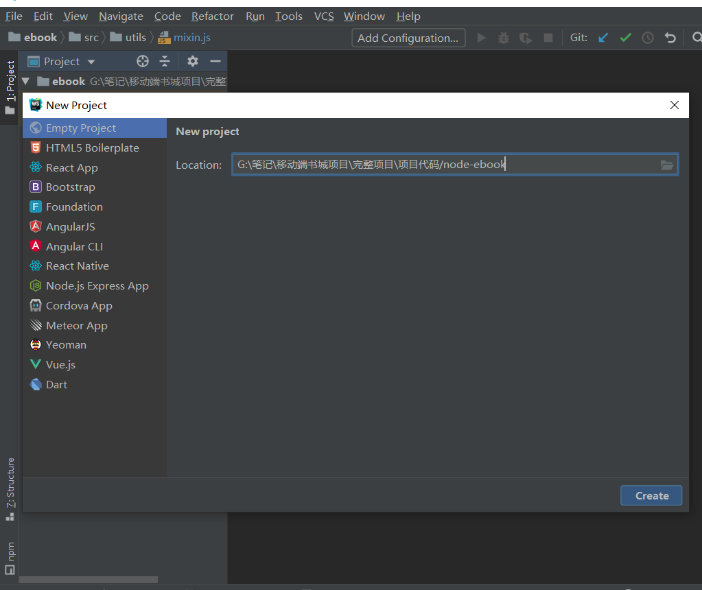
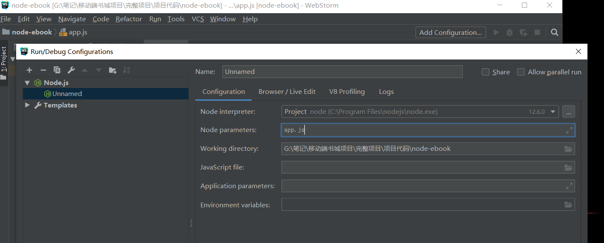
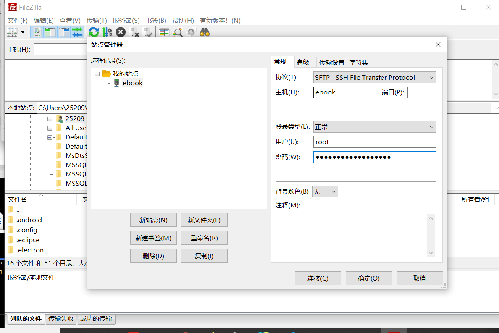
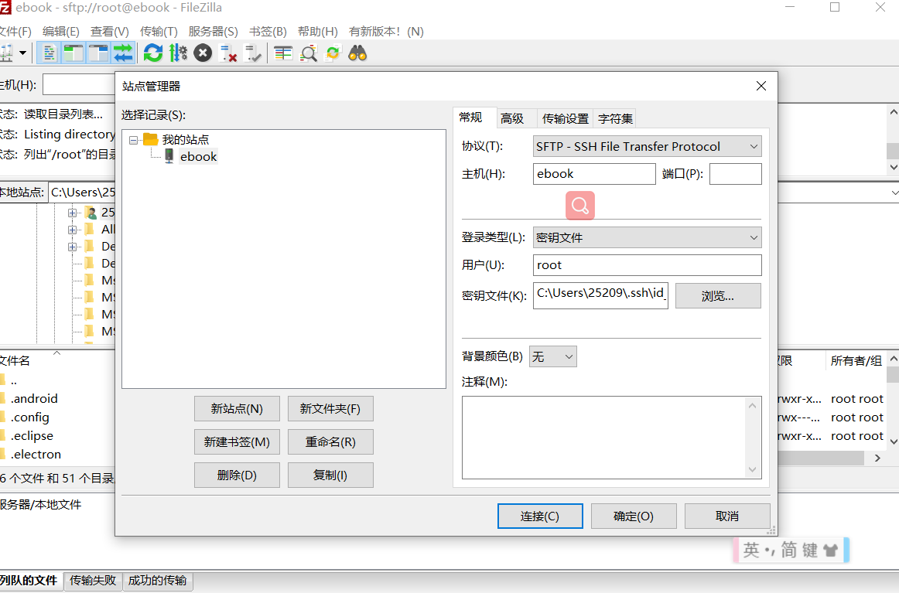
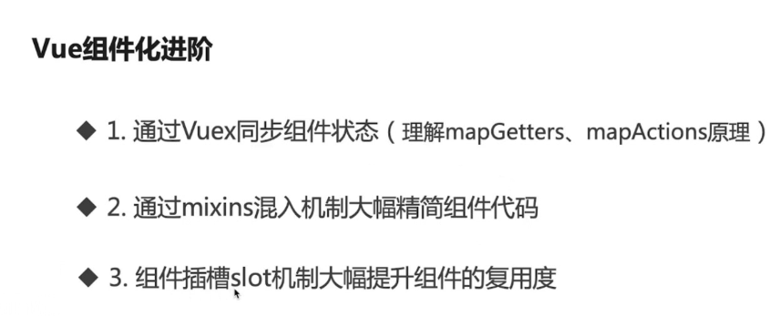
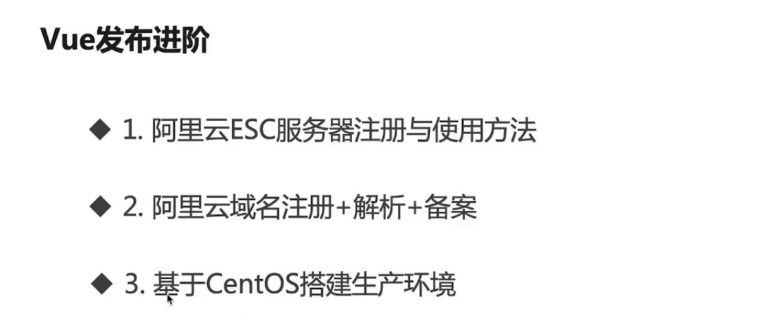
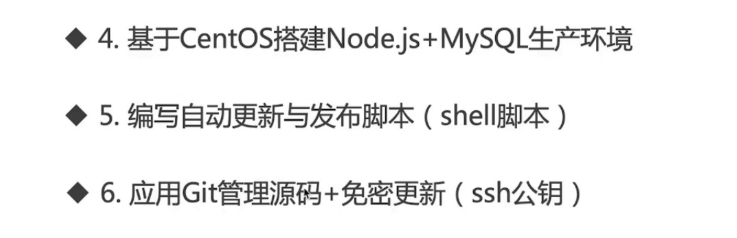
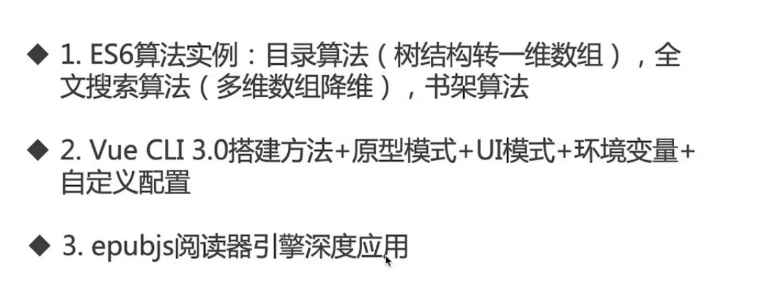
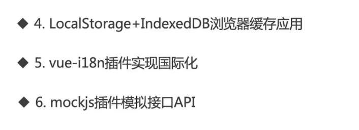

# 项目构建

## 接口文件

项目在开发时和项目上线后的接口并不一定相同，所以可以新建一个一个生产模式的接口文件

在根目录下新建`.env.production`

```shell
# 这里就将所有的接口改为线上服务器
VUE_APP_RES_URL = http://47.99.166.157/book/res
VUE_APP_EPUB_URL = http://47.99.166.157/epub
VUE_APP_BASE_URL = http://47.99.166.157:3000
VUE_APP_BOOK_URL = http://47.99.166.157:3000
VUE_APP_EPUB_OPF_URL = http://47.99.166.157/epub2
VUE_APP_VOICE_URL = http://47.99.166.157:3000
```

## 打包

调用`npm run build`对项目进行构建

**构建当中出现的问题**

**错误**：

**项目中不允许出现consolo.log**: `localForage.js`中可以注释调的打印直接注释掉，catch中 err光注释掉打印会报错，可以 通过`if(err) {}`进行处理

**警告**

**文件打包超出容量**： 最大默认 244kb ，

解决方法: 在vue.config.js中进行配置

```js
configureWebpack: {
    performance: {
        hints: 'warning',
        maxAssetSize: 524288 * 10,
        maxEntrypointSize: 524288 * 10
    }
}
```

之后打开index.html，就会对上述进行访问，并显示对应内容

## 出现的问题

错误1： 每次进入或刷新首页都会出现一个意义不明的错误

谷歌显示

 `GET http://localhost:63342/ebook/dist/null 404 (Not Found)`

错误排查：

首先确定了错误在`StoreHome.vue`中，之后通过逐个注释代码，确定了错误由`banner-wrapper`类引发

- 通过查找可以发现`banner`变量通过异步赋值，而我们将banner的初值定义为null，然而url不能为null,所以将`banner`改为 `''`报错消失

错误2： 电子书无法正确显示，经过排查确定是由于`EbookRender.vue`中获取图书的路径是有错，应该为

```js
// 原
this.initEpub(`${process.env.VUE_APP_RES_URL}/epub/${this.fileName}.epub`)

// 新
this.initEpub(`${process.env.VUE_APP_EPUB_URL}/${this.fileName}.epub`)
```

错误3： 

进入电子书对`EbookRender.vue`的指定代码行报null错误，

解决方法

```js
// 原 
const href = nav.href.match(/^(.*)\.html$/)[1]
if (href === loc) {
    nav.pagelist.push(item)
}
// 经过对nav.href的打印发现  console.log(nav.href) 有时结果为 html/Cover.xhtml 所以需要进行if判断
// 新
const href = nav.href.match(/^(.*)\.html$/)
if (href) {
    if (href[1] === loc) {
        nav.pagelist.push(item)
    }
}

```

错误4：

电子书下载过程中，点击页面出现的错误

`EbookBookMark`

```js
// 旧
const currentLocation = this.currentBook.rendition.currentLocation()
// 新
const currentLocation = this.currentBook.rendition.currentLocation ? this.currentBook.rendition.currentLocation() : ''

```

错误5：

`StoreDetail.vue`

```js
// 电子书从详情页跳转时，控制台有时会报错
// 简答的看，错误类似于跨域失败，但是对错误信息中的地址分析后可以看出，问题出在分类部分的地址，这里分类地址没有正确获取，得到的是undefined，所以地址访问失败
//http://192.168.1.7:8080/#/ebook/undefined|2018_Book_InvitedLecturesFromThe13thInte
// 由此找到对应的代码位置
// 原代码
readBook() {
    this.$router.push({
        path: `/ebook/${this.categoryText}|${this.fileName}`
    })
}
// 新代码
readBook() {
    this.$router.push({
        path: `/ebook/${this.bookItme.categoryText}|${this.fileName}`
    })
}
// 也就是将categoryText改为 bookItme.categoryText 即可正常显示，原因是categoryText，是根据跳转到详情页时的路由得到赋值的，然而有时路由不能准确传递分类，所以这里改用bookItme.categoryText，因为bookItme是在详情页发起请求后得到响应才赋值，所以他能正常显示
```

错误6：

**之前一直出现的翻页，书签依然存在的错误！！！，原因是，翻页是一个异步操作，而通用的refreshLocation方法（包含location信息的更新，书签的显示），应该在异步操作完成之后再执行，之前同步执行的，所以会出现书签好几页仍然不消失的错误**

```js
prevPage() {
    if (this.rendition) {
        // 原写法，如注释一般，没有等到异步的完成，直接执行了refreshLocation
        // this.rendition.prev()
        // this.refreshLocation()
        // 新写法 then之后执行
        this.rendition.prev().then(() => {
            this.refreshLocation()
        })
        this.hideTitleAndMenu()
    }
}
// nextPage 写法同理
```

错误七，

当分组中图书剩下最后一本移动会出问题

## 添加到书架方法的实现

`StoreDetail.vue`中的 `addOrRemoveShelf` 方法

## 数据库使用

使用mysql

新建`book`数据库，

将准备好的sql查询`book.sql`打开，复制表中的语句（包括新建表，插入数据等）

在book数据库,中右键新建查询，将复制的内容帖进去，之后执行语句

之后就可以发现数据库下多了一个 sql表，其中共有463条数据

表各列说明·

| 列名         | 含义                                              |
| ------------ | ------------------------------------------------- |
| id           | 序号                                              |
| fileName     | 电子书名                                          |
| cover        | 封面路径，之后封面全部都会存到nginx中             |
| title        | 标题（从电子书opf）文件中解析到的数据，放到了这里 |
| author       | 作者信息                                          |
| publisher    | 出版社                                            |
| bookId       | 与fileName值相同                                  |
| category     | 分类id（自行设定）                                |
| categoryText | 分类id对应的文本                                  |
| language     | 语言                                              |
| rootFile     | 电子书中opf文件的路径                             |

## 资源整合

在`nginx`的 `resource`目录下需要有以下文件夹

- 已有的文件夹
  - book 打包后的前台项目
  - epub epub文件
  - fonts 切换的字体
  - thems 主题样式
- 新增的文件夹
  - epub2 epub文件解压后电子书的文件夹，可以通过路径访问到opf等文件
  - cover  封面图片
  - img 封面图片
  - mp3音频文件
- 新增图片
  - 两张banner

# 后台搭建

使用webstorm在 ebook同级的位置新建后台项目`node-ebook`



- 新建 `app.js`

- 执行`npm init -y`进行`package.json`初始化

- 安装`express`

  - ```js
    npm i express -S
    ```

    

## 首页接口开发

```js
// 注： node默认支持commonjs而想要支持es6的引入(import)则需要，bable
```

### 应用启动

方式1： `node 文件名`

方式2 ： 通过webstorm配置启动

点击右上角的Add C...  在弹窗内先点击加号，之后选则 Node.js

在配置中写上文件名`app.js`  点ok即可

之后通过菜单栏上的 运行按钮即可运行



### 安装数据库操作包

- `npm i mysql -S`

### 新建const.js

用于保存常量

### 在项目中测试自己编写的接口

- 注释掉vue.config.js中通过webpack-dev-serve实现的mock接口
- 在`.env.development`中进行测试

```shell
# 旧
VUE_APP_RES_URL = http://192.168.1.7:81
VUE_APP_EPUB_URL = http://47.99.166.157/epub
VUE_APP_BASE_URL = http://192.168.1.7:8080
VUE_APP_BOOK_URL = http://47.99.166.157:3000
VUE_APP_EPUB_OPF_URL = http://47.99.166.157/epub2
VUE_APP_VOICE_URL = http://47.99.166.157:3000
# 新
## 简单解释：相当于分为两种情况，
#端口号81得就代表直接去nginx服务器中请求的资源，
#端口号3000的是去node服务器中请求的资源（node服务器中的资源通过，查询数据库并处理得到，注意：资源当中的封面图，也是在前台请求nginx服务器得到，node服务器提供的只有地址）
VUE_APP_RES_URL = http://192.168.1.7:81
VUE_APP_EPUB_URL = http://192.168.1.7:81/epub
VUE_APP_BASE_URL = http://192.168.1.7:3000
VUE_APP_BOOK_URL = http://192.168.1.7:3000
VUE_APP_EPUB_OPF_URL = http://192.168.1.7:81/epub2
VUE_APP_VOICE_URL = http://192.168.1.7:3000
```

### 解决跨域问题

- 通过运行可以发现，上述的接口与`npm serve`开启的服务器接口并不相同，所以需要在后台配置跨域

- nginx，已经配置过了

- 这里主要配置node

- 步骤：

- 思路有两个：

- 一：

- 设置响应头

- ```js
  // 在express中,可以通过该方法设置，如果有更多的需要，就重复使用该方法，添加更多的响应头
  // 该方法相当于node 的 res.setHeader
  res.header('Access-Control-Allow-Origin', '*')
  ```

- 二：

- 安装cors包 `npm i cors -S`

```js
const cors = require('cors')
// 允许所有跨域
app.use(cors())
```

补充说明：https://www.npmjs.com/package/cors

```js
// express环境下 
// cors跨域单个网址
const express = require('express')
const cors = require('cors')
const app = express()
 // 直接作为第二个参数即可
app.get('/products/:id', cors(), function (req, res, next) {
  res.json({msg: 'This is CORS-enabled for a Single Route'})
})

// 还可以传入配置使用
const express = require('express')
const cors = require('cors')
const app = express()
 
var corsOptions = {
  origin: 'http://example.com',  // 只有该网站访问下方的get请求时，跨域
  optionsSuccessStatus: 200 // 配置成功的状态码为200 因为类似ie11的旧版浏览器会阻塞204
}
 
app.get('/products/:id', cors(corsOptions), function (req, res, next) {
  res.json({msg: 'This is CORS-enabled for only example.com.'})
})
```

## 详情页接口开发

## 列表页数据接口开发

## 所有图书数据接口开发

## 书架默认图书数据接口开发

## 听书接口开发


# 科大讯飞语音API的实现

- 访问讯飞开放平台，注册账号并登陆 （密码: nodejavascriptes6）
- 点击控制台，创建`free_ebook`应用
- 找到语言合成选项的在线语音合成
  - 选项卡中的剩余服务量代表一天允许访问的次数
  - 右下角的ip白名单功能在如果开启，则只有指定ip可以访问，不开启任何ip都可以访问
  - 接口认证信息，调用接口时需要
- 新建`voice.js`,在该文件中编写api
- 用到的库
  - base64 `npm i js-base64 -S`'
  - md5 `npm i js-md5 -S`
  - qs `npm i qs -S`: 使字符串变为post请求可识别的键值对形式
  - http `npm i http -S` 用于发起请求
- 关于debug调试，点击菜单栏的debug按钮，在响应代码行打上断点，之后访问接口即可

```js
const Base64 = require('js-base64').Base64
const md5 = require('js-md5')
const qs = require('qs')
const http = require('http')
const mp3FilePath = require('./const').mp3FilePath
const resUrl = require('./const').resUrl
const fs = require('fs')


function createVoice(req, res) {
  // 获取要合成的文字，文字不超过1000
  // const text = req.query.text
  // 语言
  // const lang = req.query.lang
  const text = '却无法少的高度发送给'
  const lang = 'cn'

  // 引擎类型
  let engineType = 'intp65'
  if (lang.toLowerCase() === 'en') {
    engineType = 'intp65_en'
  }
  // 语速
  const speed = '30'
  const voiceParam = {
    // 音频采样率
    auf: 'audio/L16;rate=16000',
    // 音频编码
    aue: 'lame',
    // 发音人
    voice_name: 'aisxping',
    speed,
    // 音量
    volume: '50',
    // 音高
    pitch: '50',
    engine_type: engineType,
    // 文本类型
    text_type: 'text'
  }
  // 时间戳
  const currentTime = Math.floor(new Date().getTime() / 1000)
  const appId = '5e6994e7'
  const apiKey = '9af84aa0ece62b537270e1078c594bd3'
  // 参数加密
  const xParam = Base64.encode(JSON.stringify(voiceParam))
  // md5加密
  const checkSum = md5(apiKey + currentTime + xParam)
  // 请求头
  const headers = {}
  headers['Content-Type'] = 'application/x-www-form-urlencoded; charset=utf-8'
  headers['X-Param'] = xParam
  headers['X-Appid'] = appId
  headers['X-CurTime'] = currentTime
  headers['X-CheckSum'] = checkSum
  headers['X-Real-Ip'] = '127.0.0.1'
  // 请求数据
  const data = qs.stringify({
    text: text
  })
  // 配置
  const options = {
    host: 'api.xfyun.cn',
    path: '/v1/service/v1/tts',
    method: 'POST',
    headers
  }
  // 发起http request请求
  const request = http.request(options, response => {
    let mp3 = ''
    // 返回内容长度
    const contentLength = response.headers['content-length']
    // 设置响应编码格式 为二进制
    response.setEncoding('binary')
    // response响应方法，获取响应内容(该方法由于数据的长度可能会执行多次)
    response.on('data', data => {
      // mp3存储响应内容
      mp3 += data
      /*当前已有响应内容，除以总内容，得到进度*/
      const process = data.length / contentLength * 100
      /*对进度进行处理得到百分比*/
      const percent = parseInt(process.toFixed(2))
      console.log(percent)
    })
    // 结束响应
    response.on('end', () => {
      // console.log(response.headers)
      // console.log(mp3)
      const contentType = response.headers['content-type']
      // 判断响应类型,处理错误响应
      // 该情况一般出现在请求了错误的接口，一般会返回404
      if (contentType === 'text/html') {
        res.send(mp3)
      } else if (contentType === 'text/plain') {
        // 该情况出现在服务器没有返回正确的内容，
        // 一般会返回一个错误码，和错误信息，可以通过打印响应头查看
        res.send(mp3)
      } else {
        // mp3文件会根据以这里获取的时间命名
        const fileName = new Date().getTime()
        // mp3文件保存的本地路径
        const filePath = `${mp3FilePath}/${fileName}.mp3`
        // 实际下载的路径(nginx的路径)
        const downloadUrl = `${resUrl}/mp3/${fileName}.mp3`
        // console.log(filePath, downloadUrl)
        // 将mp3文件写入本地地址,参数分别为 路径 数据 数据类型 回调函数
        fs.writeFile(filePath, mp3, 'binary', err => {
          // 失败则证明node服务器下载保存mp3到本地的操作失败
          if (err) {
            res.json({
              error: 1,
              msg: '下载失败'
            })
          } else {
            // 成功则证明操作成功，返回下载路径，供前台下载
            res.json({
              error: 0,
              msg: '下载成功',
              path: downloadUrl
            })
          }
        })
      }
    })
  })
  // 传入请求数据
  request.write(data)
  // 结束请求
  request.end()
}
module.exports = createVoice

```

该普通版不能再成功访问，科大讯飞采用了新的流式版 通过websocket请求访问

新写法所需的包

`log4node` 由于记录访问日志 `npm install log4node -S`

`ws `一个node.js的WebSockedt库 `npm install ws -S`

`crypto-js` md5类似使一种用于加密的js库  `npm install crypto-js` 

```js
const CryptoJS = require('crypto-js')
const WebSocket = require('ws')
var log = require('log4node')
const mp3FilePath = require('./const').mp3FilePath
const resUrl = require('./const').resUrl
const fs = require('fs')


function createVoice(req, res) {
  // 获取要合成的文字，文字不超过1000
  // const text = req.query.text
  // 语言
  // const lang = req.query.lang
  const text = '却无法少的高度发送给'
  const lang = 'cn'
  // 引擎类型
  let engineType = 'intp65'
  if (lang.toLowerCase() === 'en') {
    engineType = 'intp65_en'
  }
// 系统配置
  const config = {
    // 请求地址
    hostUrl: "wss://tts-api.xfyun.cn/v2/tts",
    host: "tts-api.xfyun.cn",
    //在控制台-我的应用-在线语音合成（流式版）获取
    appid: "5e6994e7",
    //在控制台-我的应用-在线语音合成（流式版）获取
    apiSecret: "37b4dced30af415618b049edd7ab585d",
    //在控制台-我的应用-在线语音合成（流式版）获取
    apiKey: "9af84aa0ece62b537270e1078c594bd3",
    text: text,
    uri: "/v2/tts",
  }

// 获取当前时间 RFC1123格式
  let date = (new Date().toUTCString())
// 设置当前临时状态为初始化

  let wssUrl = config.hostUrl + "?authorization=" + getAuthStr(date) + "&date=" + date + "&host=" + config.host
  // 将要访问的地址传入 实例化websocket,发起请求
  let ws = new WebSocket(wssUrl)

// 连接建立完毕，执行回调
  ws.on('open', () => {
    // 日志打印
    log.info("websocket connect!")
    // 发送二进制数据
    send()
  })

// 得到结果后进行处理，仅供参考，具体业务具体对待
  ws.on('message', (data, err) => {
    // 访问错误，打印错误日志
    if (err) {
      log.error('message error: ' + err)
      res.json({
        error: 1,
        msg: '下载失败'
      })
      return
    }
    // 解析语音合成接口返回的数据并保存
    let resObj = JSON.parse(data)
    // 数据状态不为0则证明错误
    if (resObj.code != 0) {
      log.error(`${resObj.code}: ${resObj.message}`)
      res.json({
        error: 1,
        msg: '下载失败'
      })
      ws.close()
      return
    }
    // 当code为0 data.status为2 证明传输完成 关闭连接
    if (resObj.code == 0 && resObj.data.status == 2) {
      let audio = resObj.data.audio
      let audioBuf = Buffer.from(audio, 'base64')
      // mp3文件会根据以这里获取的时间命名
      const fileName = new Date().getTime()
      // mp3文件保存的本地路径
      const filePath = `${mp3FilePath}/${fileName}.mp3`
      // 实际下载的路径(nginx的路径)
      const downloadUrl = `${resUrl}/mp3/${fileName}.mp3`
      // 保存文件
      save(audioBuf, filePath, downloadUrl)
      // 关闭链接，因为下方对关闭链接后的回调进行了处理，所以也会打印日志
      ws.close()
    }
  })

// 资源释放
  ws.on('close', () => {
    log.info('connect close!')
  })

// 连接错误
  ws.on('error', (err) => {
    log.error("websocket connect err: " + err)
  })

// 鉴权签名
  function getAuthStr(date) {
    let signatureOrigin = `host: ${config.host}\ndate: ${date}\nGET ${config.uri} HTTP/1.1`
    let signatureSha = CryptoJS.HmacSHA256(signatureOrigin, config.apiSecret)
    let signature = CryptoJS.enc.Base64.stringify(signatureSha)
    let authorizationOrigin = `api_key="${config.apiKey}", algorithm="hmac-sha256", headers="host date request-line", signature="${signature}"`
    let authStr = CryptoJS.enc.Base64.stringify(CryptoJS.enc.Utf8.parse(authorizationOrigin))
    return authStr
  }

// 传输数据
  function send() {
    let frame = {
      // 填充common
      "common": {
        "app_id": config.appid
      },
      // 填充business
      "business": {
        // 音频编码，专用于mp3格式
        "aue": "lame",
        "auf": "audio/L16;rate=16000",
        "vcn": "aisxping",
        "tte": "UTF8",
        "ent": engineType
      },
      // 填充data
      "data": {
        "text": Buffer.from(config.text).toString('base64'),
        "status": 2
      }
    }
    // 像服务器发送二进制数据
    ws.send(JSON.stringify(frame))
  }

// 保存文件
  function save(data, filePath, downloadUrl) {
    fs.writeFile(filePath, data, (err) => {
      if (err) {
        log.error('save error: ' + err)
        res.json({
          error: 1,
          msg: '下载失败'
        })
        return
      }
      log.info('文件保存成功')
      // 成功则证明操作成功，返回下载路径，供前台下载
      res.json({
        error: 0,
        msg: '下载成功',
        path: downloadUrl
      })
    })
  }
}
module.exports = createVoice


```

# 后端代码的git托管

这里托管主要通过webstorm自身的控制面板实现

步骤：

- `git init `初始化为git项目
- 提交到本地
  - 这里没有使用git add git commit命令 而是直接使用 控制面板的版本控制，提交
  - `app.js`   `const.js`   `package.json`   `voice.js`四个文件
- 新建`.gitignore`在里面填入忽略的文件之后提交到本地
- 在github中新建远程仓库
- 选择菜单栏中的`vcs`选项，接着选择 `git` 之后`remotes`,点击弹出窗口的加号,输入远程仓库的url
- 选择菜单栏中的`vcs`选项，接着选择 `git` 之后`push`上传得到远程仓库
- 当webstorm右下角弹出`push successful`证明 push成功

# 在线发布

## 阿里云

- 登录阿里云，选择产品，购买ecs云服务器

## 配置介绍

地域配置： 访问地离服务器越近，访问速度越快，而离得远，就会变慢（可通过CDN）方式解决该问题

cpu，内存可选，这里使用（单核cpu 1g内存，系统选择centos）

公网贷款选项：公网iP地址需要选中

安全组： 选择HTTP80端口，使用http协议 

注：配置可以随时通过点击控制台，之后在左侧导航栏找到对应云服务器实例进行更改

## 关于控制台

在控制台，点击找到对应实例

### 密码设置

系统用户名默认root,在实例的操作栏中，选择 -更多-密码-重置密码 即可对密码进行设置(Nodejavascriptes6!)

注意：重置密码后需要选择 - 更多-实例状态-重启

### 远程登录

因为 centos是linux系统，所以我们可以在控制台通过远程ssh命令远程登录

```shell
# 输入该命令之后选择yes 输入密码，即可连接
ssh root@123.57.33.170
```

成功连接后显示该提示

```shell
Welcome to Alibaba Cloud Elastic Compute Service !
[root@iZ2ze1cssudfurqurwfwc4Z ~]#
```

输入 `who`可以查看连接记录， 输入 `exit`退出

### 设置秘钥

注：以下命令需要Git的支持

为了方便登录，可以设置秘钥

```shell
# 参数 -t rsa 表示使用rsa算法进行加密，
#之后连续点击回车，执行后，会在C:/Users/25209/.ssh/id_rsa ,C:/Users/25209/.ssh/id_rsa.pub下找到id_rsa(私钥)和id_rsa.pub(公钥)
ssh-keygen -t rsa
```

注：`ssh-copy-id`命令在window中无法执行

```shell
# 执行该语句绑定远程地址，回车之后输入密码
ssh-copy-id -i ~/.ssh/id_rsa.pub root@123.57.33.170
# 当出现Number of key(s) added证明公钥保存成功
# 之后再次使用 ssh root@123.57.33.170 就可以免密登录
```

```shell
# 这里在配置hosts后最终可以通过 
ssh root@ebook
# (windows)需采用下方的方式
```

注2：

```shell
# 在mac，linux系统中
vim /etc/ssh/sshd_config
# 打开ssh配置文件将ClientAliveInterval设为30即每30s保持一次连接，从而防止服务器断开
# ClientAliveInterval 30 
# mac中改完需要执行如下命令，重启ssh服务，window一般不需要重启，改完就会生效
service sshd restart
```


==window解决方法== https://www.bilibili.com/read/cv1420735/

```shell
# 打开私钥文件 
# C:/Users/25209/.ssh/id_rsa.pub 
# 复制其中的内容，在阿里云服务器- 控制台- 网络与安全-秘钥对-界面-创建秘钥对-导入已有秘钥对-将内容粘贴上去
# 注意粘贴的内容要去掉最后的用户名和电脑机型，如：25209@LAPTOP-QHQ5VUQD
# 之后保存，并将该秘钥对绑定需要的服务器

# 使用 这里的id_rsa是文件名
ssh -i id_rsa root@123.57.33.170
```

可以通过配置hosts使上述访问更加简单

```shell
# 文件位置 C:\Windows\System32\drivers\etc
123.57.33.170  ebook
```

之后访问 

```shell
# 方式1：
ssh -i id_rsa root@ebook


# 补充：方式二：最简，只不过相比其他系统,第一次执行还需要输入yes，后面就相同了
ssh root@ebook
```

**windwos**保持服务器长时间连接：

在用户秘钥目录（.ssh）下，即``C:\Users\25209\.ssh` 新增`config`文件，文件中写入`ServerAliveInterval 60`保存即可，之后就能==保持服务器的长时间连接==


补充： **SSH服务器的安装**

- 在搜索栏输入`管理可选功能`，之后添加功能`OpenSSHServer`即可


问题补充：

```shell
# 这里当找到配置文件时会发现所属权限不够，无法修改，可以通过右键
# 属性- 安全- 高级-添加新的权限条目 并赋予该条目完全控制的权限，
# 之后更改文件即可

# OpenSSHServer在 服务 中启动， 服务可以通过搜索框直接搜索打开
```

## node环境搭建

- 在远程服务器上安装 `nvm` （node版本管理工具）
  - 执行`wget -qO- https://raw.githubusercontent.com/nvm-sh/nvm/v0.35.3/install.sh | bash`即可
    - **这里的安装链接随着版本的更新会改变，最新的 wget下载地址 见 nvm代码仓库 https://github.com/nvm-sh/nvm**
    - 卸载`nvm` 命令：`rm -rf ~/.nvm`
  - 输入`ls .nvm` 或 `ll.nvm` 发现有文件，即安装成功
- nvm使用
  - 通过`vim .bashrc`命令查看可以发现环境`nvm`的环境变量保存在该文件中
  - 执行`source .bashrc`  (执行shell文件)
  - 输入`nvm`回车，可以看到弹出一系列常用命令说明
  - 这时就可以正常使用 `nvm`的常用命令了


安装node

- 执行`nvm install node`直接安装最新版本的node
- 执行`node -v`成功

安装cnpm 

`npm install -g cnpm --registry=https://registry.npm.taobao.org`

注：这里的cnpm会安装在`.nvm`路径下，通过`which cnpm `可以查看路径

## nginx环境搭建

### 安装和启动

这里安装需要借助`yum`

- 安装pcre(正则数据库)相关依赖  `yum -y install  pcre*`
- 安装openssl依赖(用于安全通信)`yum -y install openssl*`

在`/root`下新建nginx 目录，`mkdir nginx`

- 切换到该目录`cd nginx`
- 下载nginx安装包 `wget http://nginx.org/download/nginx-1.16.1.tar.gz`
- 解压安装包`tar -zxvf nginx-1.16.1.tar.gz`
- 切换目录 `cd nginx.1.16.1`
- 该目录下的`configure`是一个可执行文件,是否可执行可以通过执行`ll`指令，结果的第一列，最后一个字母是`x`的就证明可执行
- 执行该文件`./configure` 检查配置是否生效，如果未生效会报错
- 接下来要做的就是编译，因nginx使用c语言编写，所以这里可以通过make指令进行编译安装
- make需要`gcc`相关工具的支持，所以这里首先查看本地是否有该工具输入`make` 输入`gcc`分别回车，发现两者都弹出类似于未发现要执行的文件的提示，证明两者都已默认安装，所以接下来可以正式安装
- 依旧在当前目录下 执行`make -j4`
- 继续执行`make install`
- 之后执行`/usr/local/nginx/sbin/nginx -t `返回的结果第一行结尾是ok证明执行成功
- 之后即可进行软链接
  - 切换目录`cd /usr/bin`
  - 使用`ll`可以查看目录种的文件，该目录下的所有指定链接都可以直接访问
  - 创建软链接 `ln -s /usr/local/nginx/sbin/nginx  nginx`
  - 通过`ll nginx`可以查看链接是否成功
- 切换目录 `cd /root`
- 执行`nginx` 命令，服务就会启动
- 执行` ps -ef|grep nginx` 可以观察到nginx服务已启动
- 停止nginx服务`nginx -s stop`

### 查看配置

- `cd /usr/local/nginx/conf/`
- 打开主配置文件`vim nginx.conf`
- 可以发现那么端口号为80 ，那么通过在浏览器输入`123.57.33.170`即可访问

### 新建配置

- 进入nginx目录`cd nginx`

- 新建配置文件`vim nginx.conf`，之后先退出该文件

- 打开主配置文件`vim /usr/local/nginx/conf/nginx.conf`做一定修改

  - ```shell
    # 配置文件第一行是空行
    # 配置文件第二行将 #user  nobody; 改为 下面
    user root;
    
    # server名为localhost的服务 作用是因为新引入的配置文件端口号设置的也是80，所以这里为了防止冲突，将原来的80改为9000
    listen:9000;
    
    # 在配置文件最后新增内容 下面一行，作用是引入如新建的配置文件
    include /root/nginx/*.conf;
    ```

- 进入nginx目录`cd nginx/`

- 编写配置文件`vim nginx.conf`

  - ```shell
    server {
    	listen 80;
    	# 服务名称
    	server_name localhost;
    	# 根目录
    	root /root/nginx/upload;
    	# 查看resource下的文件列表，也就是当你访问该域名时会列出目录，方便浏览
    	autoindex on;
    	# 增加头信息 作用是每次请求都需要重新验证，不能缓存
    	add_header Cache-Control "no-cache, must-revalidate";
    	 # 增加头信息，该请求头作用是允许跨域访问
    	location / {
    	  add_header Access-Control-Allow-Orgin * ;
    	}
    }
    ```

- 新建`mkdir upload`

- 进入`cd upload/`

- 在该目录下新建index.html 写入测试内容，之后重启nginx服务器，并再次访问`123.57.33.170`发现页面成功显示

### 上传资源文件

- 工具有多种，这里使用**filezilla**（在官网可以下载绿色免安装版，直接解压使用）

1.新建站点

- 文件-站点管理器-新站点-命名为ebook- 协议选择sftp(通过ssh传输，经过加密比ftp更安全)，主机因为hosts设置过了，所以可以用ebook- 用户root- 密码：服务器密码



注意：由于上文中在阿里云服务器设置了秘钥，所以这里不能通过密码登录，但可以通过加载秘钥的方式登录  秘钥文件为 `C:/Users/25209/.ssh/id_rsa`



登录之后左侧窗口为本地站点，右侧窗口为远程站点

- 将本地nginx/resourse目录下所有文件（book文件夹除外），全部上传远程服务器`upload`文件夹
- 上传方式：先打开远程服务器中的`upload`之后选中本地文件，直接拖拽上传即可
- 注：右键删除掉服务器中测试用的`index.html`

上传完毕后再访问`123.57.33.170`就可以看到资源目录已存在

- 当发现目录存在后，打开nginx目录下的`nginx.conf`将先前设置的`autoindex`注释掉，即关闭目录（因为生产模式中一般不开启目录）
- 这时再访问`123.57.33.170`就会出现403状态码（对资源有了一定保护），这时除非知道资源的具体地址（比如：`123.57.33.170/home_banner.jpg`），否则不能直接通过目录查看

## 源码部署

目标：**将github上的代码远程部署到服务端，在服务端实现自动的更新和产品发布**

注：为什么不将build好的代码直接通过*filezilla*上传的到服务器使用

- 原因是：这样虽然能够使用，但是无法做到自动更新，每次改变代码，都需要重新打包（build）——再上传

**远程部署的步骤**

### .在root目录下安装git

- 方式1：

-  `yum install git -y ` (这里的-y表示自动安装，如果不加-y会有一个确认弹窗)
- 安装完成后发现直接安装的版本为`1.8.3.1`较为古老，这里用其他方法下载最新的git
- 方式2：
- 删除旧的`yum remove git`
- 首先下载相关依赖
- `yum install -y curl-devel expat-devel gettext-devel openssl-devel zlib-devel`
- 之后`yum install -y gcc perl-ExtUtils-MakeMaker`
- 之后`yum install -y tcl build-essential tk gettext`
- 最后即可通过wget指令下载指定版本 压缩包
- `wget https://github.com/git/git/archive/v2.9.2.tar.gz`
- 解压
- `tar -zxvf v2.9.2.tar.gz `
- 切换目录`cd git-2.9.2/`
- 编译`make prefix=/usr/local/git all`
- 安装`make prefix=/usr/local/git install`
- 查看`cd /usr/local/git/bin/`下发现有git指令，于是接下来创建该指令的软链接
- `cd /usr/bin/ `
- 执行`ln -s /usr/local/git/bin/git git`
- 此时执行 `git `发现会出现相关操作信息，安装成功！
- **本来打算装2.20.1，但是上述依赖不能完全支持，所以用2.9.2**
- ==注：！== 下载新git的另一种[方法][https://zhuanlan.zhihu.com/p/73357795]

### .项目下载

- 在root目录下新建ebook文件夹存放源码`mkdir ebook`
- 切换到该目录`cd ebook/`
- 通过`git clone 链接`将项目源码下载到本地
- 下载时可以发现，弹出输入账号密码的选项（注意：必须安装git 2.9以上的版本才能弹出该选项，旧版本没有该选项下载不会成功）

### .免密下载

- 上文中在弹出输入账号密码选项时退出输入，因为在发布更新的过程中，并不希望每次都输入密码，所以接下来通过秘钥解决这一问题
- 执行 `ssh-keygen -t rsa -C "252099457@qq.com" `     (-C  属性后跟github账号)  
- 点击三下回车
- 执行`cat ~/.ssh/id_rsa.pub`将秘钥打印在终端上
- 将打印的秘钥拷贝下来，登录github 点击头像 - settings- 选择左侧菜单栏`SSH and GPG keys` - `New SSH key`  之后粘贴秘钥内容 ，标题名为 key
- 注：==该方式设置的秘钥对于所有项目均有效，如果想设置指定项目的秘钥，也可以到项目目录下的Settings—Deploy keys 进行设置==
- 注意：**秘钥设置后，就可以通过SSH下载，该下载方式不需要秘钥（https依然是需要的）**
- 之后在`ebook-front`项目下 复制**SSH**的下载链接
- 切换到`cd ebook/`
- `git clone ssh地址`(此时不再需要输入密码)
- 依然在当前目录，复制node-ebook的ssh下载链接并下载
- `git clone ssh地址`
- 补充：以上设置实际上要求项目是私密项目，如果是公有项目，则不会有问题，可以直接clone,不过为了避免以后出问题，所以还是设置私钥

### 代码更新

- `cd ebook-front` 
- 更新代码`git pull`
- `cd node-ebook` 
- 更新代码`git pull`

### .实现前台

- 进入`cd ebook-front` 文件夹 执行`cnpm i` 安装依赖
- 使用`cnpm run build `进行打包
- 执行`mv dist/ ~/nginx/upload/book`将dist文件夹下的内容（因为有 / 所以代表文件夹内容）移动到 nginx/upload下的book文件夹，如果本身没有book，会自动新建一个book
- `cd ~/nginx/upload/book/` 可以看到移动成功
- 这时访问http://123.57.33.170/book 就可以看到页面
- 此时访问的是生产环境下的环境变量文件即`http://47.99.166.157`这个ip下的资源

注： nginx 报错`nginx: [error] open() "/usr/local/nginx/logs/nginx.pid" failed (2: No such file or directory)`

解决代码：`/usr/local/nginx/sbin/nginx -c /usr/local/nginx/conf/nginx.conf`

### .实现后台环境的配置

- 在本地的`node-ebook`项目中新建`env.js`,在该文件中导出·变量`env`然后在`const.js`中使用，之后依次`commit` 和`push` ,即可
- 打开线上服务器进入`node-ebook`文件夹，执行 `git pull`更新代码，并执行`cnpm i `安装模块
- `node app.js`启动服务 可以看到这时的端口号是3000
- 访问`123.57.33.170:3000/book/list`进行接口测试，发现并不能访问，原因在于，虽然允许了跨域，但是阿里云服务器本身对于端口的访问有限制，之前只开通了80,22等端口，3000没开通，所以需要去阿里云开通（注：这个限制不会对前台项目的访问有影响，因为当我们访问前台项目时，访问的是80端口没问题，前台项目向后台发送请求时访问的是3000端口，两者同属于一台服务器，所以就不会被阿里云拦截了）
- 开通3000 流程    阿里云 - 控制台- 网络与安全 -安全组-配置规则-添加安全组规则（入方向 允许 自定义tcp 3000/3000  授权对象 0.0.0/0）
- 之后再次访问``123.57.33.170:3000/book/list``发现可以响应（响应结果是数据获取失败，因为mysql没有装，但是接口的访问是成功的）
- 注：使用`node app.js`开启服务时，终端会被占用，而想要使用终端（ctrl+c）就会关闭node服务，这里如果想要node服务在后台依然运行可以执行==`node app.js & `==此时（ctrl+c）后，执行`ps -ef|grep node` 就可以发现`app.js`仍然在后台运行

### .MySql数据库的实现

**注意mysql语句执行最好加上分号**

1.安装 

`centos6`安装

- `yum -y install mysql-server`  (这里会同时安装mysql客户端与服务端，如果mysql后面不加上 -server则只会下载客户端)

`centos7 `安装

版本 `5.7.26`

- https://juejin.im/post/5d07cf13f265da1bd522cfb6#heading-15

- 步骤：去https://dev.mysql.com/downloads/mysql/ 下载[5.7.26][https://downloads.mysql.com/archives/get/p/23/file/mysql-5.7.26-1.el7.x86_64.rpm-bundle.tar]的tar版本

- 随便找个目录解压，之后安装如下命令，安装四个文件，注意：需要在解压的目录安装，且顺序不能变

- ```shell
  shell> rpm -ivh mysql-community-common-5.7.26-1.el7.x86_64.rpm
  shell> rpm -ivh mysql-community-libs-5.7.26-1.el7.x86_64.rpm
  shell> rpm -ivh mysql-community-client-5.7.26-1.el7.x86_64.rpm
  shell> rpm -ivh mysql-community-server-5.7.26-1.el7.x86_64.rpm
  ```

2.访问

- 首先使用`service mysqld status ` 可以查看mysql服务是否启动
  - *centos7*查看`systemctl status mysqld.service`
- 如果没启动可以执行 `service mysqld restart` 重启服务
- *centos7*重启 `systemctl restart mysqld.service`
- mysql密码会在下载时自动初始化一个
- 执行`cat /var/log/mysqld.log |grep password`打印密码

==找不到密碼時的解决流程==

1.`vim /etc/my.cnf` 在`[mysqld]`后面任意一行添加`skip-grant-tables`

2.重启mysql `service mysqld restart`

3.使用无密码登录`mysql -u root `登录成功

4.执行`alter user 'root'@'localhost' identified by 'Qsc56789!';`更新密码

5.如果出现`1290`报错，则执行`flush privileges;`

6.之后再次执行`alter user 'root'@'localhost' identified by 'Qsc56789!';`

7.`exit`退出数据库，`vim /etc/my.cnf`删除刚刚添加的一行，保存退出

**没有root用户的解决方法https://blog.csdn.net/niuchenliang524/article/details/104607496/**

- 之后就可执行`mysql -u root -p`有密码登录
- 登录成功后，需要先重置密码   **注意：这一步，如果在上文由于找不到密码已经重置过密码则不用执行这一部分**
  - 执行
  - `alter user 'root'@'localhost' identified by 'Qsc56789!';`
  - 说明： @左边是用户 右边表示本服务器  ；identified（识别）by 后面跟密码,密码要求有**大小写数字字符**
  - 之后输入exit退出`mysql`，重新执行登录命令，输入密码完成登录

3.创建服务器数据库

- 在登录mysql情况下执行`create user 'root'@'%' identified with mysql_native_password by 'Qsc56789!';` 
  - 说明 create user代表创建`root` 用户 `@`后面跟着允许访问该用户的网络地址 `%`代表全部允许, `mysql_native_password`（8.0新增）表示使用该插件进行认证，如果不加这句话，用node连接数据库时会出现错误, by后面的密码是一个新的密码，这里将其与登录密码设为相同的
- 权限赋予：如果赋予，如果不赋予权限，可视化软件连接时只会显示一个数据库
  - 执行`grant all privileges on *.* to 'root'@'%';` 
  - 说明 代表 对`root `用户在所有ip地址，赋予所有权限
- 执行`flush privileges;` 使设置生效

4.客户端可视化软件连接服务端

- 在阿里云开启3306端口（Mysql默认端口）
- 打开本地的客户端软件`Navicat`
- 新建连接 名称为`ebook` 主机为`123.57.33.170` 用户名 `root` 密码：`Qsc56789!` 点击测试连接，成功后保存
- ==数据库一直连接不上是因为主机写错了，不能写协议名，不能加`/`，node也是因为加了`/`所以访问不了！！！！！~！！！！！！！！！！==
- ==https://www.linuxidc.com/Linux/2017-04/143203.htm==

5.可视化软件创建数据库

- 在`ebook`连接下右键新建 `book`数据库 字符集 `utf8` 排序规则` utf8_general_ci`
- 与本地创建时相同，导入sql语句并执行

6.服务端数据库测试

- show databases; （可以看到book数据库已经出现）
- use book;
- show tables;  (可以发现book表存在)
- select count(*) from book; (可以查到数据数量与预期相符)

7.node-ebook数据库部分的改造

- 首先在本地改造，在不同的环境下，对数据库的连接
- 之后在本地运行 并对接口进行测试，发现已经能得到数据,证明改造成功
- 测试完毕后 `commit` `push`
- 之后在服务端`node-ebook`目录下执行 `git pull`
- `node-ebook`后台启动node服务  `node app.js & `

### 前端环境API更新

1.修改本地`ebook`项目中的`.env.production`

2.`commit` `push`

3.服务端`ebook-front`目录`git pull`

4.重新打包`cnpm run build`

5.删除旧的nginx目录中的book文件夹

- `rm -rf ~/nginx/upload/book`

6.将新打包的内容移动过去

- `mv dist/ ~/nginx/upload/book`

### 一键部署脚本实现

- 前文中虽然每次`git push` 拉取代码之后再移动dist文件，相比每次都通过`sftp`重新上传要简单一些，但是仍然没有做到自动化一键部署，所以这里我们通过编写脚本实现这一功能。
- 步骤
- 在 root目录下 新建文件 (注：通过ll可以发现，第一列最后一位没有x证明他目前不是可执行文件)
  - `touch update.sh`
- `chmod +x update.sh` 添加为可执行文件

**内容如下**

```shell
echo "start updating frontend..."
cd /root/ebook/ebook-front
echo "updating source..."
git pull
echo "frontend building..."
cnpm run build
echo "frontend publish..."
rm -rf ~/nginx/upload/book
mv dist/ ~/nginx/upload/book
echo "finish updating frontend..."


echo "start updating backend..."
cd /root/ebook/node-ebook
echo "updating source..."
git pull
echo "stopping service..."        # 停止现有服务      
kill -9 `ps -ef|grep node|grep app.js|awk '{print $2}'`
echo "restarting service..."   # 重启服务
node app.js &
echo "finish updating backend..."
```

之后每次更新前后段代码 只需要执行 ：`./update.sh`，就可以完成前后端的自动更新


# 补充

## 图片懒加载实现

- 通过`vue-lazyload`

## 重点知识回顾













