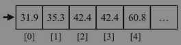
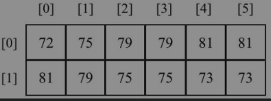
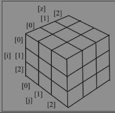
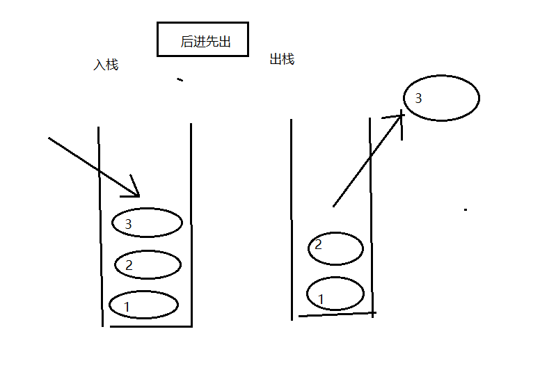
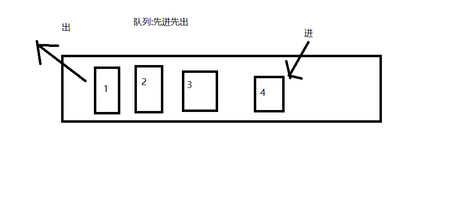
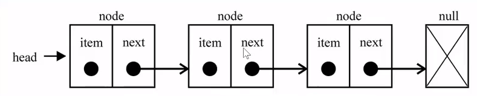
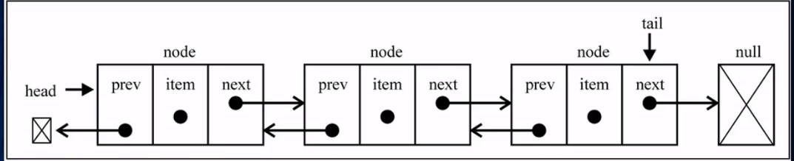
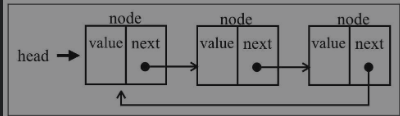
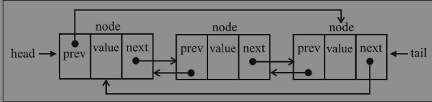

# 学习JavaScript数据结构与算法

## 第一章 JavaScript简介

注： 本章节会略过部分基础的语法介绍

### 服务器环境搭建

**Chrome**

	- 安装插件 `WebServer for Chrome`
	- 打开该插件可以点击CHOOSE FOLDER来选择需要在哪个文件夹中开启服务器
	- 然后就能通过设定的URL（默认是http://127.0.0.1:8887）来进行访问

**Node.js**

- 安装http-server 
  - `npm  install http-server -g`
  - 如果是linux系统 `sudo npm  install http-server -g`
- 在代码文件夹下的终端执行
  - `http-server`启动服务器
  - 服务启动后会返回访问地址，之后通过指定端口进行访问即可

### 基础

#### 变量作用域

```js
var test = 0
var test2 = 0
function fun1() {
    var test = 1
    console.log(test)
}
function fun2() {
    // 因为此处赋值的是全局变量，所以当此函数执行后，外部test2被重新赋值
    test2 = 1   
    console.log(test2)
}
console.log(test) // 0
fun1()  // 1
console.log(test) // 0
console.log(test2) // 0
fun2() // 1
console.log(test2) // 1
```

#### 运算符

**逻辑运算符**（逻辑上的真假判断）

- && 与 
- || 或
- ！ 非

**位运算符**（二进制位运算）

- 在了解位运算之前，首先要了解原反补码的概念

|                        | 原码                                 | 反码                                                   | 补码                                        |
| ---------------------- | ------------------------------------ | ------------------------------------------------------ | ------------------------------------------- |
| 特点                   | 将一个十进制整数转成二进制，就是原码 | 正数的反码等于原码，负数的反码是除符号位以外，全部取反 | 正数的补码等于原码，负数的补码等于其反码加1 |
| 正数(第一位符号位是0） | 如： 5  -> 0000 0101                 | 如：  5 -> 0000 0101                                   | 如：  5 -> 0000 0101                        |
| 负数(第一位符号位是0） | 如：-3 -> 1000 0011                  | 如：  5 -> 1111 1100                                   | 如：  5 -> 1111 1101                        |

- 在计算机中内存中，数字由补码的形式保存，所以下面的位运算符，都需要现将两边的数字转换成补码，之后再计算，注意：计算结果也是补码，如果想要得到10进制数 还要将其转为原码

- & 与
  - 如 5 & -3
  - 转为二进制补码 0000 0101  1111 1101  取**公共部分**，
  -  得到补码0000 0101 转为原码0000 0101 转为 10进制， 结果 是5
- | 或
  - 如 5 | -3
  - 则 转为二进制补码 0000 0101  1111 1101  取所有**为1的部分**，
  - 得到补码 1111 1101 转为原码 1000 0011, 转为10进制， 结果 -3
- ～ 非
  - 作用是将每位二进制取反
  - 如 ~5
  - 补码 0000 0101 取反 1111 1010 转为原码 1000 0110 ,转为10进制，结果 -6
  - 如 -3
  - 补码 1111 1101  取反 0000 0010 转为原码 0000 0010 转为10进制 ，结果 2
  - 注意： ～非，口诀 
    -  所有正整数的按位取反是其本身+1的负数
    -  所有负整数的按位取反是其本身+1的绝对值
    -  零的按位取反是 -1（0在数学界既不是正数也不是负数） 

- ^ 异或
  - 取只有一位是1的部分
  - 如 5 ^ -3
  - 转为补码 0000 0101 和 1111 1101 ，得到补码，1111 1000
  - 转为原码 1000 1000, 转为10进制，结果是  -8

- << 左移 
  - 除符号位外整体向左移动指定位数，多余高位舍弃， 新增低位正数补0，负数补1
  - 如 5 << 2
  - 补码 0000 0101 移动2位 0001 0100  转为原码  0001 0100 转为 10进制 20
  - 如 -5 << 2
  - 补码 1111 1011 移动2位 1110 1100 转为原码 1001 0100 转为 10进制 -20
- `>>` 右移
  - 除符号位外整体向右移动指定位数，多余低位舍弃， 新增高位正数补0，负数补1
  - 如 5 >> 2
  - 补码 0000 0101 移动2位 0000 0001 转为原码 0000 0001 转为 10进制 1
  - 如 -5 >> 2
  - 补码 1111 1011 移动2位 1111 1110 转为原码 1000 0010 转为 10进制 -2

**关于typeof** 

- 返回一个字符串，该字符串是变量或表达式的类型

- ```js
  typeof 37 === 'number';
  typeof '' === 'string';
  typeof true === 'boolean';
  typeof Symbol() === 'symbol';
  typeof undefined === 'undefined';
  
  typeof {a: 1} === 'object';
  typeof [1, 2, 4] === 'object';
  typeof new Date() === 'object';
  typeof /regex/ === 'object'; // 正则表达式
  typeof new Boolean(true) === 'object';  // 构造函数实例
  // 特殊情况
  typeof null === 'object'
  ```

- 根据标准，在JavaScript中有两种数据类型。

  -  原始数据类型：Null、Undefined、String、Number、Boolean、Symbol、BigInt。
  -  派生数据类型/对象：JavaScript对象，包括函数、数组和正则表达式。

**关于delete** 

- 用于删除对象中的属性

- ```js
  let test = {a: 1, b: 2}
  delete test.a
  console.log(test) // {b: 2}
  ```

#### 真值和假值

| 数值类型  | 转换成布尔值                       |
| --------- | ---------------------------------- |
| undefined | false                              |
| null      | false                              |
| number    | +0, -0 ,NaN 是 false , 其他是 true |
| string    | '' 是 false ,其他是 true           |
| object    | true                               |

#### 相等运算符 （== 和 === ）

- 关于这两个相等运算符的使用区分，可参见《你不知道的JavaScript（中卷）》 第4章 强制类型转换

### 控制结构

JavaScript的控制结构与C和Java里的类似。条件语句支持if...else和switch。循环支持while、do...while和for。

`switch`

```js
let month = 5
switch(month) {
    case 1:
        console.log('1月')
        break;
    case 2:
        console.log('2月')
        break;
    default: 
        console.log('不是1月和2月')
}
```


`do...while`

```js
let i = 0
do {
    console.log(i) // 输出 0 - 9
    i++
} while ( i < 10)
```

### 函数

略

### JavaScript面向对象编程

- 创建一个对象

```js
// new 方式
let obj  = new Object()
// 字面量方式
let obj2 = {}
```

- 在面向对象编程（OOP）中，对象是类的实例
  - 使用构造函数创建类

```js
function person(name, age) {
    this.name = name
    this.age = age
}
// 在原型中声明方法，从而避免在构造函数中声明导致实例化时多次创建方法
person.prototype.sayname = function() {
    console.log(this.name)
}
```

### 调试工具

- vscode 使用　Debugger for Chrome　插件进行调试


## 第二章 ECMAScript和TypeScript概述

### ECMAScript还是JavaScript

ECMA是一个将JavaScript标准化的组织，该标准被称作ECMAScript

### ES6、ES2015、ES7、ES2016、ES8、ES2017和ES.Next

- ECMAScript 5（即ES5，其中的ES是ECMAScript的简称），2009年12月发布
- ECMAScript 2015（ES2015）在2015年6月标准化，ES6
- 2016年6月，ECMAScript第七版被标准化，称为ECMAScript2016或ES2016（ES7）
- 2017年6月，ECMAScript第八版被标准化。称它为ECMAScript 2017或ES2017（ES8）
- ES.Next 用来指代下一个版本的ECMAScript。

**[查看各个浏览器中哪些特性可用](http://kangax.github.io/compat-table/es6/)**

- 在谷歌Chrome浏览器中，你可以访问*chrome://flags/#enable-javascript-harmony*，开启Experimental JavaScript标志，启用新功能

### 使用Babel.js

- Babel是一个JavaScript转译器，也称为源代码编译器。它将使用了ECMAScript语言特性的JavaScript代码转换成只使用广泛支持的ES5特性的等价代码
- 使用方式： 
  - 一种是根据设置文档（https://babeljs.io/docs/setup/）进行安装。另一种方式是直接在浏览器中试用（https://babeljs.io/repl/）

### ECMAScript 2015+的功能

注： 本小节会略过部分基础的语法介绍，只记录个人学习中部分模糊的概念，详细语法可参见 《深入理解ES6》 一书

#### 用let替代var声明变量

- 注意点， 同一变量名，var 在同一作用域中可以连续声明 , let不可以

```js
var test = '123'
var test = '456'
console.log(test) //456

let test2 = '789'
let test2 = '001'  // 抛出错误 ，这里只能重新赋值  : test2 = '001'
```

####  模板字面量

- 用一对`包裹。要插入变量的值，放在${}里
- 模板字面量也可以用于多行的字符串，再也不需要用\n了。只要按下键盘上的Enter就可以换一行

#### 箭头函数

```js
let test = function () {
    return 1
}
//等同
let test2 = () => 1
```

#### 函数的参数默认值

```js
function test(x=1, y=2 , z=3) {
    return x+y+z
}
test(2,4) // 9
```

#### 声明展开和剩余参数

```js
// 声明展开
let arr  = [1, 3, 5]
numFun(...arr)
// 等同于使用apply
numFun.apply(undefined, arr)


// 剩余参数
function test(a, b, ...c) {
    return a + b + c.length
}
test(1, 2, 4, 5,6) // 6
// 等同于
function test2(a, b) {
    return a + b + Array.prototype.slice.call(arguments, 2).length
}
test2(1, 2, 4, 5,6) // 6
```

####  增强的对象属性

- 数组解构

```js
// 定义变量
let [a, b] = [1, 3]
// 等同
let a = 1
let b = 3
```

- 变量互换

```js
[a, b] = [b, a]
console.log(a, b)  // 3,1
// 等同
let temp = a
a = b
b = temp
```

- 属性简写

```js
let [x, y] = [2, 6]
let obj = {
    // 属性
    x,
    y,
    // 方法
    fun() {
        console.log(1)
    }
}
```

#### 使用类进行面向对象编程

- 类声明

```js
class Book {
    constructor(title, page) {
        this.title = title
        this.page = page
    }
    showTitle() {
        console.log(this.title)
    }
}
// 使用
let book = new Book('章', 115)
book.showTitle() // 章
```

- 继承

```js
// extends 关键字继承
cIass Tbook extends Book {
    constructor (title, page, word) {
        // super 引用父类构造函数
        super(title, page)
        this.word = word
    }
}
```

- 属性存取器
  - ES2015也可以为类属性创建存取器函数。虽然不像其他面向对象语言（封装概念），类的属性不是私有的，但最好还是遵循一种命名模式。

```js
class Person {
    constructor(name) {
        this._name = name
    }
    set name (value) {
        this._name = value
    }
    get name () {
        return this._name
    }
}
let person = new Person('张三')
console.log(person.name) // 张三
person.name = '李四'
console.log(person._name) //'李四' 由于不是私有，所以可访问
```

#### 乘方运算符

- `**`用于指数级计算

```js
// 计算圆面积
const area = 3.14 * r * r
// 使用Math.pow 方法
const area = 3.14 * Math.pow(r, 2)
// 使用乘方运算符
const area = 3.14 * r ** 2
```

#### 模块

- 文件 `area.js`

```js
const circleArea = r => (r ** 2) * 3.14
const squareArea = s => s ** 2
// 导出声明
export {circleArea, squareArea}
```

- 导入使用

```js
// 注意导入时文件的 .js 后缀 可有可无
import {circleArea, squareArea} from './area'
console.log(circleArea(2))
```

- 重命名使用

```js
// 这里可以只导入需要的内容， as 进行命名
import {circleArea as cArea} from './area'
console.log(cArea(2))
```

注意： 也可以在导出时就使用`as` 重命名,如：

```js
export {circleArea as cArea, squareArea as sArea}

// 这时导入就需要使用重新命名的名字
import {cArea, sArea} from './area'
```

- 导入全部，不需要 `{}`

```js
import * as areaFun from './area'
console.log(areaFun.circleArea(2))
console.log(areaFun.squareArea(2))
```

- 不使用导出声明，直接一条条导出

```js
export const circleArea = r => (r ** 2) * 3.14
export const squareArea = s => s ** 2
```

- 假设模块中只有一个成员，而且需要将其导出。可以使用**export default**关键字

```js
// book.js
export default class Book {
    constructor(title, page) {
        this.title = title
        this.page = page
    }
    showTitle() {
        console.log(this.title)
    }
}
// 导入 不需要 {}
import Book from './book'
const book = new Book('title')
```

 

**使用node.js运行ES6模块**

由于Node并不原生支持ES6模块， 所以需要相应的处理

- 方式一： 对于低版本node, 通过babel转译导出部分的js文件，之后依旧通过`require`的方式引入

  - 安装babel

    ```shell
    npm install -g babel-cli  
    ```

  - 将文件转译, 并将转译后的代码放到 lib 文件夹下

    ```shell
    babel book.js --out-dir lib
    ```

  - 创建`test.js`,在该文件中使用 `require`的方式导入模块即可

    ```js
    const Book = require('./lib/book.js')
    //使用
    const book = new Book('title')
    ```

- 方式二： 在node中直接使用ES6导入，不转译

  - 要求：（作为Node8.5以上的实验功能，Node 10 LTS 稳定支持，有固定使用方式）

  - 首先将 所有的`.js`文件重命名为 `.mjs`

  - 之后将`test.mjs`中的导入语句更新

    ```js
    import Book from './book.mjs'
    ```

  - 在node命令后添加--experimental-modules来执行代码

    ```js
    node --experimental-modules test.mjs
    ```


**在浏览器中运行ES6模块**

- 方式一： 使用webpack等打包工具，生成传统的代码包（即转译成ES5代码的JavaScript文件），将js文件直接引入 `html`文件中 

  - ```html
    <script src="xxx.js"></script>
    ```

- 方式二： 自在2017年初，现代浏览器逐步支持ES6模块

  - 支持情况可查阅（http://caniuse.com/#feat=es6-module）
  - 需要注意：在浏览器中使用import关键字，首先需要在代码的import语句后加上．js文件扩展名
  
  ```js
  // 在test.js中使用book.js
  import Book from './book.js'
  ```
  
  - 在html 文件中引入 `test.js`,需要在script标签中增加**type="module"**
  
  ```html
  <script src="test.js" type="module"></script>
  <!-- 如果想要兼容 不支持模块的浏览器可以使用nomodule 额外写一行代码
  这种情况下,支持和不支持的浏览器,会根据情况选择相应的代码去执行
  -->
  <script src="test.js" nomodule></script>
  ```
  
  

### 介绍TypeScript

#### 类型推断

```js
// typesScript 允许为变量设置类型
let age: number = 20
let name: string = '123'
// 由于TypeScript有类型推断机制，也就是说TypeScript会根据为变量赋的值自动给该变量设置一个类,所以上述代码可以简化
let age2 = 20
let name = '456'
// 而在声明变量,未赋值时,推荐设置类型
let detail: string
```

#### 接口

```ts
// 常用情形1: 给变量设置类型
interface Duck {
    name: string
    sayName():void 
}
let randomDuck = {
    name: 'ab', 
    sayName() {
        console.log(this.name)
    }
}
let randomDuck2 = {
    name: 'cd', 
    age: 18,
    sayName() {
        console.log(this.name)
    }
}
function duckFun(obj: Duck) {
    obj.sayName()
}
duckFun(randomDuck) // ab
// 尽管这里传入的对象比接口定义的属性要多,但是由于它符合鸭子类型的概念,它看起来像鸭子，像鸭子一样游泳，像鸭子一样叫，那么它一定是一只鸭子！在本例中，randomDuck2的行为和Duck接口定义的一样，那么它就是一个Duck。
duckFun(randomDuck2) // cd 


// 常用情形2: 通过类来进行实现 (implements)
interface Comparable {
    compareTo(b): number
}
class MyObject implements Comparable {
    num: number
    compareTo(b): number {
        if (this.num === b.num) {
            return 0
        }
        return this.num > b.num ? 1 : -1
    }
}

// 泛型,可以动态的决定类型
// 定义接口, 定义泛型T,并使参数b符合泛型
interface Comparable<T> {
    compareTo(b: T ): number
}
// 这里将泛型指定为MyObject类,从而使compareTo只能比较相同类型的对象(MyObject)
class MyObject implements Comparable<MyObject> {
    num: number
    compareTo(b: MyObject): number {
        if (this.num === b.num) {
            return 0
        }
        return this.num > b.num ? 1 : -1
    }
}

```

#### 其他TypeScript功能

[英文文档](https://www.typescriptlang.org/docs/home.html找到)

[在线测试地址](https://www.typescriptlang.org/play/index.html)

#### TypeScript中对JavaScript文件的编译时检查

- 某些情况下,我们依然会创建`.js`文件使用普通的javaScript进行开发,而不是创建`.ts`使用typescript进行开发,但是此时依然可以在JavaScript中使用一些类型和错误检测功能
- 首先需要全局安装TypeScript
- 其次在js文件第一行加上 

```js
// @ts-check
```

- 此时类型检查成功启用


## 第三章 数组

### 为什么用数组

- 时间复杂度：删除或添加 O(n)  查找O(1)

```js
// 保存某天各个小时的气温
// 非数组
let one, two, three = '31.9', '35.3', '42.4'
// 这种情况下,如果要存的天数更多,显然要管理的变量也会不断增多,这时可以使用数组,简洁的呈现相同的信息
const tempArr = []
tempArr[0] = '31.9'
tempArr[1] = '35.3'
tempArr[2] = '42.4'

```

保存形式如图



### 创建和初始化数组

```js
// 方式一 通过new 
let daysOfWeek = new Array() // 声明并初始化数组
daysOfWeek = new Array(7)  // 创建一个长度为7的数组
daysOfWeek = new Array('Sunday', 'Monday') // 声明并传入数组元素

// 方式二 通过 []
let daysOfWeek = []
daysOfWeek = ['Sunday', 'Monday'] 

//查看存放元素个数 通过length 属性
daysOfWeek.length
```

- 访问和迭代

```js
// 访问数组可以通过 中括号传递位置  如 a[0], 赋值, a[1] = 5
// 迭代可以通过for 循环
for (let i  = 0; i < testArr.length; i++) {
    console.log(testArr[i])
}
```

- 打印斐波那契数列前20个数字(特点: 该数列前两个值是1,之后每个值是前两个值的和)

```js
let fibonacci  = []
fibonacci[1] = 1
fibonacci[2] = 1
for (let i = 3; i <= 20; i++) {
    fibonacci[i] = fibonacci[i-1] + fibonacci[i-2]
}
for (let i = 1; i < fibonacci.length; i++) {
    console.log(fibonacci[i])
}
```

### 添加元素

- 在末尾插入

```js
// 方式1
arr[arr.length] = 5
// 方式2
arr.push(5) // push 可以添加多个元素  arr.push(5,5,6,7)
```

- 在开头插入

```js
// 方式1
Array.prototype.insertFirstPosition = function(value) {
    for (let i = this.length; i > 0; i--) {
        this[i] = this[i-1]
    }
    this[0] = value
}
arr.insertFirstPosition(6)
// 方式2
arr.unshift(6) // unshift 可以添加多个元素  arr.unshift(6,5,6,1)
```

### 删除元素

```js
// 末尾删除
arr.pop()

// 开头删除
// 方式1
Array.prototype.removeFirstPosition = function() {
    // 将元素值整体前移,此时最后一个元素变为 undefined,应将其去掉
    for (let i = 0; i < this.length; i++) {
        this[i] = this[i + 1]
    }
    return reIndex(this)
}
// 创建reIndex方法去除多余元素
let reIndex = function(arr) {
    let newArr = []
    for (let i  = 0; i < arr.length; i++) {
        if (arr[i] !== undefined) {
            newArr.push(arr[i])
        }
    }
    return newArr
}
// 注意由于reIndex重新创建并返回了数组,所以这里需要重新赋值,才能更新原数组
arr = arr.removeFirstPosition()


// 方式2
arr.shift()
```

### 在任意位置添加或删除元素

```js
arr.splice(5, 3, 2, 1) // 参数分别是 开始的索引位置 ; 删除元素个数 ; 之后所有参数都是新增的元素
```

### 二维和多维数组

- 二维数组保存多日每小时的气温

```js
let temp = []
temp[0] = [23, 16,31, 23]
temp[1] = [13, 26,11, 22]

// 上述代码还可以写成类似矩阵的效果
temp[0] = []
temp[0][0] = 23
temp[0][1] = 16
temp[0][2] = 31
temp[0][3] = 23
temp[1] = []
temp[1][0] = 13
temp[1][1] = 26
temp[1][2] = 11
temp[1][3] = 22
```

可以理解成如图形式,行是每天数据,列是每小时数据



- 迭代二维数组元素

```js
function printMatrix(myMatrix) {
    for (let i = 0; i < myMatrix.length; i++) {
        for (let j = 0; j < myMatrix[i].length; j++) {
            console.log(myMatrix[i][j])
        }
    }
}
printMatrix(temp)
```

- 多维数组 (以三维为例,更多维度同理)

```js
// 创建3维
const matrix3x3x3 = []
for (let i = 0; i < 3; i++) {
    matrix3x3x3[i] = []
    for (let j = 0; j < 3; j++) {
        matrix3x3x3[i][j] = []
        for (let k = 0; k < 3; k++) {
            matrix3x3x3[i][j][k] = i + j + k
        }
    }
}
// 迭代同理,使用三个for 循环进行遍历即可
```

三维数组效果图



### JavaScript的数组方法参考

- 此处仅对方法进行列举,详细使用方式不展开介绍

```js
// 数组合并 : arr.concat()方法

// 迭代方法
// arr.forEach()  迭代数组,与for循环表现一致
// arr.every()  迭代数组 返回值全部为true时返回true 
// arr.some() 迭代数组 返回值有true则为true
// arr.map() 返回迭代后值组成的数组
// arr.filter() 返回结果为true的值组成的数组
// arr.reduce((累计值, 当前值, 索引, 源数组)=>{}) 求和函数

// es6新功能 涉及
// for...of   ; Symbol.iterator ; entries, values, keys ; 
// Array.from ; Array.of; 
//Array.fill()填充数组 参数分别是  用来填充的值 开始索引(可选) 结束索引(可选) ; 
// Array.copyWithin() 拷贝数组, 参数分别是 目标位置索引 开始复制元素的起始位置 开始复制元素的结束位置(复制元素不包含该位置,参数可忽略)

// 排序方法
// arr.reverse  反转数组
// arr.sort 排序

// 搜索方法
// es5 
// arr.indexOf; arr.lastIndexOf
// es6
// arr.find(fn); arr.findIndex(fn)
// arr.includes()

// 输出数组为字符串
// arr.join()
// arr.toString()
```

### 类型数组

[参考资料](https://developer.mozilla.org/zh-CN/docs/Web/JavaScript/Reference/Global_Objects/TypedArray)


## 第四章 栈

特点: 后进先出




- js中的栈 --> 函数调用栈
  - 如: 执行a函数，执行b函数，执行c函数 结束执行c函数 结束执行b函数 结束执行a函数

### 创建基于数组的栈

```js
class Stack {
    constructor() {
        this.items = []
    }
    // push 添加元素到栈顶
    push(element) {
        this.items.push(element)
    }
    // pop 从栈顶移除元素
    pop() {
        return this.items.pop()
    }
    // peek 返回栈顶元素
    peek() {
        return this.items[this.items.length - 1]
    }
    // isEmpty 判断栈是否为空
    isEmpty() {
        return this.items.length === 0
    }
    // clear 清空栈内元素
    clear() {
        return this.items = []
    }
    // size 返回栈内元素个数
    size() {
        return this.items.length
    }
}
```

### 创建基于JavaScript对象的Stack类

- 基于对象的Stack类, 除了 toString 方法,其余方法时间复杂度都是 O(1)

```js
class Stack {
    constructor() {
        this.items = {}
        this.count = 0
    }
    isEmpty() {
        return this.count === 0
    }
    push(element) {
        this.items[this.count] = element
        this.count++
    }
    pop() {
        if (this.isEmpty()) {
            return undefined
        }
        this.count--
        let elem = this.items[this.count]
        delete this.items[this.count]
        return elem
    }
    peek() {
        if (this.isEmpty()) {
            return undefined
        }
        return this.items[this.count - 1]
    }
    clear() {
        this.items = []
        this.count = 0
    }
    size() {
        return this.count
    }
    toString() {
        if (this.isEmpty()) {
            return ''
        }
        let objStr = `${this.items[0]}`
        for (let i = 1; i < this.count; i++) {
            objStr = `${objStr}, ${this.items[i]}`
        }
        return objStr
    }
}
```

### 保护数据结构内部元素

- 如下方代码所示,实例中的属性并没有受保护,栈可以直接访问item属性,并可以通过 {1} {2}的方式进行访问

```js
count stack = new Stack()
Object.getOwnPropertyNames(stack) // ['count', 'items']  {1}
Object.keys(stack) // ['count', 'items']  {1}
stack.items // []
```

- 下划线命名约定
  - 一些开发者会采用下划线得方式命名私有属性,但这只是一种约定,并不具有实际效果

```js
class Stack {
    constructor() {
        this._items = {}
        this._count = []
    }
    //...
}
```

- 用ES6的Symbol
  - 通过Symbol定义属性名, 该种方式只能通过特定方法访问,不能直接访问

```js
const _items = Symbol('items')
class Stack {
    constructor () {
        this[_items] = []
    }
//...
}

const stack = new Stack()
// 只能通过下面的方式访问
let symbolArr = Object.getOwnPropertySymbols(stack)
console.log(symbolArr.length) // 1
console.log(symbolArr) // [Symbol(items)]
console.log(stack[symbolArr[0]]) // []
```

- 用ES6的WeakMap
  - 真正的私有属性, 缺点是 代码可读性不强, 类继承时不会继承属性

```js
const items = new WeakMap()
// 这里使用数组实现栈的方式举例
class Stack {
    constructor() {
        items.set(this, [])
    }
    push(element) {
        let s = items.get(this)
        s.push(element)
    }
    pop() {
        let s = items.get(this)
        return s.pop()
    }
    // ...
}
```

- ECMAScript 类属性提案
  - 在 TypeScript 中 可以 通过 private 修饰符 定义私有属性,但是该属性只在编译阶段有用,编译完成后,属性同样是公开的
  - 目前[最新提案](https://github.com/tc39/proposal-class-fields)中可以通过(#) 定义私有属性

```js
class Stack {
    constructor() {
        #items = []
        #count = 0
    }
}
```

### 用栈解决问题

- 从十进制到二进制

```js
function decimalToBinary(number) {
    let stack = new Stack(), str = ''
    while(number) {
        stack.push(number % 2)
        number = parseInt(number / 2)
      }
    while (!stack.isEmpty()) {
        str += stack.pop()
    }
    return str
}
```

- 十进制转换其它进制算法(基于十进制二进制转换方法进行改造)

```js
// 参数1 十进制数字 参数2 要转换的进制
function baseConverter(number, base) {
    let stack = new Stack(), str = ''
    let digits = '0123456789ABCDEFGHIJKLMNOPQRSTUVWXYZ'
    if (!(base >= 2 && base <= 36)) {
        return ''
     }
    while(number) {
        stack.push(number % base)
        number = parseInt(number / base)
     }
    while(!(stack.isEmpty())) {
          str += digits[stack.pop()]
     }
    return str
}
```


## 第五章 队列和双端队列

特点: 先进先出(FIFO)



### 基于对象创建队列

```js
class Queue {
    constructor() {
        this.count = 0 // 指向队列尾
        this.lowestCount = 0 // 指向队头
        this.items = {} // 保存队列
    }
    // 添加元素
    enqueue(element) {
        this.items[this.count] = element
        this.count++
    }
    // 删除元素
    dequeue() {
        if (this.isEmpty()) {
            return undefined
        }
        let delEle = this.items[this.lowestCount]
        delete this.items[this.lowestCount]
        this.lowestCount++
        return delEle
    }
    // 计数
    size() {
        return this.count - this.lowestCount
    }
    // 判空
    isEmpty() {
        return this.size() === 0
    }
    // 查看第一个元素
    peek() {
        if (this.isEmpty()) {
            return undefined
        }
        return this.items[this.lowestCount]
    }
    // 清空队列
    clear() {
        this.items = {}
        this.count = 0
        this.lowestCount = 0
    }
    toString() {
        if (this.isEmpty()) {
            return ''
        }
        let str = `${this.items[this.lowestCount]}`
        for (let i = this.lowestCount + 1; i < this.count; i++) {
            str = `${str}, ${this.items[i]}`
        }
        return str
    }
}
```

### 双端队列

- 是一种允许同时从前端和后端添加和移除元素的特殊队列,它同时遵守了先进先出和后近先出原则,是一种把队列和栈相结合的数据结构

```js
class DeQueue {
    constructor() {
        this.items = {}
        this.lowestCount = 0
        this.count = 0
    }
    // 从前端添加
    addFront(element) {
        if (this.isEmpty()) { // 队列中没有元素
            this.addBack(element)
        } else if (this.lowestCount > 0) { // 队列从前端移除过元素
            this.lowestCount--
            this.items[this.lowestCount] = element
        } else { // 队列没有移除过元素
            for (let i = this.count; i > 0; i--) {
                this.items[i] = this.items[i - 1]
            }
            this.items[0] = element
            this.count++
        }
    }
    // 从后端添加
    addBack(element) {
        this.items[this.count] = element
        this.count++
    }
    // 从前端删除
    removeFront() {
        if (this.isEmpty()) {
            return undefined
        }
        const result = this.items[this.lowestCount]
        delete this.items[this.lowestCount]
        this.lowestCount++
        return result
    }
    // 从后端删除
    removeBack() {
        if (this.isEmpty()) {
            return undefined
        }
        this.count--
        const result = this.items[this.count]
        delete this.items[this.count]
        return result
    }
    // 查看前端第一个元素
    peekFront() {
        if (this.isEmpty()) {
            return undefined
        }
        return this.items[this.lowestCount]
    }
    // 查看后端最后一个元素
    peekBack() {
        if (this.isEmpty()) {
            return undefined
        }
        return this.items[this.count - 1]
    }
    //isEmpty clear size toString 方法与 队列一致
}
```

### 使用队列和双端队列解决问题

#### 循环队列--击鼓传花游戏

- 规则: 固定队伍人数 ，通过给出一个固定数字，之后开始在队伍中循环，每次当固定数字和队伍中数字相符时，淘汰这个人，之后继续循环，直到剩一个人为止

```js
// 参数分别是 人员列表 , 被选数字
function game(listArr, selNum) {
    const queue = new Queue(), failArr = []
    for(let i = 0; i < listArr.length; i++) {
        queue.enqueue(listArr[i])
    }
    while(queue.size() > 1) {
        let flag = 0
        while(flag !== selNum) {
            // 这里实际上就是一个循环队列
            queue.enqueue(queue.dequeue())
            flag++
        }
        failArr.push(queue.dequeue())
    }
    return {
        failArr,
        winner: queue.dequeue()
    }
}
```

#### 回文检查器

- 回文是正反都能读通的单词、词组、数或一系列字符的序列

```js
// 使用双端队列实现回文检查器
function palindromeChecker(aString) {
    if (aString === null || aString === undefined || (aString !== null && aString.length ===0)) {
        return false
    }
    const dequeue = new DeQueue()
    let isEqual = true, lastStr, firstStr, lowerStr
    // 将传入字符串变为小写,并去除其中的空格
    lowerStr = aString.toLocaleLowerCase().split(' ').join('')
    for (let i = 0; i < lowerStr.length; i++) {
        dequeue.addBack(lowerStr.charAt(i))
    }
    while(dequeue.size() > 1 && isEqual) {
        firstStr = dequeue.removeFront()
        lastStr = dequeue.removeBack()
        if (firstStr !== lastStr) {
            isEqual = false
        }
    }
    return isEqual
}
```

#### JavaScript任务队列

- 在js中,当我们在浏览器中打开新标签时，就会创建一个任务队列, 每个标签都是单线程处理所有的任务，称为事件循环。浏览器要负责多个任务，如渲染HTML、执行JavaScript代码、处理用户交互（用户输入、鼠标点击等）、执行和处理异步请求

## 第六章 链表

### 链表数据结构

特点:

- 元素在内存中不一定存储在连续的空间中
- 每个元素由两部分组成，元素自身以及指向下一个元素的指针
- 缺点：查找较为麻烦，需要读取所有地址，才能找到对应得元素
- 优点：插入方便，只需要改前后两个指针，初始的内存空间也不需要固定，根据需要自行扩展
- 时间复杂度：删除或添加 O(1)  查找O(n)



```js
// 判等函数
function defaultEquals(a, b) {
    return a === b
}
// 节点类
class Node {
    constructor(element, next) {
        this.element = element
        this.next = next  // next 参数一般不用, 默认undefined , 这里设置主要是为了下面双向链表方便继承
    }
}
class LinkedList {
    // 默认判断相等的函数使用 defaultEquals ,根据实际情况,也可以自行传入
    constructor(fnEquals = defaultEquals) {
        this.count = 0
        this.head = undefined
        this.fnEquals = fnEquals
    }
    // 向链表结尾插入元素
    push(element) {
        const node = new Node(element) 
        if (this.head == null) {
            this.head = node
        } else {
            let current = this.head
            while(current.next != null) {
                current = current.next
            }
            current.next = node
        }
        this.count++
    }
    // 通过索引查找元素
    getElementAt(index) {
        if (index >= 0 && index < this.count) {
            let current = this.head
            for (let i = 0; i < index && current != null; i++) {
                current = current.next
            }
            return current
        }
        return undefined
    }
    // 向指定位置插入元素
    insert(element, index) {
        if (index >= 0 && index <= this.count) {
            const node = new Node(element)
            let current
            if (index === 0) {
                current = this.head
                node.next = current
                this.head = node
            } else {
                let persious = this.getElementAt(index - 1)
                node.next = persious.next
                persious.next = node
            }
            this.count++
            return true
        }
        return false
    }
    // 根据索引删除元素
    removeAt(index) {
        if (index >=0 && index < this.count) {
            let current
            if (index === 0) {
                current  = this.head
                this.head = current.next
            } else {
            	let previous = this.getEelementAt(index -1)
                current = previous.next
                previous.next = current.next
            }
            this.count--
            return current
        }
        return undefined
    }
    // 根据元素查找元素
    indexOf(element) {
        let current = this.head
        for (let i = 0; i < this.count; i++) {
            if (this.equalsFn(current.element, element)) {
                return i
            }
            current = current.next
        }
        return -1
    }
    // 根据元素删除
    remove(element) {
        const index = this.indexOf(element)
        return this.removeAt(index)
    }
    // size
    size() {
        return this.count
    }
    // isEmpty
    isEmpty() {
        return this.count === 0
    }
    // getHead
    getHead() {
        return this.head
    }
    // clear
    clear() {
        this.count = 0
        this.head = undefined
    }
    // toString
    toString() {
        if (this.isEmpty()) {
            return ''
        }
        let str = `${this.head.element}`, current = this.head
        for (let i = 1; i < this.count && current.next != null; i++) {
            current = current.next
            str = `${str}, ${current.element}`
        }
        return str
    }
}
```

### 双向链表

- 双向链表和普通链表的区别在于，在链表中，一个节点只有链向下一个节点的链接；而在双向链表中，链接是双向的：一个链向下一个元素，另一个链向前一个元素



```js
//首先对链表进行继承
class DoublyNode extends Node {
    constructor(element, next, prev) {
        super(element, next)
        this.prev = prev
    }
}
class DoublyLinkedList extends Linkedlist {
    constructor(equalsFn = defaultEquals) {
        super(equalsFn)
        this.tail = undefined
    }
    // 从尾部添加
    push(element) {
        const node  = new DoublyNode(element)
        if (this.count === 0) {
            this.head = node 
            this.tail = node
        } else {
            this.tail.next = node
            node.prev = this.tail
            this.tail = node
        }
        this.count++
    }
    // getElementAt(index) 直接继承
    // 插入任意位置
    insert(element, index) {
        if (index >=0 && index <= this.count) {
            const node = new DoublyNode(element)
            if (index === 0) {
                if (this.head == null) {
                    this.head = node
                    this.tail = node
                } else {
                    node.next = this.head
                    this.head.prev = node
                    this.head = node
                }
            } else if (this.count === index) {
                this.tail.next = node
                node.prev = this.tail
                this.tail = node
            } else {
                const previous = getElementAt(index - 1)
                const current = previous.next
                previous.next = node
                node.prev = previous
                node.next = current
                current.prev = node
            }
            this.count++
            return true
        }
        return false
    }
    // 根据位置删除元素
    removeAt(index) {
        if (index >=0 && this.count > index) {
            let current = this.head
            if (index === 0) {
                if (this.count === 1) {
                    this.head = undefined
                    this.tail = undefined
                } else {
                    this.head = this.head.next
                    this.head.prev = undefined
                }
            } else if (index === this.count - 1) {
                current = this.tail
                this.tail = this.tail.prev
                this.tail.next = undefined
            } else {
                const previous = this.getElementAt(index -1)
                current = previous.next
                previous.next = current.next
                current.next.prev = previous
            }
            this.count--
            return current.element
        }
        return undefined
    }
    // 根据元素查找位置
    indexOf(element) {
        let current = this.head
        let index = 0
        while(current != null) {
            if (this.equalsFn(current.element, element)) {
                return index
            }
            current = current.next
            index++
        }
        return -1
    }
    // remove方法与链表一致
    // 查看链表头
    getHead() {
        return this.head
    }
    // 查看链表尾
    getTail() {
        return this.tail
    }
    // toString
    toString() {
        if (this.head == null) {
            return ''
        }
        let str = `${this.head.element}`, current = this.head.next
        for (let i = 1; i < this.count; i++) {
            str = `${str}, ${current.element}`
            current = current.next
        }
        return str
    }
    // inverseToString
    inverseToString() {
        if (this.tail == null) {
            return ''
        }
        let str = `${this.tail.element}`, current = this.tail.prev
        for (let i = 1; i < this.count; i++) {
            str = `${str}, ${current.element}`
            current = current.prev
        }
        return str
    }
    // 清空双向链表
    clear() {
        super.clear() // 调用链表清空方法
        this.tail = undefined // 清空尾指针
    }
}
```

### 循环链表

循环链表可以像链表一样只有单向引用，也可以像双向链表一样有双向引用。循环链表和链表之间唯一的区别在于，最后一个元素指向下一个元素的指针（tail.next）不是引用undefined，而是指向第一个元素（head）

**单向循环链表**



**双向循环链表**



```js
// 单向循环链表实现
class CircularLinkedList extends LinkedList {
    constructor(equalsFn = defaultEquals) {
        super(equalsFn)
    }
    // 大部分方法可以直接继承,只有push removeAt insert 方法需要做出修改
    push(element) {
        const node = new Node(element)
        if (this.head == null) {
            this.head = node
        } else {
            // 获取最后一个元素
            const tailEle = this.getElementAt(this.count - 1)
            tailEle.next = node
        }
        node.next = this.head // 指向开头
        this.count++
    }
    insert(element, index) {
        if (index >= 0 && index <= this.count) {
            const node = new Node(element)
            if (index === 0) {
                if (this.head == null) {
                    this.head = node
                    node.next = this.head
                } else {
	                node.next = this.head
                    this.head = node
                    const tailEle = this.getElementAt(this.count - 1)
                    tailEle.next = this.head
                }
            } else {
                const previous = this.getElementAt(index - 1)
                node.next = previous.next
                previous.next = node
            }
            this.count++
            return true
        }
        return false
    }
    removeAt(index) {
        if (index >= 0 && index < this.count) {
            let current = this.head
            if (index === 0) {
                if (this.count == 1) {
                    this.head = undefined
                } else {
                    this.head = current.next
                    const tailEle = this.getElementAt(this.count - 1)
                    tailEle.next = this.head
                }
            } else {
                // 下方代码与链表一致
                const previous = this.getElementAt(index - 1)
                current = previous.next
                previous.next = current.next
            }
            this.count--
            return current.element
        }
        return undefined
    }
}
```

### 有序链表

- 有序链表是指保持元素有序的链表结构。除了使用排序算法之外，我们还可以将元素插入到正确的位置来保证链表的有序性

```js
// 对象保存比较状态
const compare = {
    LESS_THAN: -1,
    BIGGER_THAN: 1,
    EQUALS: 0
}
// 比较函数
function defaultCompare(a , b) {
    if (a === b) {
        return compare.EQUALS
    }
    return a < b ? compare.LESS_THAN : compare.BIGGER_THAN
}

class SortedLinkedList extends LinkedList {
    constructor(equalsFn = defaultEquals, compareFn = defaultCompare) {
        super(equalsFn)
        this.compareFn = compareFn
    }
    push(element) {
        if (this.head === null) {
            // 本身无元素复用原有方法
            super.push(element)
        } else {
            // 本身有元素, 通过排序,得到元素位置,之后复用insert 方法,插入元素
            const index = getIndexNextSortedElement(element)
            super.insert(element, index)
        }
    }
    insert(element, index = 0) {
        if (this.head === null) {
            return super.insert(element, index === 0 ? index : 0)
        } else {
            const index = getIndexNextSortedElement(element)
            return super.insert(element, index)
        }
    }
    // 获取排序元素位置
    getIndexNextSortedElement(element) {
        let i = 0, current = this.head
        for ( ; i < this.count; i++) {
            if (compare.LESS_THAN === this.compareFn(element, current.element)) {
                return i
            }
            current = current.next
        }
        return i
    }
}
```

###  创建StackLinkedList类

- 即基于链表创建栈,时间复杂度O(1)

```js
class StackLinkedList {
    constructor() {
        this.items = new DoublyLinkedList()
    }
    push(element) {
        this.items.push(element)
    }
    pop() {
        if (this.isEmpty()) {
            return undefined
        }
        return this.items.removeAt(this.size() - 1)
    }
    peek() {
        if (this.isEmpty()) {
            return undefined
        }
        return this.items.peekTail()
    }
    isEmpty() {
        return this.items.isEmpty()
    }
    size() {
        return this.items.size()
    }
    clear() {
        this.items.clear()
    }
    toString() {
        return this.items.toString()
    }
}
```

## 第七章 集合

- 集合是由一组无序且唯一（即不能重复）的项组成的
- 在数学中，集合是一组不同对象的集。比如说，一个由大于或等于0的整数组成的自然数集合：N = {0, 1, 2, 3, 4, 5, 6,…}。集合中的对象列表用花括号（{}）包围。空集用{ }表示。


### 创建集合类

